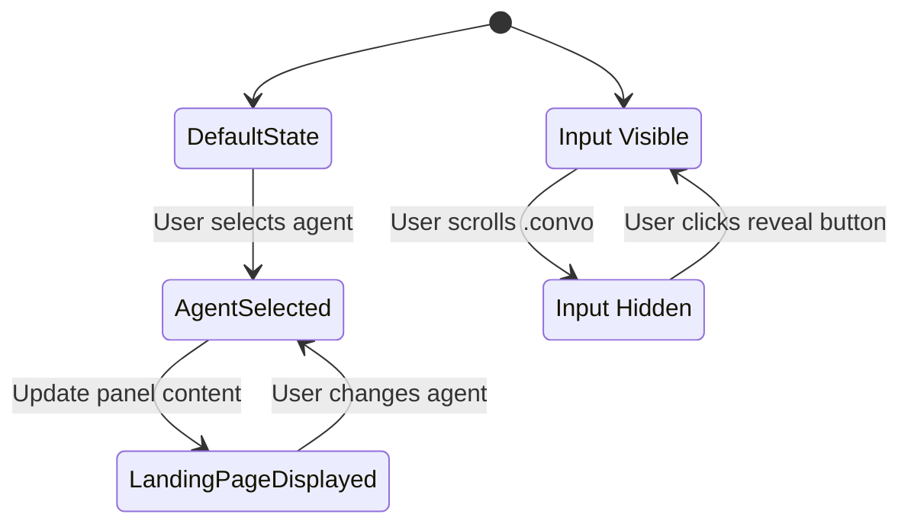

# Design Document

## Overview

This design implements five complementary UI enhancements for the chat interface: agent-specific landing pages, sliding input mechanism, instant input clearing, immediate chain-of-thought display, and improved scrolling. The key insight is that visual feedback must happen immediately on user action, creating a real-time, responsive feel.

## Architecture

### High-Level Component Structure

```
ChatPage
├── AgentLandingPanel (NEW)
│   ├── DuplicateAgentSelector (NEW)
│   ├── SegmentedController (existing)
│   └── LandingPageContent (NEW)
│       ├── AutoAgentLanding
│       ├── RenewableEnergyLanding
│       ├── MaintenanceLanding
│       └── DefaultLanding
├── ConversationArea (.convo)
│   ├── ChatMessages
│   └── ExtendedThinkingDisplay (ENHANCED)
│       ├── Immediate loading state
│       ├── Real-time content streaming
│       └── Smart auto-scroll
└── SlidingChatInput (ENHANCED)
    ├── AgentSwitcher (existing)
    ├── MessageInput (ENHANCED - instant clear)
    └── RevealButton (NEW)
```

### Timing Sequence for Message Send

**Improved Flow (Instant & Real-time):**
```
User hits Enter (0ms) →
  Chain of thought appears with loading state (50ms) →
  Input clears (50ms) →
  Prompt bubble appears (100ms) →
  Chain of thought starts streaming (200ms) →
  Content updates in real-time (continuous)
```

### State Management Flow



## Components and Interfaces

### 1. AgentLandingPanel Component

**Purpose**: Container component that manages the panel area, including the duplicate selector and landing page content.

**Props**:
```typescript
interface AgentLandingPanelProps {
  selectedAgent: AgentType;
  onAgentChange: (agent: AgentType) => void;
}
```

**State**:
```typescript
interface AgentLandingPanelState {
  currentAgent: AgentType;
  isTransitioning: boolean;
}
```

**Responsibilities**:
- Render duplicate agent selector
- Display agent-specific landing page content
- Coordinate with segmented controller positioning
- Handle agent selection changes from duplicate selector

### 2. DuplicateAgentSelector Component

**Purpose**: Icon button selector positioned 20px left of segmented controller, synchronized with input switcher.

**Props**:
```typescript
interface DuplicateAgentSelectorProps {
  selectedAgent: AgentType;
  availableAgents: AgentOption[];
  onAgentChange: (agent: AgentType) => void;
  className?: string;
}
```

**Design**:
- Icon button with dropdown menu
- Same agent options as input switcher
- Positioned absolutely or with flexbox gap
- Uses existing Cloudscape or MUI icon button component
- Dropdown menu shows agent icons and names

### 3. LandingPageContent Component

**Purpose**: Renders agent-specific landing page content in the panel area.

**Props**:
```typescript
interface LandingPageContentProps {
  agent: AgentType;
  className?: string;
}
```

**Content Structure** (per agent):
```typescript
interface AgentLandingContent {
  title: string;
  description: string;
  capabilities: string[];
  quickStartTips?: string[];
  icon: ReactNode;
}
```

**Agent-Specific Content**:

- **Auto Agent**:
  - Title: "Auto Agent Selection"
  - Description: "Intelligent agent routing based on your query"
  - Capabilities: 
    - Automatically detects intent from your message
    - Routes to the most appropriate specialized agent
    - Handles multi-domain queries seamlessly
    - Falls back to general assistance when needed
  - How It Works: "Simply type your question naturally. The system analyzes your intent and automatically selects the best agent to help you—whether it's renewable energy analysis, maintenance planning, or general assistance."
  - Icon: Magic wand, sparkles, or auto-routing icon

- **Renewable Energy Agent**:
  - Title: "Renewable Energy Site Design"
  - Description: "AI-powered wind farm analysis and optimization"
  - Capabilities: Terrain analysis, Layout optimization, Wake simulation, Performance analysis, Financial modeling
  - Icon: Wind turbine or renewable energy icon

- **Maintenance Agent**:
  - Title: "Equipment Maintenance & Monitoring"
  - Description: "Predictive maintenance and asset health monitoring"
  - Capabilities: Equipment status, Failure prediction, Maintenance scheduling, Inspection reports, Asset lifecycle
  - Icon: Wrench or maintenance icon

- **Default (No Agent)**:
  - Current "AI-Powered Workflow Recommendations" content

### 4. SlidingChatInput Component (Enhanced)

**Purpose**: Existing chat input enhanced with sliding behavior on scroll.

**Props**:
```typescript
interface SlidingChatInputProps {
  selectedAgent: AgentType;
  onAgentChange: (agent: AgentType) => void;
  onMessageSend: (message: string) => void;
  // ... existing props
}
```

**State**:
```typescript
interface SlidingChatInputState {
  isVisible: boolean;
  isAnimating: boolean;
  scrollPosition: number;
}
```

**Behavior**:
- Monitor `.convo` scroll events
- Slide right with CSS transform on scroll
- Show reveal button when hidden
- Slide back on reveal button click

### 5. RevealButton Component

**Purpose**: Icon button that appears in right margin when input is hidden.

**Props**:
```typescript
interface RevealButtonProps {
  onClick: () => void;
  position: { top: number; right: number };
  isVisible: boolean;
}
```

**Design**:
- Fixed position in right margin
- Circular icon button with chat/message icon
- Fade in/out animation
- Positioned at original input vertical location

### 6. Enhanced ChatInput with Instant Clear

**Purpose**: Clear input instantly on send, before any async operations.

**Current Behavior (SLOW)**:
```typescript
// ❌ Waits for API
const handleSend = async () => {
  const response = await sendMessage(input);
  setInput(''); // Clears AFTER response
};
```

**Improved Behavior (FAST)**:
```typescript
// ✅ Clears immediately
const handleSend = async () => {
  const messageToSend = input;
  setInput(''); // Clear IMMEDIATELY (synchronous)
  sendMessage(messageToSend); // Then send async
};
```

**Implementation**:
- Clear input synchronously before any async calls
- Store message content in local variable before clearing
- Maintain focus on input after clearing

### 7. Enhanced ExtendedThinkingDisplay

**Purpose**: Show immediate processing state and stream content in real-time.

**State Interface**:
```typescript
interface ExtendedThinkingState {
  status: 'idle' | 'initializing' | 'processing' | 'streaming' | 'complete';
  content: ThinkingStep[];
  isVisible: boolean;
  isAutoScrolling: boolean;
  hasUserScrolled: boolean;
}

interface ThinkingStep {
  id: string;
  text: string;
  timestamp: number;
  isComplete: boolean;
}
```

**Immediate Display Logic**:
```typescript
// Show immediately on send (within 50ms)
const handleMessageSend = () => {
  setThinkingState({
    status: 'initializing',
    isVisible: true,
    content: []
  });
  // Visual indicators appear instantly
};
```

**Streaming Content Logic**:
```typescript
// Update as chunks arrive
const handleStreamChunk = (chunk: string) => {
  setThinkingState(prev => ({
    ...prev,
    status: 'streaming',
    content: [...prev.content, {
      id: generateId(),
      text: chunk,
      timestamp: Date.now(),
      isComplete: false
    }]
  }));
};
```

### 8. Smart Auto-Scroll System

**Purpose**: Scroll to show new content while respecting user scroll position.

**Scroll State**:
```typescript
interface ScrollState {
  isAutoScrollEnabled: boolean;
  isNearBottom: boolean;
  lastScrollTop: number;
  scrollThreshold: number; // 50px from bottom
}
```

**Auto-Scroll Logic**:
```typescript
const handleScroll = (e: React.UIEvent<HTMLDivElement>) => {
  const element = e.currentTarget;
  const isNearBottom = 
    element.scrollHeight - element.scrollTop - element.clientHeight < 50;
  
  setScrollState(prev => ({
    ...prev,
    isNearBottom,
    isAutoScrollEnabled: isNearBottom
  }));
};

const scrollToBottom = () => {
  if (scrollState.isAutoScrollEnabled) {
    scrollContainerRef.current?.scrollTo({
      top: scrollContainerRef.current.scrollHeight,
      behavior: 'smooth'
    });
  }
};

// Scroll on new content
useEffect(() => {
  if (thinkingState.content.length > 0) {
    scrollToBottom();
  }
}, [thinkingState.content]);
```

### 9. Visual Activity Indicators

**Purpose**: Show immediate visual feedback that processing has started.

**Loading States**:
```typescript
const LoadingIndicator = ({ status }: { status: ExtendedThinkingState['status'] }) => {
  switch (status) {
    case 'initializing':
      return <PulsingDots text="Initializing..." />;
    case 'processing':
      return <SpinnerWithText text="Processing..." />;
    case 'streaming':
      return <FlowingAnimation text="Thinking..." />;
    default:
      return null;
  }
};
```

**Animation Components**:
```typescript
// Pulsing dots for immediate feedback
const PulsingDots = () => (
  <div className="flex gap-1">
    <span className="animate-pulse-fast">●</span>
    <span className="animate-pulse-fast delay-100">●</span>
    <span className="animate-pulse-fast delay-200">●</span>
  </div>
);
```

## Data Models

### AgentType Enum
```typescript
enum AgentType {
  AUTO = 'auto',
  RENEWABLE_ENERGY = 'renewable_energy',
  MAINTENANCE = 'maintenance',
  DEFAULT = 'default'
}
```

### AgentOption Interface
```typescript
interface AgentOption {
  type: AgentType;
  label: string;
  icon: ReactNode;
  description: string;
}
```

### InputVisibilityState
```typescript
interface InputVisibilityState {
  isVisible: boolean;
  lastScrollPosition: number;
  scrollThreshold: number; // pixels scrolled before hiding
}
```

### Message Send Event
```typescript
interface MessageSendEvent {
  messageId: string;
  content: string;
  timestamp: number;
  agentType: AgentType;
}
```

### Streaming Response
```typescript
interface StreamingResponse {
  messageId: string;
  chunks: StreamChunk[];
  isComplete: boolean;
}

interface StreamChunk {
  type: 'thinking' | 'content' | 'metadata';
  data: string;
  timestamp: number;
  sequence: number;
}
```

## Error Handling

### Agent Selection Errors
- **Invalid Agent Type**: Fall back to default landing page
- **Missing Landing Content**: Display generic "Agent information unavailable" message
- **Synchronization Failure**: Log error, maintain last valid state

### Sliding Input Errors
- **Animation Failure**: Ensure input remains accessible (don't hide permanently)
- **Scroll Event Listener Failure**: Keep input visible by default

### Input Clearing Failures
- **State Update Failure**: Use synchronous state update with fallback to direct DOM manipulation
- **Fallback**: `inputRef.current.value = ''`

### Chain of Thought Display Failures
- **Component Doesn't Appear**: Set initial state synchronously before any async operations
- **Fallback**: Show generic "Processing..." message

### Streaming Failures
- **Out of Order Chunks**: Use sequence numbers, buffer and reorder if needed
- **Dropped Chunks**: Display available content, show warning for gaps

### Scroll Failures
- **Auto-scroll Doesn't Work**: Debounce scroll events, use requestAnimationFrame
- **Fallback**: Disable auto-scroll, show "scroll to bottom" button
- **Position Calculation Error**: Use fallback fixed positioning

## Implementation Notes

### CSS Animations for Real-time Feel

**Pulsing Dots**:
```css
@keyframes pulse-fast {
  0%, 100% { opacity: 1; }
  50% { opacity: 0.3; }
}

.animate-pulse-fast {
  animation: pulse-fast 0.8s ease-in-out infinite;
}

.delay-100 { animation-delay: 0.1s; }
.delay-200 { animation-delay: 0.2s; }
```

**Flowing Animation**:
```css
@keyframes flow {
  0% { transform: translateX(-100%); }
  100% { transform: translateX(100%); }
}

.animate-flow {
  animation: flow 1.5s ease-in-out infinite;
}
```

**Chain of Thought Container**:
```css
.chain-of-thought-container {
  scroll-behavior: smooth;
  overflow-y: auto;
  max-height: 300px;
  min-height: 150px; /* Show at least 5 lines */
}
```

### Performance Optimizations

**Debounced Scroll Handling**:
```typescript
const debouncedScrollHandler = useMemo(
  () => debounce(handleScroll, 100),
  []
);
```

**Memoized Content Rendering**:
```typescript
const MemoizedThinkingStep = React.memo(ThinkingStep, (prev, next) => {
  return prev.id === next.id && prev.isComplete === next.isComplete;
});
```

**RequestAnimationFrame for Scroll**:
```typescript
const scrollToBottomRAF = () => {
  requestAnimationFrame(() => {
    scrollContainerRef.current?.scrollTo({
      top: scrollContainerRef.current.scrollHeight,
      behavior: 'smooth'
    });
  });
};
```

### Optimistic UI Updates Strategy

**Immediate State Updates**:
```typescript
const handleSend = async (message: string) => {
  // 1. Clear input (synchronous - 0ms)
  setInput('');
  
  // 2. Show chain of thought (synchronous - 50ms)
  setThinkingState({ status: 'initializing', isVisible: true });
  
  // 3. Add prompt bubble (synchronous - 100ms)
  addMessage({ role: 'user', content: message });
  
  // 4. Send to backend (asynchronous)
  try {
    const response = await sendMessage(message);
    handleStreamingResponse(response);
  } catch (error) {
    handleError(error);
  }
};
```

**Streaming State Updates**:
```typescript
const handleStreamingResponse = (stream: ReadableStream) => {
  const reader = stream.getReader();
  
  const processChunk = async () => {
    const { done, value } = await reader.read();
    
    if (!done) {
      // Update immediately on each chunk
      setThinkingState(prev => ({
        ...prev,
        status: 'streaming',
        content: [...prev.content, parseChunk(value)]
      }));
      
      processChunk(); // Continue reading
    } else {
      setThinkingState(prev => ({ ...prev, status: 'complete' }));
    }
  };
  
  processChunk();
};
```

### Graceful Degradation
- If animations not supported: Use instant show/hide
- If positioning fails: Keep input in default position
- If agent content missing: Show default content

## Testing Strategy

### Unit Tests

**AgentLandingPanel**:
- Renders correct landing content for each agent type
- Updates content when agent changes
- Positions duplicate selector correctly

**DuplicateAgentSelector**:
- Displays current agent selection
- Triggers onAgentChange callback
- Synchronizes with input switcher

**SlidingChatInput**:
- Hides on scroll event
- Shows reveal button when hidden
- Reveals on button click
- Maintains scroll position

**RevealButton**:
- Renders at correct position
- Triggers reveal callback
- Animates visibility correctly

### Integration Tests

**Agent Selection Synchronization**:
- Change agent in input switcher → duplicate selector updates
- Change agent in duplicate selector → input switcher updates
- Both changes → landing page updates

**Sliding Input Flow**:
- Scroll .convo → input slides out → reveal button appears
- Click reveal button → input slides in → reveal button disappears
- Multiple scroll/reveal cycles work correctly

**State Persistence**:
- Agent selection persists across interactions
- Input visibility state maintained during session
- State resets appropriately on navigation

### E2E Tests

**Complete User Workflows**:
1. User selects agent from input switcher → sees landing page → selects from duplicate selector → landing page updates
2. User scrolls conversation → input hides → clicks reveal → input shows → scrolls again → input hides
3. User switches agents while input is hidden → landing page updates → reveals input → agent selection synchronized

### Visual Regression Tests
- Landing page layouts for each agent
- Duplicate selector positioning
- Input sliding animations
- Reveal button positioning

## Implementation Notes

### CSS Considerations

**Sliding Animation**:
```css
.sliding-input {
  transition: transform 300ms ease-in-out;
  transform: translateX(0);
}

.sliding-input.hidden {
  transform: translateX(100%);
}
```

**Reveal Button Positioning**:
```css
.reveal-button {
  position: fixed;
  right: 20px;
  /* top calculated dynamically based on input position */
  z-index: 1000;
  opacity: 0;
  transition: opacity 200ms ease-in-out;
}

.reveal-button.visible {
  opacity: 1;
}
```

**Duplicate Selector Positioning**:
```css
.duplicate-selector {
  margin-right: 20px;
  /* positioned relative to segmented controller */
}
```

### Performance Considerations

**Scroll Event Optimization**:
- Use `requestAnimationFrame` for scroll handling
- Debounce scroll events (100ms threshold)
- Only trigger hide after scroll threshold exceeded (e.g., 50px)

**Animation Performance**:
- Use CSS transforms (GPU-accelerated)
- Avoid layout thrashing
- Use `will-change` property for animated elements

**State Updates**:
- Batch state updates where possible
- Avoid unnecessary re-renders
- Use React.memo for landing page content components

### Accessibility

**Keyboard Navigation**:
- Duplicate selector accessible via Tab key
- Reveal button accessible via Tab key
- Agent selection via keyboard (Enter/Space)
- Input reveal via keyboard (Enter/Space)

**Screen Readers**:
- Announce agent selection changes
- Announce input visibility changes
- Label reveal button clearly ("Show chat input")
- Provide ARIA labels for all interactive elements

**Focus Management**:
- Maintain focus on duplicate selector after selection
- Move focus to input when revealed
- Ensure focus visible indicators

### Browser Compatibility
- CSS transforms supported in all modern browsers
- Fallback to display: none for older browsers
- Test in Chrome, Firefox, Safari, Edge
- Mobile browser considerations (touch events)

## Dependencies

### Existing Components
- `AgentSwitcher` (src/components/AgentSwitcher.tsx)
- Chat page layout (src/app/chat/[chatSessionId]/page.tsx)
- Cloudscape/MUI components for UI consistency

### New Dependencies
- None required (use existing React, CSS, TypeScript)

### Styling
- Tailwind CSS for utility classes
- CSS modules or styled-components for component-specific styles
- Existing design system tokens for colors, spacing, typography

## Migration Strategy

### Phase 1: Agent Landing Pages
1. Create `AgentLandingPanel` component
2. Create `DuplicateAgentSelector` component
3. Create `LandingPageContent` component with agent-specific content
4. Integrate into chat page layout
5. Implement synchronization logic
6. Test agent selection flow

### Phase 2: Sliding Input
1. Enhance existing chat input with sliding behavior
2. Create `RevealButton` component
3. Implement scroll detection logic
4. Add slide animations
5. Test scroll/reveal flow
6. Optimize performance

### Phase 3: Integration & Polish
1. Test both features together
2. Refine animations and transitions
3. Accessibility audit and fixes
4. Performance optimization
5. Cross-browser testing
6. User acceptance testing

## Open Questions

1. **Scroll Threshold**: How many pixels should user scroll before input hides? (Suggested: 50px)
2. **Animation Duration**: Is 300ms appropriate for sliding animation? (Can adjust based on user feedback)
3. **Reveal Button Icon**: Which icon best represents "show input"? (Suggested: chat bubble or chevron left)
4. **Landing Page Content**: Should we include example prompts or quick actions in landing pages?
5. **Mobile Behavior**: Should sliding input work differently on mobile devices?
6. **State Persistence**: Should agent selection persist across browser sessions (localStorage)?
