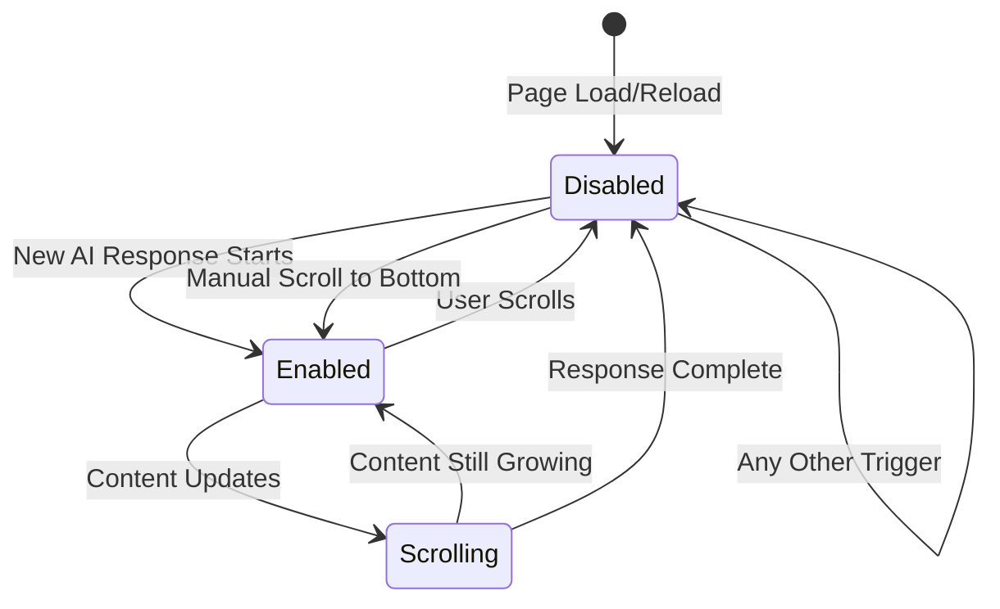

# Design Document

## Overview

This design implements precise auto-scroll control for the EDI Platform chat interface, replacing the current broad auto-scroll behavior with a targeted system that only scrolls when new AI responses appear. The solution uses state-driven auto-scroll management with clear triggers and user override capabilities.

## Architecture

### Core Components

1. **AutoScrollManager** - Central state management for auto-scroll behavior
2. **ResponseTracker** - Tracks new vs. existing AI responses
3. **ScrollController** - Handles actual scrolling operations with user interrupt detection
4. **SessionStateManager** - Manages auto-scroll state across page loads and navigation

### State Management Flow



## Components and Interfaces

### 1. AutoScrollManager

**Purpose**: Central state management for auto-scroll behavior

```typescript
interface AutoScrollState {
  isEnabled: boolean;
  currentResponseId: string | null;
  isNewResponse: boolean;
  userInterrupted: boolean;
  lastScrollPosition: number;
}

class AutoScrollManager {
  private state: AutoScrollState;
  private listeners: Set<(state: AutoScrollState) => void>;
  
  // Core methods
  enableForNewResponse(responseId: string): void;
  disable(reason: string): void;
  handleUserScroll(): void;
  handleManualScrollToBottom(): void;
  
  // State queries
  shouldAutoScroll(): boolean;
  getCurrentState(): AutoScrollState;
}
```

### 2. ResponseTracker

**Purpose**: Distinguish between new and existing AI responses

```typescript
interface ResponseInfo {
  id: string;
  isNew: boolean;
  isComplete: boolean;
  startTime: number;
}

class ResponseTracker {
  private knownResponses: Map<string, ResponseInfo>;
  private sessionStartTime: number;
  
  // Track response lifecycle
  markResponseStart(responseId: string): boolean; // Returns true if new
  markResponseComplete(responseId: string): void;
  isNewResponse(responseId: string): boolean;
  
  // Session management
  resetForNewSession(): void;
  loadExistingSession(responses: Message[]): void;
}
```

### 3. ScrollController

**Purpose**: Handle actual scrolling with smooth animations and user interrupt detection

```typescript
interface ScrollOptions {
  behavior: 'smooth' | 'auto';
  block: 'start' | 'end' | 'center';
  buffer: number;
}

class ScrollController {
  private container: HTMLElement;
  private isScrolling: boolean;
  private scrollTimeout: NodeJS.Timeout | null;
  
  // Scrolling operations
  scrollToBottom(options: ScrollOptions): Promise<void>;
  cancelScroll(): void;
  
  // User interaction detection
  setupScrollListeners(): void;
  onUserScroll(callback: () => void): void;
  
  // Position utilities
  isAtBottom(threshold?: number): boolean;
  getCurrentPosition(): number;
}
```

### 4. SessionStateManager

**Purpose**: Manage auto-scroll state across page loads and navigation

```typescript
interface SessionState {
  chatSessionId: string;
  autoScrollEnabled: boolean;
  lastKnownResponses: string[];
  scrollPosition: number;
}

class SessionStateManager {
  // Session lifecycle
  initializeSession(chatSessionId: string): SessionState;
  saveSessionState(state: SessionState): void;
  loadSessionState(chatSessionId: string): SessionState | null;
  
  // Navigation handling
  handlePageReload(): void;
  handleSessionSwitch(fromId: string, toId: string): void;
}
```

## Data Models

### AutoScroll Configuration

```typescript
interface AutoScrollConfig {
  // Timing
  scrollDelay: number; // Delay before auto-scroll starts (default: 100ms)
  scrollDuration: number; // Animation duration (default: 500ms)
  debounceTime: number; // User scroll debounce (default: 150ms)
  
  // Behavior
  bottomThreshold: number; // Pixels from bottom to consider "at bottom" (default: 50)
  scrollBuffer: number; // Extra pixels to scroll beyond content (default: 20)
  
  // Features
  enableManualButton: boolean; // Show scroll-to-bottom button (default: true)
  enableChainOfThought: boolean; // Apply same rules to CoT panel (default: true)
  
  // Debug
  enableLogging: boolean; // Console logging for debugging (default: false)
}
```

### Message State Tracking

```typescript
interface MessageState {
  id: string;
  role: 'human' | 'ai' | 'ai-stream';
  isNew: boolean; // True only for responses that started after session load
  isComplete: boolean;
  firstSeenAt: number; // Timestamp when first detected
  lastUpdatedAt: number; // Timestamp of last content change
}
```

## Error Handling

### User Interrupt Scenarios

1. **During Response Generation**
   - User scrolls up → Immediately disable auto-scroll for current response
   - User scrolls down but not to bottom → Disable auto-scroll
   - User scrolls to bottom → Re-enable auto-scroll for current response

2. **During Page Load**
   - Auto-scroll is disabled by default
   - No error recovery needed - system starts in safe state

3. **During Session Navigation**
   - Clear all auto-scroll state
   - Reset response tracking
   - Start fresh in disabled state

### Fallback Mechanisms

```typescript
class ErrorHandler {
  // Graceful degradation
  handleScrollError(error: Error): void {
    console.warn('Auto-scroll failed, disabling:', error);
    autoScrollManager.disable('scroll-error');
  }
  
  // State recovery
  recoverFromInvalidState(): void {
    autoScrollManager.disable('state-recovery');
    responseTracker.resetForNewSession();
  }
  
  // Performance protection
  handlePerformanceIssue(): void {
    // Disable auto-scroll if scrolling is causing performance issues
    autoScrollManager.disable('performance-protection');
  }
}
```

## Testing Strategy

### Unit Tests

1. **AutoScrollManager**
   - State transitions
   - User interrupt handling
   - Response lifecycle tracking

2. **ResponseTracker**
   - New vs. existing response detection
   - Session boundary handling
   - Response completion tracking

3. **ScrollController**
   - Smooth scrolling animations
   - User interrupt detection
   - Position calculations

### Integration Tests

1. **Chat Session Lifecycle**
   - Page load behavior
   - New response handling
   - User interaction scenarios

2. **Cross-Component Communication**
   - ChatBox ↔ AutoScrollManager
   - ResponseTracker ↔ SessionStateManager
   - ScrollController ↔ User Events

### User Experience Tests

1. **Scenario Testing**
   - New user starts chat → No auto-scroll
   - User reloads page → No auto-scroll
   - AI responds → Auto-scroll enabled
   - User scrolls up during response → Auto-scroll disabled
   - User clicks scroll-to-bottom → Auto-scroll re-enabled

2. **Performance Testing**
   - Large chat history loading
   - Rapid message updates
   - Multiple concurrent responses

## Implementation Approach

### Phase 1: Core State Management
1. Implement AutoScrollManager with basic state tracking
2. Add ResponseTracker for new/existing response detection
3. Update ChatBox to use new state management

### Phase 2: User Control
1. Implement ScrollController with user interrupt detection
2. Add manual scroll-to-bottom button
3. Integrate user scroll event handling

### Phase 3: Session Management
1. Implement SessionStateManager for cross-navigation state
2. Add page reload handling
3. Integrate with existing chat session lifecycle

### Phase 4: Chain of Thought Integration
1. Apply same auto-scroll rules to CoT panel
2. Ensure consistent behavior across all scrollable areas
3. Add CoT-specific state management

## Migration Strategy

### Backward Compatibility
- Existing auto-scroll behavior will be completely replaced
- No breaking changes to ChatBox component interface
- Existing scroll-to-bottom button functionality preserved

### Rollout Plan
1. **Development**: Implement behind feature flag
2. **Testing**: A/B test with subset of users
3. **Staging**: Full deployment to staging environment
4. **Production**: Gradual rollout with monitoring

### Monitoring
- Track auto-scroll enable/disable events
- Monitor user scroll behavior patterns
- Measure user satisfaction with new behavior

## Success Metrics

### User Experience
- Reduced complaints about unwanted auto-scrolling
- Increased time spent reading chat history
- Improved user control satisfaction scores

### Technical
- Zero auto-scroll on page reloads
- 100% user interrupt success rate
- < 100ms response time for scroll state changes

### Performance
- No impact on chat rendering performance
- Minimal memory overhead for state tracking
- Smooth scroll animations (60fps target)