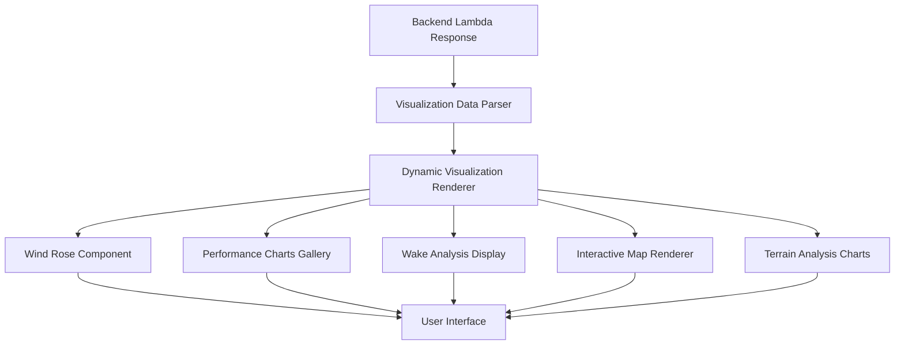

# Design Document

## Overview

This design bridges the gap between the comprehensive renewable energy visualizations generated by the backend Lambda functions and the frontend React components. The backend is already generating wind rose diagrams, wake analysis heat maps, performance charts, seasonal analysis, and interactive folium maps, but the frontend components are not properly displaying these rich visualizations. This solution updates the React components to automatically detect and display all available visualizations from the backend response.

## Architecture

### Current State Analysis

**Backend Capabilities (Already Implemented):**
- Wind rose diagrams (`visualizations.wind_rose`)
- Performance charts array (`visualizations.performance_charts[]`)
- Wake analysis charts (`visualizations.wake_analysis`)
- Seasonal wind analysis (`visualizations.seasonal_analysis`)
- Interactive folium maps (`mapHtml`, `visualizations.interactive_map`)
- Wake heat maps (`visualizations.wake_heat_map`)
- Elevation profiles (`visualizations.elevation_profile`)
- Accessibility analysis (`visualizations.accessibility_analysis`)
- Complete report packages (`visualizations.complete_report`)

**Frontend Gap:**
- Components only display basic placeholders
- Rich visualizations are ignored or not properly rendered
- No automatic detection of available visualizations
- Missing responsive layout for multiple charts

### Solution Architecture



## Components and Interfaces

### 1. Enhanced Visualization Data Parser

**Purpose**: Parse and organize all visualization data from backend responses

```typescript
interface VisualizationData {
  // Wind analysis
  wind_rose?: string;
  seasonal_analysis?: string;
  variability_analysis?: string;
  
  // Performance analysis
  performance_charts?: string[];
  monthly_production?: string;
  capacity_factor_analysis?: string;
  
  // Wake analysis
  wake_analysis?: string;
  wake_heat_map?: string;
  wake_deficit_heatmap?: string;
  
  // Terrain analysis
  elevation_profile?: string;
  accessibility_analysis?: string;
  topographic_map?: string;
  slope_analysis?: string;
  
  // Interactive maps
  interactive_map?: string;
  
  // Reports and exports
  complete_report?: string;
  export_package?: string;
}

class VisualizationDataParser {
  static parseVisualizationData(responseData: any): VisualizationData {
    const visualizations = responseData.visualizations || {};
    
    return {
      // Extract all available visualizations
      wind_rose: visualizations.wind_rose,
      seasonal_analysis: visualizations.seasonal_analysis,
      variability_analysis: visualizations.variability_analysis,
      performance_charts: visualizations.performance_charts || [],
      monthly_production: visualizations.monthly_production,
      capacity_factor_analysis: visualizations.capacity_factor_analysis,
      wake_analysis: visualizations.wake_analysis,
      wake_heat_map: visualizations.wake_heat_map,
      wake_deficit_heatmap: visualizations.wake_deficit_heatmap,
      elevation_profile: visualizations.elevation_profile,
      accessibility_analysis: visualizations.accessibility_analysis,
      topographic_map: visualizations.topographic_map,
      slope_analysis: visualizations.slope_analysis,
      interactive_map: visualizations.interactive_map || responseData.mapUrl,
      complete_report: visualizations.complete_report,
      export_package: visualizations.export_package
    };
  }
  
  static getAvailableVisualizations(data: VisualizationData): string[] {
    return Object.entries(data)
      .filter(([key, value]) => value !== undefined && value !== null)
      .map(([key]) => key);
  }
  
  static organizeVisualizationsByCategory(data: VisualizationData) {
    return {
      wind_analysis: {
        wind_rose: data.wind_rose,
        seasonal_analysis: data.seasonal_analysis,
        variability_analysis: data.variability_analysis
      },
      performance_analysis: {
        performance_charts: data.performance_charts,
        monthly_production: data.monthly_production,
        capacity_factor_analysis: data.capacity_factor_analysis
      },
      wake_analysis: {
        wake_analysis: data.wake_analysis,
        wake_heat_map: data.wake_heat_map,
        wake_deficit_heatmap: data.wake_deficit_heatmap
      },
      terrain_analysis: {
        elevation_profile: data.elevation_profile,
        accessibility_analysis: data.accessibility_analysis,
        topographic_map: data.topographic_map,
        slope_analysis: data.slope_analysis
      },
      interactive_maps: {
        interactive_map: data.interactive_map
      },
      reports: {
        complete_report: data.complete_report,
        export_package: data.export_package
      }
    };
  }
}
```

### 2. Dynamic Visualization Renderer

**Purpose**: Automatically render any available visualization with proper error handling

```typescript
interface VisualizationRendererProps {
  imageUrl?: string;
  htmlContent?: string;
  title: string;
  description?: string;
  category: 'chart' | 'map' | 'report';
  fallbackContent?: React.ReactNode;
}

const VisualizationRenderer: React.FC<VisualizationRendererProps> = ({
  imageUrl,
  htmlContent,
  title,
  description,
  category,
  fallbackContent
}) => {
  const [loading, setLoading] = useState(true);
  const [error, setError] = useState<string | null>(null);
  
  const handleImageLoad = () => {
    setLoading(false);
    setError(null);
  };
  
  const handleImageError = () => {
    setLoading(false);
    setError('Failed to load visualization');
  };
  
  if (category === 'map' && htmlContent) {
    return (
      <div className="visualization-container">
        <Box variant="awsui-key-label" margin={{ bottom: 'xs' }}>
          {title}
        </Box>
        {description && (
          <Box variant="small" color="text-body-secondary" margin={{ bottom: 's' }}>
            {description}
          </Box>
        )}
        <div
          style={{
            width: '100%',
            height: '600px',
            border: '1px solid #e9ebed',
            borderRadius: '8px',
            overflow: 'hidden',
          }}
        >
          <iframe
            srcDoc={htmlContent}
            style={{
              width: '100%',
              height: '100%',
              border: 'none',
            }}
            title={title}
            sandbox="allow-scripts allow-same-origin"
          />
        </div>
      </div>
    );
  }
  
  if (category === 'chart' && imageUrl) {
    return (
      <div className="visualization-container">
        <Box variant="awsui-key-label" margin={{ bottom: 'xs' }}>
          {title}
        </Box>
        {description && (
          <Box variant="small" color="text-body-secondary" margin={{ bottom: 's' }}>
            {description}
          </Box>
        )}
        <div
          style={{
            width: '100%',
            border: '1px solid #e9ebed',
            borderRadius: '8px',
            overflow: 'hidden',
            backgroundColor: '#fff',
            padding: '16px',
            textAlign: 'center',
          }}
        >
          {loading && (
            <div style={{ padding: '40px', color: '#666' }}>
              Loading visualization...
            </div>
          )}
          {error && (
            <div style={{ padding: '40px', color: '#d13212' }}>
              {error}
              {fallbackContent && (
                <div style={{ marginTop: '16px' }}>
                  {fallbackContent}
                </div>
              )}
            </div>
          )}
          
        </div>
      </div>
    );
  }
  
  if (category === 'report' && imageUrl) {
    return (
      <div className="visualization-container">
        <Box variant="awsui-key-label" margin={{ bottom: 'xs' }}>
          {title}
        </Box>
        {description && (
          <Box variant="small" color="text-body-secondary" margin={{ bottom: 's' }}>
            {description}
          </Box>
        )}
        <Button
          variant="primary"
          iconName="download"
          onClick={() => window.open(imageUrl, '_blank')}
        >
          Download Report
        </Button>
      </div>
    );
  }
  
  return fallbackContent || null;
};
```

### 3. Enhanced SimulationChartArtifact Component

**Purpose**: Display all wake simulation visualizations with organized layout

```typescript
const EnhancedSimulationChartArtifact: React.FC<SimulationArtifactProps> = ({ data }) => {
  const visualizationData = VisualizationDataParser.parseVisualizationData(data);
  const availableVisualizations = VisualizationDataParser.getAvailableVisualizations(visualizationData);
  const categorizedVisualizations = VisualizationDataParser.organizeVisualizationsByCategory(visualizationData);
  
  return (
    <Container
      header={
        <Header
          variant="h2"
          description={data.subtitle}
          actions={
            <SpaceBetween direction="horizontal" size="xs">
              <Badge color="green">
                {data.performanceMetrics.annualEnergyProduction.toFixed(0)} MWh/year
              </Badge>
              <Badge color="blue">
                CF: {(data.performanceMetrics.capacityFactor * 100).toFixed(1)}%
              </Badge>
              {visualizationData.complete_report && (
                <Button
                  variant="primary"
                  iconName="download"
                  onClick={() => window.open(visualizationData.complete_report, '_blank')}
                >
                  Download Report
                </Button>
              )}
            </SpaceBetween>
          }
        >
          {data.title}
        </Header>
      }
    >
      <SpaceBetween size="l">
        {/* Performance Metrics */}
        <Box>
          <Box variant="awsui-key-label" margin={{ bottom: 'xs' }}>
            Performance Metrics
          </Box>
          <ColumnLayout columns={3} variant="text-grid">
            <div>
              <Box variant="small">Annual Energy Production</Box>
              <div>{data.performanceMetrics.annualEnergyProduction.toFixed(0)} MWh/year</div>
            </div>
            <div>
              <Box variant="small">Capacity Factor</Box>
              <div>{(data.performanceMetrics.capacityFactor * 100).toFixed(1)}%</div>
            </div>
            <div>
              <Box variant="small">Wake Losses</Box>
              <div>{(data.performanceMetrics.wakeLosses * 100).toFixed(1)}%</div>
            </div>
          </ColumnLayout>
        </Box>

        {/* Wind Resource Analysis */}
        {(categorizedVisualizations.wind_analysis.wind_rose || 
          categorizedVisualizations.wind_analysis.seasonal_analysis ||
          categorizedVisualizations.wind_analysis.variability_analysis) && (
          <Box>
            <Box variant="awsui-key-label" margin={{ bottom: 'xs' }}>
              Wind Resource Analysis
            </Box>
            <SpaceBetween size="m">
              {categorizedVisualizations.wind_analysis.wind_rose && (
                <VisualizationRenderer
                  imageUrl={categorizedVisualizations.wind_analysis.wind_rose}
                  title="Wind Rose Diagram"
                  description="Directional wind patterns and frequency distribution"
                  category="chart"
                />
              )}
              {categorizedVisualizations.wind_analysis.seasonal_analysis && (
                <VisualizationRenderer
                  imageUrl={categorizedVisualizations.wind_analysis.seasonal_analysis}
                  title="Seasonal Wind Analysis"
                  description="Monthly and seasonal wind pattern variations"
                  category="chart"
                />
              )}
              {categorizedVisualizations.wind_analysis.variability_analysis && (
                <VisualizationRenderer
                  imageUrl={categorizedVisualizations.wind_analysis.variability_analysis}
                  title="Wind Resource Variability"
                  description="Long-term wind resource trends and variability"
                  category="chart"
                />
              )}
            </SpaceBetween>
          </Box>
        )}

        {/* Performance Analysis Charts */}
        {(categorizedVisualizations.performance_analysis.performance_charts?.length > 0 ||
          categorizedVisualizations.performance_analysis.monthly_production ||
          categorizedVisualizations.performance_analysis.capacity_factor_analysis) && (
          <Box>
            <Box variant="awsui-key-label" margin={{ bottom: 'xs' }}>
              Performance Analysis
            </Box>
            <SpaceBetween size="m">
              {categorizedVisualizations.performance_analysis.performance_charts?.map((chartUrl, index) => (
                <VisualizationRenderer
                  key={index}
                  imageUrl={chartUrl}
                  title={`Performance Analysis ${index + 1}`}
                  description="Turbine performance metrics and comparisons"
                  category="chart"
                />
              ))}
              {categorizedVisualizations.performance_analysis.monthly_production && (
                <VisualizationRenderer
                  imageUrl={categorizedVisualizations.performance_analysis.monthly_production}
                  title="Monthly Production Analysis"
                  description="Monthly energy production patterns"
                  category="chart"
                />
              )}
              {categorizedVisualizations.performance_analysis.capacity_factor_analysis && (
                <VisualizationRenderer
                  imageUrl={categorizedVisualizations.performance_analysis.capacity_factor_analysis}
                  title="Capacity Factor Analysis"
                  description="Capacity factor distribution and statistics"
                  category="chart"
                />
              )}
            </SpaceBetween>
          </Box>
        )}

        {/* Wake Analysis */}
        {(categorizedVisualizations.wake_analysis.wake_analysis ||
          categorizedVisualizations.wake_analysis.wake_heat_map ||
          categorizedVisualizations.wake_analysis.wake_deficit_heatmap) && (
          <Box>
            <Box variant="awsui-key-label" margin={{ bottom: 'xs' }}>
              Wake Analysis
            </Box>
            <SpaceBetween size="m">
              {categorizedVisualizations.wake_analysis.wake_heat_map && (
                <VisualizationRenderer
                  htmlContent={data.mapHtml} // If available
                  imageUrl={categorizedVisualizations.wake_analysis.wake_heat_map}
                  title="Wake Heat Map"
                  description="Interactive wake deficit visualization with turbine interactions"
                  category="map"
                />
              )}
              {categorizedVisualizations.wake_analysis.wake_analysis && (
                <VisualizationRenderer
                  imageUrl={categorizedVisualizations.wake_analysis.wake_analysis}
                  title="Wake Deficit Analysis"
                  description="Wake deficit patterns and energy loss analysis"
                  category="chart"
                />
              )}
              {categorizedVisualizations.wake_analysis.wake_deficit_heatmap && (
                <VisualizationRenderer
                  imageUrl={categorizedVisualizations.wake_analysis.wake_deficit_heatmap}
                  title="Wake Deficit Heat Map"
                  description="Detailed wake deficit heat map visualization"
                  category="chart"
                />
              )}
            </SpaceBetween>
          </Box>
        )}

        {/* Interactive Maps */}
        {categorizedVisualizations.interactive_maps.interactive_map && (
          <Box>
            <Box variant="awsui-key-label" margin={{ bottom: 'xs' }}>
              Interactive Analysis Map
            </Box>
            <VisualizationRenderer
              htmlContent={data.mapHtml}
              imageUrl={categorizedVisualizations.interactive_maps.interactive_map}
              title="Interactive Wind Farm Map"
              description="Interactive map with turbine locations and analysis overlays"
              category="map"
            />
          </Box>
        )}

        {/* Fallback for legacy chart display */}
        {!availableVisualizations.length && (
          <Box>
            <Box variant="awsui-key-label" margin={{ bottom: 'xs' }}>
              Wake Analysis
            </Box>
            <div
              style={{
                width: '100%',
                minHeight: '400px',
                border: '1px solid #e9ebed',
                borderRadius: '8px',
                overflow: 'hidden',
                backgroundColor: '#fff',
                padding: '16px',
                textAlign: 'center',
                display: 'flex',
                alignItems: 'center',
                justifyContent: 'center',
              }}
            >
              <div style={{ color: '#666' }}>
                <div>📊 Advanced Visualizations</div>
                <div style={{ fontSize: '14px', marginTop: '8px' }}>
                  Rich visualizations are being generated by the backend
                </div>
                <div style={{ fontSize: '12px', marginTop: '4px', color: '#999' }}>
                  Wind rose, wake analysis, and performance charts will appear here
                </div>
              </div>
            </div>
          </Box>
        )}

        {/* Project ID */}
        <Box variant="small" color="text-body-secondary">
          Project ID: {data.projectId}
        </Box>
      </SpaceBetween>
    </Container>
  );
};
```

### 4. Enhanced TerrainMapArtifact Component

**Purpose**: Display terrain analysis with all available visualizations and guided workflow

```typescript
const EnhancedTerrainMapArtifact: React.FC<TerrainArtifactProps> = ({ data, onFollowUpAction }) => {
  const visualizationData = VisualizationDataParser.parseVisualizationData(data);
  const categorizedVisualizations = VisualizationDataParser.organizeVisualizationsByCategory(visualizationData);
  
  return (
    <Container
      header={
        <Header
          variant="h2"
          description={data.message || 'Comprehensive terrain analysis with interactive visualizations'}
          actions={
            <SpaceBetween direction="horizontal" size="xs">
              <Badge color="green">
                {data.metrics.totalFeatures} Features Found
              </Badge>
              <Badge color="blue">
                {data.metrics.radiusKm || 5}km Radius
              </Badge>
              {visualizationData.complete_report && (
                <Button
                  variant="primary"
                  iconName="download"
                  onClick={() => window.open(visualizationData.complete_report, '_blank')}
                >
                  Download Report
                </Button>
              )}
            </SpaceBetween>
          }
        >
          {data.title || 'Terrain Analysis'}
        </Header>
      }
    >
      <SpaceBetween size="l">
        {/* Enhanced Follow-up Actions with Professional Workflow */}
        <Box>
          <Box variant="awsui-key-label" margin={{ bottom: 'xs' }}>
            Recommended Next Steps
          </Box>
          <SpaceBetween direction="vertical" size="s">
            <div>
              <Box variant="small" color="text-body-secondary" margin={{ bottom: 'xs' }}>
                Based on the terrain analysis, proceed with wind farm layout optimization:
              </Box>
              <SpaceBetween direction="horizontal" size="xs">
                <Button
                  variant="primary"
                  onClick={() => onFollowUpAction?.(`Create a 30MW wind farm layout at ${data.coordinates.lat}, ${data.coordinates.lng}`)}
                >
                  Create Layout (30MW)
                </Button>
                <ButtonDropdown
                  items={[
                    { id: 'layout-50', text: 'Create 50MW Layout', description: 'Medium-scale wind farm development' },
                    { id: 'layout-100', text: 'Create 100MW Layout', description: 'Large-scale wind farm development' },
                    { id: 'layout-custom', text: 'Custom Capacity...', description: 'Specify custom MW capacity' },
                    { id: 'turbine-15', text: 'Design with 15 Turbines', description: 'Fixed turbine count layout' },
                    { id: 'turbine-20', text: 'Design with 20 Turbines', description: 'Optimal for this site size' },
                    { id: 'turbine-25', text: 'Design with 25 Turbines', description: 'Maximum density layout' },
                  ]}
                  onItemClick={({ detail }) => {
                    const coords = `${data.coordinates.lat}, ${data.coordinates.lng}`;
                    switch (detail.id) {
                      case 'layout-50':
                        onFollowUpAction?.(`Create a 50MW wind farm layout at ${coords}`);
                        break;
                      case 'layout-100':
                        onFollowUpAction?.(`Create a 100MW wind farm layout at ${coords}`);
                        break;
                      case 'turbine-15':
                        onFollowUpAction?.(`Design a wind farm with 15 turbines at ${coords}`);
                        break;
                      case 'turbine-20':
                        onFollowUpAction?.(`Design a wind farm with 20 turbines at ${coords}`);
                        break;
                      case 'turbine-25':
                        onFollowUpAction?.(`Design a wind farm with 25 turbines at ${coords}`);
                        break;
                    }
                  }}
                >
                  More Layout Options
                </ButtonDropdown>
              </SpaceBetween>
            </div>
            
            <div>
              <Box variant="small" color="text-body-secondary" margin={{ bottom: 'xs' }}>
                Additional analysis and reporting options:
              </Box>
              <SpaceBetween direction="horizontal" size="xs">
                <Button
                  onClick={() => onFollowUpAction?.('Generate comprehensive terrain analysis report')}
                >
                  Generate Report
                </Button>
                <Button
                  onClick={() => onFollowUpAction?.(`Analyze wind resource potential at ${data.coordinates.lat}, ${data.coordinates.lng}`)}
                >
                  Wind Resource Analysis
                </Button>
                <Button
                  onClick={() => onFollowUpAction?.(`Perform environmental impact assessment at ${data.coordinates.lat}, ${data.coordinates.lng}`)}
                >
                  Environmental Assessment
                </Button>
              </SpaceBetween>
            </div>
          </SpaceBetween>
        </Box>

        {/* Site Information */}
        <ColumnLayout columns={4} variant="text-grid">
          <div>
            <Box variant="awsui-key-label">Coordinates</Box>
            <div>
              {data.coordinates.lat.toFixed(6)}, {data.coordinates.lng.toFixed(6)}
            </div>
          </div>
          <div>
            <Box variant="awsui-key-label">Total Features</Box>
            <div>{data.metrics.totalFeatures}</div>
          </div>
          <div>
            <Box variant="awsui-key-label">Analysis Radius</Box>
            <div>{data.metrics.radiusKm || 5} km</div>
          </div>
          <div>
            <Box variant="awsui-key-label">Data Source</Box>
            <div>OpenStreetMap</div>
          </div>
        </ColumnLayout>

        {/* Interactive Map */}
        <Box>
          <Box variant="awsui-key-label" margin={{ bottom: 'xs' }}>
            Interactive Terrain Map
          </Box>
          <VisualizationRenderer
            htmlContent={data.mapHtml}
            imageUrl={categorizedVisualizations.interactive_maps.interactive_map}
            title="Interactive Terrain Analysis Map"
            description="Interactive map with terrain features, exclusion zones, and multiple tile layers"
            category="map"
            fallbackContent={
              <div
                ref={mapRef}
                style={{
                  width: '100%',
                  height: '600px',
                  position: 'relative',
                  zIndex: 1,
                  pointerEvents: 'auto',
                  touchAction: 'none',
                }}
              />
            }
          />
        </Box>

        {/* Terrain Analysis Charts */}
        {(categorizedVisualizations.terrain_analysis.elevation_profile ||
          categorizedVisualizations.terrain_analysis.accessibility_analysis ||
          categorizedVisualizations.terrain_analysis.topographic_map ||
          categorizedVisualizations.terrain_analysis.slope_analysis) && (
          <Box>
            <Box variant="awsui-key-label" margin={{ bottom: 'xs' }}>
              Terrain Analysis
            </Box>
            <SpaceBetween size="m">
              {categorizedVisualizations.terrain_analysis.elevation_profile && (
                <VisualizationRenderer
                  imageUrl={categorizedVisualizations.terrain_analysis.elevation_profile}
                  title="Elevation Profile"
                  description="Cross-sectional elevation analysis with turbine positions"
                  category="chart"
                />
              )}
              {categorizedVisualizations.terrain_analysis.accessibility_analysis && (
                <VisualizationRenderer
                  imageUrl={categorizedVisualizations.terrain_analysis.accessibility_analysis}
                  title="Accessibility Analysis"
                  description="Construction difficulty and access route analysis"
                  category="chart"
                />
              )}
              {categorizedVisualizations.terrain_analysis.topographic_map && (
                <VisualizationRenderer
                  htmlContent={data.topographicMapHtml} // If available
                  imageUrl={categorizedVisualizations.terrain_analysis.topographic_map}
                  title="Topographic Analysis Map"
                  description="Comprehensive topographic analysis with elevation contours"
                  category="map"
                />
              )}
              {categorizedVisualizations.terrain_analysis.slope_analysis && (
                <VisualizationRenderer
                  imageUrl={categorizedVisualizations.terrain_analysis.slope_analysis}
                  title="Slope Analysis"
                  description="Slope gradient analysis and suitability assessment"
                  category="chart"
                />
              )}
            </SpaceBetween>
          </Box>
        )}

        {/* Feature Table */}
        <Box>
          <Box variant="awsui-key-label" margin={{ bottom: 'xs' }}>
            Features ({data.exclusionZones.length})
          </Box>
          {/* Existing table implementation */}
        </Box>

        {/* Project ID */}
        <Box variant="small" color="text-body-secondary">
          Project ID: {data.projectId}
        </Box>
      </SpaceBetween>
    </Container>
  );
};
```

## Data Models

### Enhanced Artifact Interfaces

```typescript
interface EnhancedVisualizationData {
  // Wind analysis
  wind_rose?: string;
  seasonal_analysis?: string;
  variability_analysis?: string;
  
  // Performance analysis
  performance_charts?: string[];
  monthly_production?: string;
  capacity_factor_analysis?: string;
  
  // Wake analysis
  wake_analysis?: string;
  wake_heat_map?: string;
  wake_deficit_heatmap?: string;
  
  // Terrain analysis
  elevation_profile?: string;
  accessibility_analysis?: string;
  topographic_map?: string;
  slope_analysis?: string;
  
  // Interactive maps
  interactive_map?: string;
  
  // Reports and exports
  complete_report?: string;
  export_package?: string;
}

interface EnhancedSimulationArtifact {
  messageContentType: 'wind_farm_simulation';
  title: string;
  subtitle?: string;
  projectId: string;
  performanceMetrics: {
    annualEnergyProduction: number;
    capacityFactor: number;
    wakeLosses: number;
    wakeEfficiency?: number;
    grossAEP?: number;
    netAEP?: number;
  };
  
  // Enhanced visualization data
  visualizations?: EnhancedVisualizationData;
  mapHtml?: string;
  
  // Legacy support
  chartImages?: {
    wakeMap?: string;
    performanceChart?: string;
  };
}

interface EnhancedTerrainArtifact {
  messageContentType: 'wind_farm_terrain_analysis';
  title: string;
  subtitle?: string;
  projectId: string;
  coordinates: { lat: number; lng: number };
  exclusionZones: GeoJSONFeature[];
  metrics: TerrainMetrics;
  
  // Enhanced visualization data
  visualizations?: EnhancedVisualizationData;
  mapHtml?: string;
  mapUrl?: string;
  
  // Individual visualization URLs for direct access
  elevationProfileUrl?: string;
  accessibilityChartUrl?: string;
  topographicMapUrl?: string;
}
```

## Error Handling

### Visualization Loading and Fallbacks

```typescript
interface VisualizationErrorBoundaryProps {
  children: React.ReactNode;
  fallback?: React.ReactNode;
  onError?: (error: Error) => void;
}

class VisualizationErrorBoundary extends React.Component<
  VisualizationErrorBoundaryProps,
  { hasError: boolean; error?: Error }
> {
  constructor(props: VisualizationErrorBoundaryProps) {
    super(props);
    this.state = { hasError: false };
  }

  static getDerivedStateFromError(error: Error) {
    return { hasError: true, error };
  }

  componentDidCatch(error: Error, errorInfo: React.ErrorInfo) {
    console.error('Visualization error:', error, errorInfo);
    this.props.onError?.(error);
  }

  render() {
    if (this.state.hasError) {
      return this.props.fallback || (
        <div style={{ 
          padding: '40px', 
          textAlign: 'center', 
          color: '#d13212',
          border: '1px solid #e9ebed',
          borderRadius: '8px',
          backgroundColor: '#fdf2f2'
        }}>
          <div>⚠️ Visualization Error</div>
          <div style={{ fontSize: '14px', marginTop: '8px' }}>
            Failed to load visualization content
          </div>
          <div style={{ fontSize: '12px', marginTop: '4px', color: '#666' }}>
            {this.state.error?.message}
          </div>
        </div>
      );
    }

    return this.props.children;
  }
}

// Usage in components
const SafeVisualizationRenderer: React.FC<VisualizationRendererProps> = (props) => (
  <VisualizationErrorBoundary
    fallback={
      <div style={{ padding: '40px', textAlign: 'center', color: '#666' }}>
        <div>📊 Visualization Unavailable</div>
        <div style={{ fontSize: '14px', marginTop: '8px' }}>
          Unable to load visualization content
        </div>
      </div>
    }
  >
    <VisualizationRenderer {...props} />
  </VisualizationErrorBoundary>
);
```

## Testing Strategy

### Visualization Component Tests

1. **Data Parsing Tests**
   - Test parsing of various backend response formats
   - Validate handling of missing or null visualization data
   - Test backward compatibility with legacy response formats

2. **Rendering Tests**
   - Test image loading and error handling
   - Validate iframe rendering for interactive maps
   - Test responsive behavior and layout

3. **Integration Tests**
   - Test end-to-end visualization pipeline from backend to frontend
   - Validate S3 URL handling and caching
   - Test error recovery and fallback mechanisms

## Implementation Approach

### Phase 1: Core Visualization Infrastructure
1. Create VisualizationDataParser utility
2. Implement VisualizationRenderer component
3. Add error boundary and fallback handling
4. Update artifact interfaces

### Phase 2: Enhanced Component Updates
1. Update SimulationChartArtifact with comprehensive visualization display
2. Enhance TerrainMapArtifact with terrain analysis charts
3. Add automatic visualization detection and organization
4. Implement responsive layout for multiple visualizations

### Phase 3: Advanced Features
1. Add export functionality for visualizations
2. Implement report package access
3. Add visualization gallery and full-screen modes
4. Create visualization comparison tools

### Phase 4: Performance and UX Optimization
1. Implement lazy loading for large visualizations
2. Add caching for frequently accessed visualizations
3. Optimize responsive behavior and mobile support
4. Add accessibility features for visualizations

## Success Metrics

### Visualization Display
- All backend-generated visualizations are properly displayed
- Wind rose diagrams show directional patterns clearly
- Wake analysis heat maps display interactive features
- Performance charts maintain publication quality

### User Experience
- Visualizations load within 5 seconds
- Interactive maps maintain full functionality
- Error states provide meaningful feedback
- Mobile responsiveness maintained

### Technical Performance
- No visualization-related console errors
- Proper fallback handling for failed loads
- Efficient memory usage for multiple charts
- Smooth scrolling and interaction

## Migration Strategy

### Backward Compatibility
- Maintain support for existing chartImages format
- Gracefully handle responses without visualizations object
- Preserve existing Leaflet map functionality as fallback
- Support both S3 URLs and inline data

### Deployment Approach
1. Deploy enhanced components with feature flags
2. Test with existing backend responses
3. Gradually enable new visualization features
4. Monitor performance and error rates
5. Full rollout after validation

This design ensures that users finally see the rich, professional-grade visualizations that the backend is already generating, bridging the gap between powerful backend capabilities and frontend user experience.