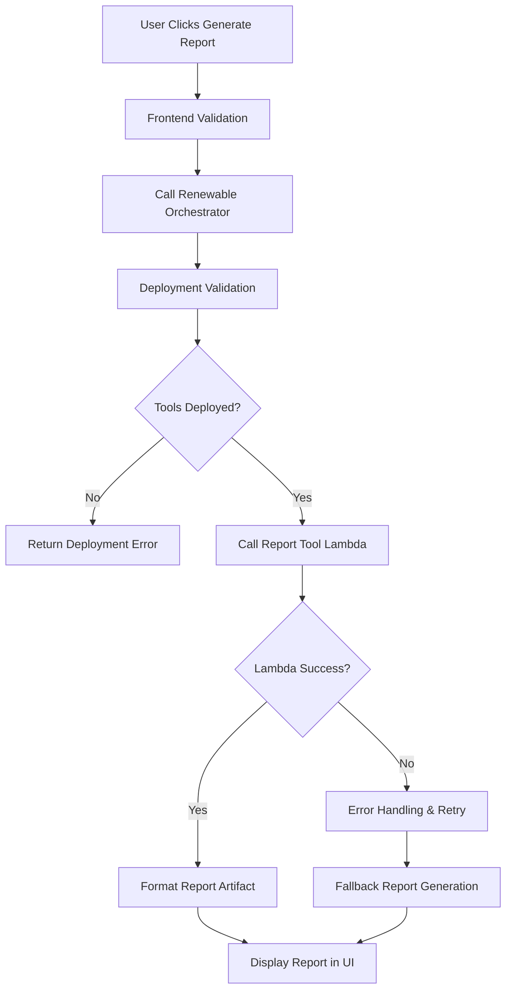

# Design Document

## Overview

This design addresses the broken "generate executive report" functionality in the renewable energy system. The root cause analysis reveals that while the Lambda functions are defined in the backend configuration, they may not be properly deployed or accessible at runtime. The solution implements comprehensive deployment validation, error handling, and fallback mechanisms to ensure reliable report generation.

## Architecture

### Problem Analysis

The current system has these components:
1. **Frontend**: TerrainMapArtifact.tsx with "Generate Report" button
2. **Orchestrator**: renewableOrchestrator Lambda that routes requests
3. **Report Tool**: renewableReportTool Lambda (Python) that generates HTML reports
4. **Backend Config**: Proper environment variable setup in amplify/backend.ts

**Issue**: The Lambda functions are configured but may not be deployed, or there are runtime permission/configuration issues.

### Solution Architecture



## Components and Interfaces

### 1. Deployment Validator

**Purpose**: Validate that renewable energy tools are properly deployed and accessible

```typescript
interface DeploymentStatus {
  isDeployed: boolean;
  missingComponents: string[];
  configurationIssues: string[];
  lastValidated: Date;
}

class RenewableDeploymentValidator {
  // Validation methods
  async validateDeployment(): Promise<DeploymentStatus>;
  async checkLambdaFunctions(): Promise<boolean>;
  async validateEnvironmentVariables(): Promise<string[]>;
  async testLambdaConnectivity(): Promise<boolean>;
  
  // Error reporting
  generateDeploymentReport(): string;
  getRemediationSteps(issues: string[]): string[];
}
```

### 2. Enhanced Error Handler

**Purpose**: Provide detailed error information and fallback mechanisms

```typescript
interface ReportGenerationError {
  type: 'deployment' | 'runtime' | 'timeout' | 'permission';
  message: string;
  details: any;
  remediationSteps: string[];
  canRetry: boolean;
}

class ReportErrorHandler {
  // Error classification
  classifyError(error: any): ReportGenerationError;
  
  // Retry logic
  async retryWithBackoff(operation: () => Promise<any>, maxRetries: number): Promise<any>;
  
  // Fallback generation
  generateFallbackReport(projectId: string, availableData: any): string;
}
```

### 3. Report Generation Service

**Purpose**: Orchestrate report generation with validation and fallbacks

```typescript
interface ReportRequest {
  projectId: string;
  terrainResults?: any;
  layoutResults?: any;
  simulationResults?: any;
  includeRecommendations: boolean;
}

interface ReportResult {
  success: boolean;
  reportHtml?: string;
  error?: ReportGenerationError;
  generatedBy: 'lambda' | 'fallback';
  executionTime: number;
}

class ReportGenerationService {
  // Main generation flow
  async generateReport(request: ReportRequest): Promise<ReportResult>;
  
  // Lambda-based generation
  async generateWithLambda(request: ReportRequest): Promise<string>;
  
  // Fallback generation
  async generateFallbackReport(request: ReportRequest): Promise<string>;
  
  // Validation
  async validatePrerequisites(): Promise<boolean>;
}
```

### 4. Frontend Integration

**Purpose**: Update UI components to handle deployment issues gracefully

```typescript
interface ReportButtonState {
  isLoading: boolean;
  isDisabled: boolean;
  errorMessage?: string;
  deploymentStatus?: DeploymentStatus;
}

// Enhanced TerrainMapArtifact component
class EnhancedTerrainMapArtifact {
  // State management
  private reportButtonState: ReportButtonState;
  
  // Event handlers
  async handleGenerateReport(): Promise<void>;
  async checkDeploymentStatus(): Promise<void>;
  
  // UI updates
  renderReportButton(): JSX.Element;
  renderDeploymentWarning(): JSX.Element;
}
```

## Data Models

### Deployment Configuration

```typescript
interface RenewableConfig {
  // Lambda function names
  orchestratorFunction: string;
  terrainToolFunction: string;
  layoutToolFunction: string;
  simulationToolFunction: string;
  reportToolFunction: string;
  
  // AWS configuration
  region: string;
  s3Bucket?: string;
  
  // Feature flags
  enableLambdaTools: boolean;
  enableFallbackGeneration: boolean;
  
  // Timeouts and retries
  lambdaTimeout: number;
  maxRetries: number;
  retryDelay: number;
}
```

### Report Template

```typescript
interface ReportTemplate {
  projectId: string;
  title: string;
  executiveSummary: string;
  sections: ReportSection[];
  recommendations: string[];
  nextSteps: string[];
  generatedAt: Date;
  generatedBy: string;
}

interface ReportSection {
  title: string;
  content: string;
  data?: any;
  charts?: ChartConfig[];
}
```

## Error Handling

### Error Classification System

1. **Deployment Errors**
   - Lambda function not found
   - Missing environment variables
   - IAM permission issues
   - Region availability issues

2. **Runtime Errors**
   - Lambda execution failures
   - Timeout errors
   - Memory limit exceeded
   - Invalid input parameters

3. **Data Errors**
   - Missing project data
   - Invalid data format
   - Corrupted analysis results

4. **Network Errors**
   - Lambda invocation failures
   - S3 access issues
   - Connectivity problems

### Error Response Format

```typescript
interface ErrorResponse {
  success: false;
  error: {
    type: string;
    message: string;
    code: string;
    details: any;
    timestamp: string;
    requestId: string;
  };
  remediation: {
    steps: string[];
    documentation: string;
    supportContact?: string;
  };
  fallback?: {
    available: boolean;
    message: string;
  };
}
```

## Testing Strategy

### Deployment Validation Tests

1. **Lambda Function Existence**
   - Test that all required Lambda functions are deployed
   - Validate function configurations and permissions
   - Check environment variable setup

2. **Connectivity Tests**
   - Test Lambda invocation from orchestrator
   - Validate S3 bucket access
   - Check IAM role permissions

3. **Configuration Tests**
   - Validate environment variables
   - Test region-specific configurations
   - Check feature flag settings

### Report Generation Tests

1. **Happy Path Tests**
   - Generate report with full project data
   - Generate report with partial data
   - Generate report with no previous data

2. **Error Handling Tests**
   - Lambda function not found
   - Lambda execution timeout
   - Invalid input parameters
   - Network connectivity issues

3. **Fallback Tests**
   - Fallback report generation
   - Fallback with various data scenarios
   - UI handling of fallback reports

### Integration Tests

1. **End-to-End Workflow**
   - Complete renewable energy workflow
   - Report generation at each step
   - Error recovery scenarios

2. **UI Integration**
   - Button state management
   - Error message display
   - Loading state handling

## Implementation Approach

### Phase 1: Deployment Validation
1. Create deployment validator service
2. Add Lambda function existence checks
3. Implement environment variable validation
4. Add connectivity testing

### Phase 2: Error Handling Enhancement
1. Implement comprehensive error classification
2. Add retry logic with exponential backoff
3. Create detailed error messages
4. Add remediation step generation

### Phase 3: Fallback Report Generation
1. Create client-side report template engine
2. Implement fallback report generation
3. Add template customization
4. Integrate with existing data flow

### Phase 4: Frontend Integration
1. Update TerrainMapArtifact component
2. Add deployment status checking
3. Implement error state handling
4. Add user-friendly error messages

### Phase 5: Monitoring and Diagnostics
1. Add comprehensive logging
2. Implement performance monitoring
3. Create deployment health checks
4. Add user feedback collection

## Deployment Strategy

### Configuration Updates

```typescript
// Enhanced renewable configuration
const renewableConfig = {
  // Validate deployment on startup
  validateOnStartup: true,
  
  // Fallback configuration
  enableFallback: true,
  fallbackTemplate: 'basic-wind-farm-report',
  
  // Error handling
  maxRetries: 3,
  retryDelay: 1000,
  timeoutMs: 30000,
  
  // Monitoring
  enableMetrics: true,
  logLevel: 'INFO'
};
```

### Environment Variable Validation

```bash
# Required environment variables
RENEWABLE_ORCHESTRATOR_FUNCTION_NAME=<function-name>
RENEWABLE_REPORT_TOOL_FUNCTION_NAME=<function-name>
RENEWABLE_S3_BUCKET=<bucket-name>
AWS_REGION=<region>

# Optional configuration
RENEWABLE_ENABLE_FALLBACK=true
RENEWABLE_MAX_RETRIES=3
RENEWABLE_TIMEOUT_MS=30000
```

## Success Metrics

### Functional Metrics
- Report generation success rate > 95%
- Average report generation time < 10 seconds
- Error recovery success rate > 90%
- Fallback report quality score > 80%

### User Experience Metrics
- User satisfaction with error messages
- Time to resolution for deployment issues
- Reduction in support tickets
- User adoption of report generation feature

### Technical Metrics
- Lambda cold start impact
- Memory and CPU utilization
- Error rate by error type
- Deployment validation accuracy

## Monitoring and Alerting

### Key Metrics to Monitor
1. **Report Generation Success Rate**
2. **Lambda Function Health**
3. **Deployment Validation Results**
4. **Error Classification Distribution**
5. **Fallback Usage Frequency**

### Alerting Thresholds
- Report generation failure rate > 10%
- Lambda function errors > 5%
- Deployment validation failures > 1%
- Average response time > 15 seconds

### Dashboards
1. **Renewable Energy Health Dashboard**
2. **Report Generation Metrics**
3. **Error Analysis Dashboard**
4. **Deployment Status Overview**