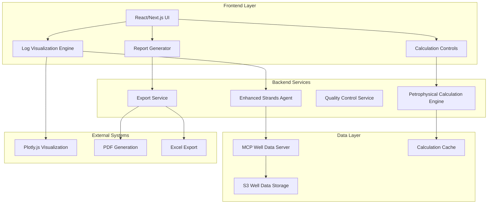

# Design Document

## Overview

The Professional Petrophysical Analysis System will transform the existing well analysis agent into a comprehensive, industry-standard platform for petroleum engineers and geoscientists. The system builds upon the current AWS Amplify architecture with S3 storage for LAS files and extends it with advanced visualization, calculation engines, and professional reporting capabilities.

The design leverages the existing infrastructure while adding new components for log visualization, petrophysical calculations, interactive analysis tools, and professional reporting. The system will maintain the current MCP (Model Context Protocol) integration for well data access while significantly enhancing the frontend visualization and backend calculation capabilities.

## Architecture

### High-Level Architecture



### Current System Integration

The design builds upon the existing system components:

- **AWS Amplify Backend**: Maintains current infrastructure with enhanced Lambda functions
- **S3 Storage**: Continues to store LAS files with improved organization and metadata
- **MCP Server**: Extends the existing Python MCP server with advanced calculation capabilities
- **React Frontend**: Enhances existing components with professional log visualization
- **Strands Agent**: Upgrades the current agent with comprehensive petrophysical expertise

## Components and Interfaces

### 1. Enhanced Log Visualization Engine

**Purpose**: Render industry-standard log displays with professional formatting

**Key Components**:
- `LogPlotViewer`: Main visualization component supporting triple/quad combo displays
- `TrackRenderer`: Individual track rendering with proper scaling and color schemes
- `CurveManager`: Handles curve data, normalization, and environmental corrections
- `InteractionController`: Manages zoom, pan, and selection interactions

**Interfaces**:
```typescript
interface LogPlotConfig {
  wells: string[];
  tracks: TrackConfig[];
  depthRange: [number, number];
  interactive: boolean;
  exportOptions: ExportFormat[];
}

interface TrackConfig {
  type: 'GR' | 'POROSITY' | 'RESISTIVITY' | 'CALCULATED';
  curves: CurveConfig[];
  scale: ScaleConfig;
  fills: FillConfig[];
}

interface CurveConfig {
  name: string;
  color: string;
  lineWidth: number;
  scale: [number, number];
  inverted?: boolean;
}
```

### 2. Petrophysical Calculation Engine

**Purpose**: Perform industry-standard petrophysical calculations with multiple methodologies

**Key Components**:
- `PorosityCalculator`: Density, neutron, and combined porosity calculations
- `ShaleVolumeCalculator`: Larionov, Clavier, and linear methods
- `SaturationCalculator`: Archie, Waxman-Smits, and dual-water models
- `PermeabilityEstimator`: Kozeny-Carman, Timur, and Coates-Dumanoir methods
- `QualityController`: Environmental corrections and data validation

**Interfaces**:
```typescript
interface CalculationRequest {
  wellName: string;
  method: CalculationMethod;
  parameters: CalculationParameters;
  depthRange?: [number, number];
}

interface CalculationResult {
  values: number[];
  depths: number[];
  uncertainty: number[];
  quality: QualityMetrics;
  methodology: string;
}

interface CalculationParameters {
  // Porosity parameters
  matrixDensity?: number;
  fluidDensity?: number;
  
  // Shale volume parameters
  grClean?: number;
  grShale?: number;
  
  // Saturation parameters
  rw?: number;
  a?: number;
  m?: number;
  n?: number;
}
```

### 3. Professional Reporting System

**Purpose**: Generate industry-standard reports and exports

**Key Components**:
- `ReportTemplateEngine`: Manages report templates and layouts
- `PDFGenerator`: Creates high-quality PDF reports with proper formatting
- `ExcelExporter`: Generates Excel workbooks with data and charts
- `LASExporter`: Outputs calculated curves in LAS format
- `PresentationGenerator`: Creates PowerPoint-ready visualizations

**Interfaces**:
```typescript
interface ReportConfig {
  type: 'formation_evaluation' | 'completion_design' | 'reservoir_characterization';
  wells: string[];
  calculations: string[];
  template: string;
  branding?: BrandingConfig;
}

interface ExportOptions {
  format: 'PDF' | 'Excel' | 'LAS' | 'PNG' | 'PowerPoint';
  resolution?: number;
  includeData?: boolean;
  includeCharts?: boolean;
  includeMethodology?: boolean;
}
```

### 4. Interactive Analysis Controls

**Purpose**: Provide real-time parameter adjustment and method selection

**Key Components**:
- `MethodSelector`: Choose calculation methods and parameters
- `ParameterControls`: Adjust calculation parameters with real-time updates
- `CutoffManager`: Set and visualize reservoir quality cutoffs
- `ComparisonTool`: Compare results from different methods

**Interfaces**:
```typescript
interface AnalysisSession {
  wells: string[];
  activeCalculations: ActiveCalculation[];
  parameters: GlobalParameters;
  cutoffs: ReservoirCutoffs;
}

interface ActiveCalculation {
  type: 'porosity' | 'shale_volume' | 'saturation' | 'permeability';
  method: string;
  parameters: CalculationParameters;
  enabled: boolean;
}

interface ReservoirCutoffs {
  vshMax: number;
  porosityMin: number;
  saturationMax: number;
}
```

## Data Models

### 1. Well Log Data Model

```typescript
interface WellLogData {
  wellName: string;
  wellInfo: WellHeaderInfo;
  curves: LogCurve[];
  depthRange: [number, number];
  dataQuality: QualityAssessment;
  lastModified: Date;
}

interface LogCurve {
  name: string;
  unit: string;
  description: string;
  data: number[];
  nullValue: number;
  quality: CurveQuality;
}

interface WellHeaderInfo {
  wellName: string;
  field: string;
  operator: string;
  location: GeographicLocation;
  elevation: number;
  totalDepth: number;
  spudDate?: Date;
}
```

### 2. Calculation Results Model

```typescript
interface CalculationResults {
  wellName: string;
  calculationType: string;
  method: string;
  parameters: CalculationParameters;
  results: CalculationResult[];
  statistics: StatisticalSummary;
  qualityMetrics: QualityMetrics;
  timestamp: Date;
}

interface StatisticalSummary {
  mean: number;
  median: number;
  standardDeviation: number;
  min: number;
  max: number;
  percentiles: { [key: string]: number };
}

interface QualityMetrics {
  dataCompleteness: number;
  environmentalCorrections: string[];
  uncertaintyRange: [number, number];
  confidenceLevel: 'high' | 'medium' | 'low';
}
```

### 3. Multi-Well Analysis Model

```typescript
interface MultiWellAnalysis {
  analysisId: string;
  wells: string[];
  correlationMethod: string;
  geologicalMarkers: GeologicalMarker[];
  reservoirZones: ReservoirZone[];
  completionTargets: CompletionTarget[];
  statistics: MultiWellStatistics;
}

interface ReservoirZone {
  name: string;
  topDepth: number;
  bottomDepth: number;
  averagePorosity: number;
  averagePermeability: number;
  netToGross: number;
  quality: 'excellent' | 'good' | 'fair' | 'poor';
}

interface CompletionTarget {
  wellName: string;
  startDepth: number;
  endDepth: number;
  thickness: number;
  averagePorosity: number;
  estimatedPermeability: number;
  ranking: number;
}
```

## Error Handling

### 1. Data Validation and Quality Control

**Validation Layers**:
- **Input Validation**: Verify LAS file format and curve completeness
- **Environmental Corrections**: Apply borehole and tool corrections
- **Statistical Validation**: Detect and flag outliers and inconsistencies
- **Geological Validation**: Check for reasonable geological relationships

**Error Recovery**:
```typescript
interface ValidationResult {
  isValid: boolean;
  errors: ValidationError[];
  warnings: ValidationWarning[];
  corrections: AppliedCorrection[];
}

interface ValidationError {
  type: 'missing_curve' | 'invalid_data' | 'format_error';
  severity: 'critical' | 'major' | 'minor';
  message: string;
  suggestedFix?: string;
}
```

### 2. Calculation Error Handling

**Error Types**:
- **Parameter Errors**: Invalid or missing calculation parameters
- **Numerical Errors**: Division by zero, invalid mathematical operations
- **Data Errors**: Insufficient data for reliable calculations
- **Method Errors**: Inappropriate method for geological conditions

**Fallback Strategies**:
- Alternative calculation methods when primary method fails
- Interpolation for missing data points
- Default parameters based on regional geology
- Uncertainty quantification for questionable results

### 3. Visualization Error Handling

**Rendering Errors**:
- Graceful degradation when Plotly fails to load
- Alternative chart libraries as fallbacks
- Static image generation when interactive charts fail
- Clear error messages with suggested solutions

## Testing Strategy

### 1. Unit Testing

**Calculation Engine Tests**:
- Test each petrophysical calculation method with known inputs/outputs
- Validate against published industry examples
- Test edge cases and boundary conditions
- Verify uncertainty calculations

**Component Tests**:
- Test log visualization components with synthetic data
- Validate export functionality with various formats
- Test interactive controls and parameter updates
- Verify error handling and recovery

### 2. Integration Testing

**End-to-End Workflows**:
- Complete analysis workflow from LAS file to final report
- Multi-well correlation and comparison workflows
- Export and import of analysis results
- Real-time parameter adjustment and recalculation

**Performance Testing**:
- Large dataset handling (100+ wells)
- Real-time calculation performance
- Memory usage optimization
- Concurrent user scenarios

### 3. Validation Testing

**Industry Benchmark Validation**:
- Compare results with Techlog, Geolog, and IP software
- Validate against published case studies
- Test with real field data from multiple basins
- Verify compliance with industry standards (SPE, SPWLA)

**User Acceptance Testing**:
- Professional petroleum engineer review
- Workflow efficiency testing
- Report quality assessment
- Export format compatibility testing

### 4. Test Data Strategy

**Synthetic Test Data**:
- Generate synthetic LAS files with known properties
- Create test cases for various geological scenarios
- Build validation datasets with expected results

**Real Data Testing**:
- Use anonymized field data for realistic testing
- Test with various log suites and data quality levels
- Validate with different geological formations

## Implementation Phases

### Phase 1: Enhanced Log Visualization (Weeks 1-4)
- Implement triple combo log display with industry-standard formatting
- Add interactive zoom, pan, and selection capabilities
- Integrate with existing MCP well data server
- Basic quality control and data validation

### Phase 2: Advanced Calculations (Weeks 5-8)
- Implement comprehensive petrophysical calculation engine
- Add multiple methods for porosity, shale volume, and saturation
- Real-time parameter adjustment and recalculation
- Statistical analysis and uncertainty quantification

### Phase 3: Professional Reporting (Weeks 9-12)
- Develop report generation system with industry templates
- Implement high-quality PDF and Excel export capabilities
- Add LAS file export with calculated curves
- Create presentation-ready visualizations

### Phase 4: Multi-Well Analysis (Weeks 13-16)
- Implement well correlation and comparison tools
- Add geological marker and formation top management
- Develop completion target identification and ranking
- Advanced statistical analysis across multiple wells

This design provides a comprehensive foundation for transforming the current well analysis system into a professional-grade petrophysical analysis platform that meets industry standards and expectations.