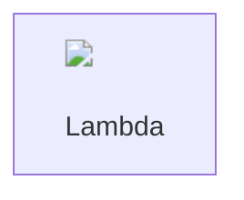

# AWS re:Invent Architecture Diagrams

High-resolution architecture diagrams for the AWS Energy Data Insights platform chalk talk presentation.

## 📁 Directory Structure

```
.kiro/specs/reinvent-architecture-diagram/
├── diagrams/              # Source Mermaid files (.mmd)
├── output/                # Generated diagrams (PNG, SVG, PDF)
├── scripts/               # Generation scripts
├── aws-icons/             # AWS Architecture Icons (download separately)
└── README.md              # This file
```

## 🎨 Available Diagrams

### 1. High-Level Architecture (`01-high-level-architecture.mmd`)
Complete system architecture showing all AWS services and their interactions.
- **Use for**: Overview of entire platform
- **Format**: Flowchart
- **Services**: API Gateway, Lambda, DynamoDB, S3, Bedrock, Cognito

### 2. Authentication Flow (`02-authentication-flow.mmd`)
Detailed sequence diagram of user authentication and JWT validation.
- **Use for**: Explaining security architecture
- **Format**: Sequence diagram
- **Key points**: JWT validation, Cognito integration, Lambda authorizer

### 3. Agent Routing Flow (`03-agent-routing-flow.mmd`)
Shows how user queries are routed to specialized agents.
- **Use for**: Demonstrating AgentCore integration
- **Format**: Sequence diagram
- **Key points**: Intent detection, async processing, artifact generation

### 4. Async Processing Pattern (`04-async-processing-pattern.mmd`)
Illustrates the fire-and-forget pattern for long-running analyses.
- **Use for**: Explaining timeout handling
- **Format**: Sequence diagram with alternatives
- **Key points**: 25s timeout, polling pattern, background processing

### 5. Multi-Agent Orchestration (`05-multi-agent-orchestration.mmd`)
Hierarchical agent architecture with specialized agents.
- **Use for**: Showing agent specialization
- **Format**: Hierarchical flowchart
- **Key points**: Agent router, domain-specific agents, tool integration

### 6. Data Flow Architecture (`06-data-flow-architecture.mmd`)
End-to-end data flow from user to response.
- **Use for**: Understanding data pipeline
- **Format**: Linear flowchart
- **Key points**: Request flow, data persistence, artifact retrieval

### 6. Authentication Flow - Detailed (`06-authentication-flow.mmd`)
Complete sequence diagram showing authentication and JWT validation with timing.
- **Use for**: Deep dive into security architecture
- **Format**: Sequence diagram with timing annotations
- **Key points**: Cognito auth (200ms), JWT validation (100ms), error handling
- **Total latency**: ~500ms

### 7. Simple Query - Petrophysics (`07-simple-query-petrophysics.mmd`)
End-to-end flow for a basic petrophysics query with tool invocation.
- **Use for**: Demonstrating single-agent workflow
- **Format**: Sequence diagram with timing annotations
- **Key points**: Intent detection, S3 data access, tool Lambda, Bedrock AI
- **Total latency**: 3-5 seconds

### 8. Complex Orchestration - Renewable (`08-complex-orchestration-renewable.mmd`)
Multi-tool async orchestration for renewable energy analysis.
- **Use for**: Showing complex workflow patterns
- **Format**: Sequence diagram with timing annotations
- **Key points**: Async invocation, 4 tool Lambdas, polling pattern, artifacts
- **Total latency**: 45-60 seconds

### 9. Chalk Talk Simple (`07-chalk-talk-simple.mmd`)
Simplified diagram with hand-drawn aesthetic and emojis.
- **Use for**: Quick overview during live presentation
- **Format**: Simple flowchart with icons
- **Key points**: High-level flow, easy to understand

## 📖 Service Flow Diagrams

The service flow diagrams (06, 07, 08) provide detailed sequence diagrams with timing annotations and error handling paths. These are essential for understanding the complete request/response lifecycle.

**Quick Reference**: See `diagrams/QUICK-REFERENCE.md` for timing benchmarks and common patterns.

**Detailed Documentation**: See `diagrams/SERVICE-FLOW-README.md` for comprehensive usage guide.

### Key Features
- **Timing Annotations**: Every operation shows typical latency
- **Error Handling**: All error scenarios documented with recovery paths
- **Service Configuration**: Lambda timeout and memory settings shown
- **Data Structures**: Request/response formats in notes
- **Performance Insights**: Optimization opportunities highlighted

### Use Cases
- **Debugging**: Trace request flow to identify bottlenecks
- **Optimization**: Identify high-latency operations
- **Documentation**: Explain system behavior to stakeholders
- **Monitoring**: Set up CloudWatch dashboards matching flows
- **Presentations**: Show complete system behavior with timing

## 🚀 Quick Start

### Prerequisites

Install Mermaid CLI:
```bash
npm install -g @mermaid-js/mermaid-cli
```

### Generate All Diagrams

```bash
cd .kiro/specs/reinvent-architecture-diagram
./scripts/generate-diagrams.sh
```

This will generate:
- **PNG files** (1920x1080, 2x scale) → `output/png/`
- **SVG files** (vector format) → `output/svg/`
- **PDF files** (for printing) → `output/pdf/`

### Generate Single Diagram

```bash
mmdc -i diagrams/01-high-level-architecture.mmd \
     -o output/png/architecture.png \
     -w 1920 -H 1080 -s 2 -b transparent
```

## 🎯 AWS Architecture Icons

### Download Official Icons

1. Visit: https://aws.amazon.com/architecture/icons/
2. Download "AWS Architecture Icons" package
3. Extract to `aws-icons/` directory

### Icon Categories

- **Compute**: Lambda, EC2
- **Storage**: S3, EBS
- **Database**: DynamoDB, RDS
- **Security**: Cognito, IAM
- **AI/ML**: Bedrock, SageMaker
- **Networking**: API Gateway, CloudFront

### Adding Icons to Diagrams

#### Method 1: Mermaid with HTML (Limited Support)


#### Method 2: Post-Processing with Draw.io
1. Generate base diagram with Mermaid
2. Import SVG into Draw.io
3. Add AWS icons from Draw.io AWS library
4. Export as PNG/PDF

#### Method 3: PowerPoint/Keynote
1. Use generated PNG as base layer
2. Add AWS icons from official icon set
3. Export as high-resolution image

## 📊 Presentation Guidelines

### For Slides
- Use **PNG files** at 1920x1080 resolution
- Transparent background works best
- Scale to fit slide dimensions

### For Handouts
- Use **PDF files** for printing
- White background for better print quality
- Consider A4/Letter size

### For Documentation
- Use **SVG files** for web documentation
- Scalable without quality loss
- Smaller file size

### For Live Demo
- Use **Chalk Talk Simple** diagram
- Large fonts and emojis for visibility
- Minimal complexity for quick understanding

## 🎨 Customization

### Color Scheme (AWS Brand Colors)

```json
{
  "primaryColor": "#ff9900",      // AWS Orange
  "secondaryColor": "#ec7211",    // Dark Orange
  "primaryTextColor": "#232f3e",  // AWS Dark Blue
  "lineColor": "#545b64",         // Gray
  "tertiaryColor": "#ffffff"      // White
}
```

### Modify Diagram Theme

Edit `output/mermaid-config.json`:
```json
{
  "theme": "default",
  "themeVariables": {
    "primaryColor": "#your-color",
    "fontSize": "16px"
  }
}
```

### Add Custom Styling

In Mermaid files:
```mermaid
style NodeName fill:#ff9900,stroke:#232f3e,stroke-width:3px
```

## 📝 Diagram Descriptions

### Authentication Flow Details (06)
- **Step 1-3**: User authentication with Cognito (200ms)
- **Step 4-6**: JWT token validation by Lambda authorizer (100ms)
- **Step 7-9**: Authorized request processing
- **Error Handling**: Invalid credentials, expired tokens, rate limiting
- **Key Security**: JWT signature verification, HTTPS only, token refresh

### Simple Query Details (07)
- **Intent Detection**: Pattern matching on user query (10ms)
- **Data Retrieval**: S3 LAS file access (100ms)
- **Tool Invocation**: Petrophysics calculator (500ms)
- **AI Generation**: Bedrock Claude response (1000ms)
- **Thought Steps**: Transparent reasoning at each stage
- **Error Handling**: Data not found, calculation errors, Bedrock throttling

### Complex Orchestration Details (08)
- **Async Pattern**: Fire-and-forget invocation (2s sync response)
- **Tool Sequence**: Terrain (15s) → Layout (12s) → Simulation (15s) → Report (8s)
- **Polling**: Frontend polls every 2 seconds for updates
- **Artifacts**: 4 artifacts stored in S3 and rendered in UI
- **Error Handling**: Timeouts, storage failures, partial results
- **User Experience**: Progressive updates via thought steps

### Agent Routing Details
- **Intent Detection**: Pattern matching on user query
- **Agent Selection**: Route to specialized agent
- **Async Processing**: Long-running tasks handled asynchronously
- **Polling**: Frontend polls for results every 2 seconds

### Async Processing Details
- **Timeout Threshold**: 25 seconds
- **Sync Path**: Fast queries return immediately
- **Async Path**: Long queries processed in background
- **User Experience**: "Processing" message with polling

## 🔧 Troubleshooting

### Issue: mmdc command not found
**Solution**: Install mermaid-cli globally
```bash
npm install -g @mermaid-js/mermaid-cli
```

### Issue: Puppeteer errors
**Solution**: Install Chromium dependencies
```bash
# macOS
brew install chromium

# Ubuntu/Debian
apt-get install -y chromium-browser
```

### Issue: Low resolution output
**Solution**: Increase scale factor
```bash
mmdc -i input.mmd -o output.png -s 3  # 3x scale
```

### Issue: Diagram too large
**Solution**: Split into multiple diagrams or simplify

## 📚 Additional Resources

- **Mermaid Documentation**: https://mermaid.js.org/
- **AWS Architecture Icons**: https://aws.amazon.com/architecture/icons/
- **AWS Well-Architected**: https://aws.amazon.com/architecture/well-architected/
- **Diagram Best Practices**: https://aws.amazon.com/architecture/reference-architecture-diagrams/

## 🎤 Presentation Tips

### For Chalk Talk
1. Start with simple diagram (07-chalk-talk-simple)
2. Explain user flow step-by-step
3. Deep dive into specific flows as needed
4. Use authentication flow for security discussion
5. Use agent routing for AgentCore demo

### Key Talking Points
- **Multi-agent architecture**: Specialized agents for different domains
- **Async processing**: Handle long-running analyses without timeouts
- **Thought steps**: Transparent reasoning for user trust
- **Starter kit pattern**: Easy to extend with new agents
- **AWS best practices**: Security, scalability, cost optimization

### Demo Flow
1. Show high-level architecture
2. Explain authentication flow
3. Demonstrate agent routing with live query
4. Show async processing for complex analysis
5. Highlight multi-agent orchestration
6. Discuss data flow and artifact storage

## 📦 Deliverables Checklist

- [x] High-resolution PNG diagrams (1920x1080)
- [x] SVG vector diagrams
- [x] PDF diagrams for printing
- [x] Simplified chalk talk version
- [x] Separate diagrams for each major flow
- [x] Service call flow diagrams with timing annotations
- [x] Authentication flow sequence diagram
- [x] Simple query sequence diagram (petrophysics)
- [x] Complex orchestration sequence diagram (renewable)
- [x] Error handling paths documented
- [ ] AWS service icons integrated (manual step)
- [x] Generation scripts
- [x] Documentation and usage guide

## 🚀 Next Steps

1. **Generate diagrams**: Run `./scripts/generate-diagrams.sh`
2. **Download AWS icons**: Get official icon set
3. **Enhance with icons**: Add AWS service icons to diagrams
4. **Review output**: Check all generated files
5. **Test in presentation**: Import into slides
6. **Prepare handouts**: Print PDF versions
7. **Practice demo**: Rehearse with diagrams

## 📄 License

These diagrams are created for the AWS re:Invent chalk talk presentation. AWS service names and icons are trademarks of Amazon Web Services, Inc.
