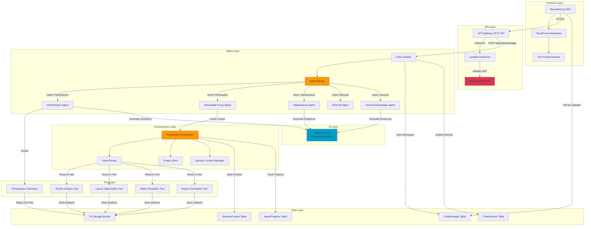
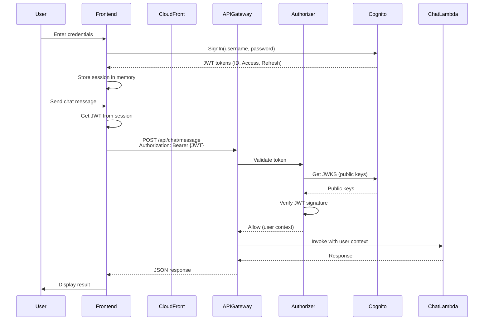
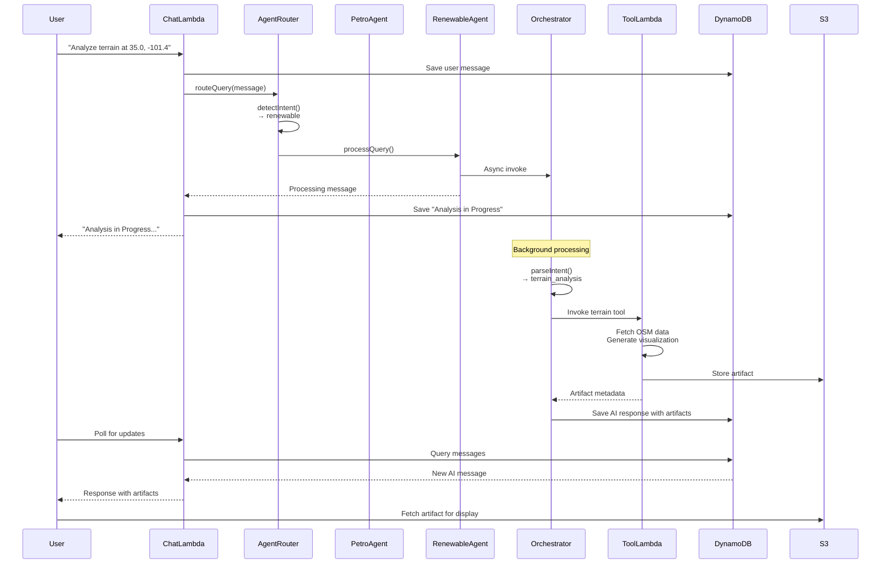
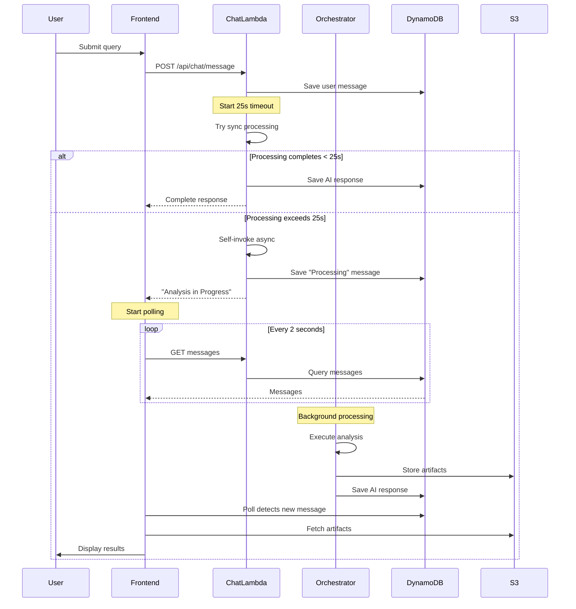
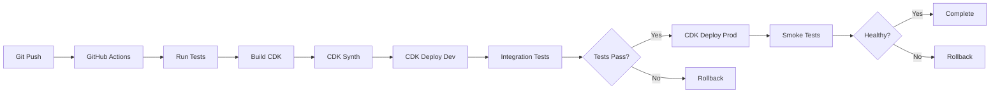

# Architecture Design Document

## Overview

This document provides comprehensive architecture diagrams, IAM permissions, and integration patterns for the AWS Energy Data Insights platform. The design focuses on demonstrating AgentCore integration and providing a reusable starter kit pattern for technical audiences at AWS re:Invent.

## High-Level Architecture

### System Components

The platform consists of the following major components:

1. **Frontend Layer**: React/Next.js SPA hosted on S3 + CloudFront
2. **API Layer**: API Gateway HTTP API with Lambda authorizer
3. **Agent Layer**: Multi-agent system with specialized agents
4. **Orchestration Layer**: Renewable energy orchestrator for complex workflows
5. **Tool Layer**: Python-based tool Lambdas for domain-specific processing
6. **Data Layer**: DynamoDB for persistence, S3 for artifacts
7. **AI Layer**: AWS Bedrock for LLM capabilities

### Architecture Diagram (Mermaid)




## Detailed Component Design

### 1. Authentication Flow



**Key Security Features:**
- JWT tokens transmitted over HTTPS only
- Tokens stored in memory (not localStorage)
- 1-hour token expiration with automatic refresh
- Lambda authorizer validates signature against Cognito JWKS
- User context passed to backend Lambdas via authorizer

### 2. Agent Routing Pattern




### 3. Multi-Agent Orchestration Pattern

The platform uses a **hierarchical agent architecture** with specialized agents for different domains:

```
AgentRouter (Traffic Controller)
├── Petrophysics Agent (Oil & Gas Analysis)
│   ├── Well data discovery
│   ├── Log curve analysis
│   ├── Porosity/shale/saturation calculations
│   └── Multi-well correlation
├── Renewable Proxy Agent (Wind Farm Analysis)
│   └── Orchestrator Lambda
│       ├── Terrain Analysis Tool
│       ├── Layout Optimization Tool
│       ├── Wake Simulation Tool
│       └── Report Generation Tool
├── Maintenance Agent (Equipment Monitoring)
│   └── Equipment status and predictive maintenance
├── EDIcraft Agent (Minecraft Visualization)
│   └── 3D subsurface visualization
└── General Knowledge Agent (Fallback)
    └── General queries and weather
```

**Intent Detection Pattern:**

```typescript
// Priority-based pattern matching
const intents = [
  // Priority 1: Exact preloaded prompt matches
  { type: 'well_data_discovery', patterns: [...], priority: 1 },
  
  // Priority 2: Domain-specific patterns
  { type: 'renewable', patterns: [/wind.*farm/, /terrain.*analysis/], priority: 2 },
  { type: 'maintenance', patterns: [/equipment.*status/], priority: 2 },
  
  // Priority 3: General patterns
  { type: 'petrophysics', patterns: [/porosity/, /shale/], priority: 3 },
  
  // Priority 4: Fallback
  { type: 'general', patterns: [/.*/], priority: 4 }
];

// Test patterns in priority order
for (const intent of intents.sort((a, b) => a.priority - b.priority)) {
  if (intent.patterns.some(p => p.test(query))) {
    return intent.type;
  }
}
```

### 4. Thought Step Pattern (Chain of Thought)

The platform implements transparent reasoning through thought steps:

```typescript
interface ThoughtStep {
  id: string;
  type: 'intent_detection' | 'parameter_extraction' | 'tool_selection' | 
        'execution' | 'completion';
  timestamp: number;
  title: string;
  summary: string;
  status: 'in_progress' | 'complete' | 'error';
  context?: Record<string, any>;
  confidence?: number;
  duration?: number;
}

// Example thought step generation
const thoughtSteps: ThoughtStep[] = [];

// Step 1: Intent Detection
thoughtSteps.push({
  id: 'step_1',
  type: 'intent_detection',
  timestamp: Date.now(),
  title: 'Analyzing User Request',
  summary: 'Processing natural language input to understand analysis requirements',
  status: 'in_progress'
});

// ... perform intent detection ...

thoughtSteps[0].status = 'complete';
thoughtSteps[0].summary = 'Intent detected: terrain_analysis with 10/10 confidence';
thoughtSteps[0].confidence = 1.0;
```

This provides transparency into agent decision-making and helps users understand the analysis process.


## IAM Permissions Matrix

### Lambda Authorizer Permissions

**Service Role:** `AuthorizerLambdaRole`

```json
{
  "Version": "2012-10-17",
  "Statement": [
    {
      "Effect": "Allow",
      "Action": [
        "cognito-idp:DescribeUserPool",
        "cognito-idp:DescribeUserPoolClient"
      ],
      "Resource": "arn:aws:cognito-idp:us-east-1:*:userpool/us-east-1_sC6yswGji"
    },
    {
      "Effect": "Allow",
      "Action": [
        "logs:CreateLogGroup",
        "logs:CreateLogStream",
        "logs:PutLogEvents"
      ],
      "Resource": "arn:aws:logs:us-east-1:*:log-group:/aws/lambda/authorizer:*"
    }
  ]
}
```

**Required Actions:**
- `cognito-idp:DescribeUserPool` - Retrieve user pool configuration for JWT validation
- `cognito-idp:DescribeUserPoolClient` - Get client configuration
- `logs:*` - CloudWatch logging (standard Lambda permissions)

### Chat Lambda Permissions

**Service Role:** `ChatLambdaRole`

```json
{
  "Version": "2012-10-17",
  "Statement": [
    {
      "Effect": "Allow",
      "Action": [
        "dynamodb:PutItem",
        "dynamodb:GetItem",
        "dynamodb:Query",
        "dynamodb:UpdateItem"
      ],
      "Resource": [
        "arn:aws:dynamodb:us-east-1:*:table/ChatMessage-*",
        "arn:aws:dynamodb:us-east-1:*:table/ChatMessage-*/index/*",
        "arn:aws:dynamodb:us-east-1:*:table/ChatSession-*",
        "arn:aws:dynamodb:us-east-1:*:table/SessionContext-*"
      ]
    },
    {
      "Effect": "Allow",
      "Action": [
        "s3:GetObject",
        "s3:PutObject"
      ],
      "Resource": "arn:aws:s3:::storage-bucket/*"
    },
    {
      "Effect": "Allow",
      "Action": [
        "bedrock:InvokeModel",
        "bedrock:InvokeModelWithResponseStream"
      ],
      "Resource": "arn:aws:bedrock:us-east-1::foundation-model/anthropic.claude-3-5-sonnet-*"
    },
    {
      "Effect": "Allow",
      "Action": "lambda:InvokeFunction",
      "Resource": [
        "arn:aws:lambda:us-east-1:*:function:petrophysics-calculator",
        "arn:aws:lambda:us-east-1:*:function:renewable-orchestrator"
      ]
    }
  ]
}
```

**Required Actions:**
- `dynamodb:PutItem` - Save chat messages and sessions
- `dynamodb:Query` - Retrieve conversation history (GSI queries)
- `s3:GetObject` - Read LAS files for analysis
- `s3:PutObject` - Store generated artifacts
- `bedrock:InvokeModel` - Call Claude for AI responses
- `lambda:InvokeFunction` - Invoke specialized tool Lambdas


## IAM Permissions Matrix

### Lambda Authorizer Permissions

**Service Role:** `CustomAuthorizerRole`

```json
{
  "Version": "2012-10-17",
  "Statement": [
    {
      "Effect": "Allow",
      "Action": [
        "cognito-idp:DescribeUserPool",
        "cognito-idp:DescribeUserPoolClient"
      ],
      "Resource": "arn:aws:cognito-idp:us-east-1:*:userpool/us-east-1_*"
    },
    {
      "Effect": "Allow",
      "Action": [
        "logs:CreateLogGroup",
        "logs:CreateLogStream",
        "logs:PutLogEvents"
      ],
      "Resource": "arn:aws:logs:*:*:*"
    }
  ]
}
```

**Required for:** JWT token validation against Cognito JWKS

### Chat Lambda Permissions

**Service Role:** `ChatLambdaRole`

```json
{
  "Version": "2012-10-17",
  "Statement": [
    {
      "Effect": "Allow",
      "Action": [
        "dynamodb:PutItem",
        "dynamodb:GetItem",
        "dynamodb:Query",
        "dynamodb:UpdateItem"
      ],
      "Resource": [
        "arn:aws:dynamodb:*:*:table/ChatMessage-*",
        "arn:aws:dynamodb:*:*:table/ChatMessage-*/index/*",
        "arn:aws:dynamodb:*:*:table/ChatSession-*",
        "arn:aws:dynamodb:*:*:table/SessionContext-*"
      ]
    },
    {
      "Effect": "Allow",
      "Action": [
        "s3:GetObject",
        "s3:PutObject"
      ],
      "Resource": "arn:aws:s3:::storage-bucket/*"
    },
    {
      "Effect": "Allow",
      "Action": [
        "bedrock:InvokeModel",
        "bedrock:InvokeModelWithResponseStream"
      ],
      "Resource": "arn:aws:bedrock:*:*:foundation-model/anthropic.claude-*"
    },
    {
      "Effect": "Allow",
      "Action": "lambda:InvokeFunction",
      "Resource": [
        "arn:aws:lambda:*:*:function:petrophysics-calculator",
        "arn:aws:lambda:*:*:function:renewable-orchestrator",
        "arn:aws:lambda:*:*:function:*-chat" 
      ]
    }
  ]
}
```

**Required for:**
- Saving/retrieving chat messages and sessions
- Storing artifacts in S3
- Invoking Bedrock for AI responses
- Calling specialized Lambda functions
- Self-invocation for async processing

### Renewable Orchestrator Permissions

**Service Role:** `RenewableOrchestratorRole`

```json
{
  "Version": "2012-10-17",
  "Statement": [
    {
      "Effect": "Allow",
      "Action": [
        "dynamodb:PutItem",
        "dynamodb:GetItem",
        "dynamodb:Query",
        "dynamodb:UpdateItem"
      ],
      "Resource": [
        "arn:aws:dynamodb:*:*:table/ChatMessage-*",
        "arn:aws:dynamodb:*:*:table/SessionContext-*",
        "arn:aws:dynamodb:*:*:table/AgentProgress-*"
      ]
    },
    {
      "Effect": "Allow",
      "Action": [
        "s3:GetObject",
        "s3:PutObject",
        "s3:ListBucket"
      ],
      "Resource": [
        "arn:aws:s3:::storage-bucket",
        "arn:aws:s3:::storage-bucket/*"
      ]
    },
    {
      "Effect": "Allow",
      "Action": "lambda:InvokeFunction",
      "Resource": [
        "arn:aws:lambda:*:*:function:renewable-tools-*"
      ]
    }
  ]
}
```

**Required for:**
- Managing project lifecycle and session context
- Storing analysis results and artifacts
- Invoking tool Lambdas for terrain, layout, simulation, reports

### Tool Lambda Permissions (Python)

**Service Role:** `RenewableToolsRole`

```json
{
  "Version": "2012-10-17",
  "Statement": [
    {
      "Effect": "Allow",
      "Action": [
        "s3:PutObject",
        "s3:GetObject"
      ],
      "Resource": "arn:aws:s3:::storage-bucket/renewable-projects/*"
    }
  ]
}
```

**Required for:** Storing generated visualizations and analysis artifacts

### Petrophysics Calculator Permissions

**Service Role:** `PetrophysicsCalculatorRole`

```json
{
  "Version": "2012-10-17",
  "Statement": [
    {
      "Effect": "Allow",
      "Action": "s3:GetObject",
      "Resource": "arn:aws:s3:::storage-bucket/well-data/*"
    }
  ]
}
```

**Required for:** Reading LAS files for petrophysical calculations


## AgentCore Integration Pattern

### Overview

The platform uses a **custom AgentCore implementation** rather than AWS Bedrock Agents directly. This provides:

1. **Fine-grained control** over agent routing and orchestration
2. **Multi-model support** (Claude 3.5 Sonnet via Bedrock)
3. **Custom tool integration** via Lambda functions
4. **Transparent reasoning** through thought steps
5. **Flexible intent detection** with pattern matching

### Agent Architecture

```
┌─────────────────────────────────────────────────────────────┐
│                      Chat Lambda                             │
│  ┌───────────────────────────────────────────────────────┐  │
│  │              Agent Router                              │  │
│  │  - Intent detection via pattern matching              │  │
│  │  - Priority-based routing                             │  │
│  │  - Context preservation                               │  │
│  └───────────────────────────────────────────────────────┘  │
│                           │                                  │
│         ┌─────────────────┼─────────────────┐               │
│         ▼                 ▼                 ▼               │
│  ┌──────────┐      ┌──────────┐     ┌──────────┐          │
│  │  Petro   │      │ Renewable│     │ General  │          │
│  │  Agent   │      │  Agent   │     │  Agent   │          │
│  └──────────┘      └──────────┘     └──────────┘          │
│       │                  │                 │                │
│       ▼                  ▼                 ▼                │
│  ┌──────────┐      ┌──────────┐     ┌──────────┐          │
│  │   MCP    │      │Orchestr- │     │ Bedrock  │          │
│  │  Tools   │      │  ator    │     │  Claude  │          │
│  └──────────┘      └──────────┘     └──────────┘          │
└─────────────────────────────────────────────────────────────┘
```

### Key Components

#### 1. Agent Router (`agentRouter.ts`)

**Responsibilities:**
- Receive user query and conversation history
- Detect user intent via pattern matching
- Route to appropriate specialized agent
- Preserve session context

**Intent Detection Algorithm:**

```typescript
class AgentRouter {
  private determineAgentType(message: string): AgentType {
    const lowerMessage = message.toLowerCase();
    
    // Priority 1: EDIcraft (Minecraft visualization)
    if (this.matchesPatterns(lowerMessage, edicraftPatterns)) {
      return 'edicraft';
    }
    
    // Priority 2: Maintenance (equipment monitoring)
    if (this.matchesPatterns(lowerMessage, maintenancePatterns)) {
      return 'maintenance';
    }
    
    // Priority 3: Renewable energy
    if (this.matchesPatterns(lowerMessage, renewablePatterns)) {
      return 'renewable';
    }
    
    // Priority 4: Petrophysics
    if (this.matchesPatterns(lowerMessage, petrophysicsPatterns)) {
      return 'petrophysics';
    }
    
    // Default: General knowledge
    return 'general';
  }
  
  async routeQuery(message: string, context?: SessionContext) {
    const agentType = this.determineAgentType(message);
    
    switch (agentType) {
      case 'renewable':
        return await this.renewableAgent.processQuery(message, [], context);
      case 'petrophysics':
        return await this.petrophysicsAgent.processMessage(message);
      // ... other agents
    }
  }
}
```

#### 2. Base Enhanced Agent (`BaseEnhancedAgent.ts`)

**Responsibilities:**
- Provide common agent functionality
- Generate verbose thought steps
- Handle errors consistently
- Format responses uniformly

**Thought Step Generation:**

```typescript
class BaseEnhancedAgent {
  protected generateThoughtSteps(
    operation: string,
    details: string
  ): ThoughtStep[] {
    return [
      {
        id: `step_${Date.now()}`,
        type: 'execution',
        timestamp: Date.now(),
        title: operation,
        summary: details,
        status: 'complete'
      }
    ];
  }
}
```

#### 3. Specialized Agents

Each agent extends `BaseEnhancedAgent` and implements domain-specific logic:

**Petrophysics Agent:**
- Well data discovery
- Log curve analysis
- Porosity/shale/saturation calculations
- Multi-well correlation
- Integrates with MCP server for calculations

**Renewable Proxy Agent:**
- Acts as proxy to Python orchestrator
- Handles async invocation for long-running analysis
- Transforms orchestrator responses to platform format
- Manages project lifecycle

**Maintenance Agent:**
- Equipment status monitoring
- Predictive maintenance analysis
- Failure prediction

**EDIcraft Agent:**
- 3D subsurface visualization in Minecraft
- Wellbore trajectory building
- Horizon surface rendering

**General Knowledge Agent:**
- Fallback for general queries
- Weather information
- Conversational responses


## Starter Kit Pattern: Adding a New Agent

### Step-by-Step Integration Guide

#### Step 1: Create Agent Class

Create a new agent file in `cdk/lambda-functions/chat/agents/`:

```typescript
// myNewAgent.ts
import { BaseEnhancedAgent } from './BaseEnhancedAgent';

export class MyNewAgent extends BaseEnhancedAgent {
  constructor() {
    super(true); // Enable verbose logging
  }

  async processMessage(message: string): Promise<any> {
    const thoughtSteps = [];
    
    // Step 1: Intent detection
    thoughtSteps.push(this.createThoughtStep(
      'intent_detection',
      'Analyzing Request',
      'Understanding user intent for my domain'
    ));
    
    // Step 2: Execute domain logic
    const result = await this.executeDomainLogic(message);
    
    // Step 3: Return response
    return {
      success: true,
      message: result.message,
      artifacts: result.artifacts || [],
      thoughtSteps
    };
  }
  
  private async executeDomainLogic(message: string) {
    // Your domain-specific logic here
    return {
      message: 'Analysis complete',
      artifacts: []
    };
  }
}
```

#### Step 2: Register with Agent Router

Update `agentRouter.ts`:

```typescript
import { MyNewAgent } from './myNewAgent';

export class AgentRouter {
  private myNewAgent: MyNewAgent;
  
  constructor() {
    // ... existing agents
    this.myNewAgent = new MyNewAgent();
  }
  
  private determineAgentType(message: string): AgentType {
    // Add your patterns at appropriate priority level
    const myNewPatterns = [
      /my.*domain.*keyword/i,
      /specific.*pattern/i
    ];
    
    if (this.matchesPatterns(message, myNewPatterns)) {
      return 'mynew';
    }
    
    // ... existing patterns
  }
  
  async routeQuery(message: string, context?: SessionContext) {
    const agentType = this.determineAgentType(message);
    
    switch (agentType) {
      case 'mynew':
        return await this.myNewAgent.processMessage(message);
      // ... existing cases
    }
  }
}
```

#### Step 3: Add Tool Lambda (if needed)

If your agent needs specialized processing, create a tool Lambda:

```typescript
// cdk/lib/main-stack.ts
const myNewToolFunction = new lambda.Function(this, 'MyNewToolFunction', {
  functionName: 'my-new-tool',
  runtime: lambda.Runtime.PYTHON_3_12, // or NODEJS_20_X
  handler: 'handler.handler',
  code: lambda.Code.fromAsset(path.join(__dirname, '../lambda-functions/my-new-tool')),
  timeout: cdk.Duration.minutes(5),
  memorySize: 1024,
  environment: {
    STORAGE_BUCKET: storageBucket.bucketName
  }
});

// Grant permissions
storageBucket.grantReadWrite(myNewToolFunction);

// Allow chat Lambda to invoke
myNewToolFunction.grantInvoke(chatFunction.function);

// Add environment variable to chat Lambda
chatFunction.addEnvironment(
  'MY_NEW_TOOL_FUNCTION_NAME',
  myNewToolFunction.functionName
);
```

#### Step 4: Implement Tool Invocation

In your agent class:

```typescript
import { LambdaClient, InvokeCommand } from '@aws-sdk/client-lambda';

export class MyNewAgent extends BaseEnhancedAgent {
  private lambdaClient = new LambdaClient({});
  
  private async invokeTool(params: any) {
    const command = new InvokeCommand({
      FunctionName: process.env.MY_NEW_TOOL_FUNCTION_NAME,
      Payload: JSON.stringify(params)
    });
    
    const response = await this.lambdaClient.send(command);
    const result = JSON.parse(
      new TextDecoder().decode(response.Payload)
    );
    
    return result;
  }
}
```

#### Step 5: Define Artifact Types

Create artifact type definitions:

```typescript
// types/artifacts.ts
export interface MyNewArtifact {
  type: 'my_new_artifact_type';
  data: {
    messageContentType: 'my_new_artifact_type';
    // Your artifact data structure
    title: string;
    content: any;
    metadata?: Record<string, any>;
  };
}
```

#### Step 6: Create Frontend Component

Create a React component to render your artifacts:

```typescript
// src/components/artifacts/MyNewArtifact.tsx
import React from 'react';

interface MyNewArtifactProps {
  artifact: {
    type: string;
    data: any;
  };
}

export const MyNewArtifact: React.FC<MyNewArtifactProps> = ({ artifact }) => {
  return (
    <div className="my-new-artifact">
      <h3>{artifact.data.title}</h3>
      {/* Render your artifact content */}
    </div>
  );
};
```

#### Step 7: Register Artifact Renderer

Update `ChatMessage.tsx`:

```typescript
import { MyNewArtifact } from './artifacts/MyNewArtifact';

const renderArtifact = (artifact: any) => {
  switch (artifact.type) {
    case 'my_new_artifact_type':
      return <MyNewArtifact artifact={artifact} />;
    // ... existing cases
  }
};
```

#### Step 8: Deploy and Test

```bash
# Deploy infrastructure
cd cdk
npm run build
cdk deploy

# Test your agent
curl -X POST https://your-api.execute-api.us-east-1.amazonaws.com/api/chat/message \
  -H "Authorization: Bearer YOUR_JWT_TOKEN" \
  -H "Content-Type: application/json" \
  -d '{
    "chatSessionId": "test-session",
    "message": "trigger my new agent"
  }'
```

### Checklist for New Agent Integration

- [ ] Create agent class extending `BaseEnhancedAgent`
- [ ] Implement `processMessage()` method
- [ ] Add intent detection patterns to `AgentRouter`
- [ ] Register agent in router constructor
- [ ] Add routing case in `routeQuery()`
- [ ] Create tool Lambda (if needed)
- [ ] Configure IAM permissions
- [ ] Define artifact types
- [ ] Create frontend rendering component
- [ ] Register artifact renderer
- [ ] Add unit tests
- [ ] Deploy and verify
- [ ] Document usage examples


## Async Processing Pattern

### Problem Statement

API Gateway has a 29-second timeout limit. Complex analyses (terrain analysis, wake simulation) can take 30-60 seconds, causing timeouts.

### Solution: Fire-and-Forget with Polling



### Implementation

**Chat Lambda Timeout Handler:**

```typescript
const TIMEOUT_MS = 25000; // 25 seconds

const timeoutPromise = new Promise<never>((_, reject) => 
  setTimeout(() => reject(new Error('PROCESSING_TIMEOUT')), TIMEOUT_MS)
);

try {
  agentResponse = await Promise.race([
    agentHandler(appSyncEvent, {}),
    timeoutPromise
  ]);
} catch (error: any) {
  if (error.message === 'PROCESSING_TIMEOUT') {
    // Invoke self asynchronously
    const asyncPayload = {
      ...event,
      body: JSON.stringify({
        ...body,
        _asyncProcessing: true,
        _userMessageId: userMessageId
      })
    };
    
    await lambdaClient.send(new InvokeCommand({
      FunctionName: process.env.AWS_LAMBDA_FUNCTION_NAME,
      InvocationType: 'Event', // Async
      Payload: JSON.stringify(asyncPayload)
    }));
    
    // Return immediate "processing" response
    return {
      statusCode: 200,
      body: JSON.stringify({
        success: true,
        message: 'Analysis in Progress...',
        processing: true
      })
    };
  }
}
```

**Frontend Polling Hook:**

```typescript
export const useChatMessagePolling = (sessionId: string) => {
  const [messages, setMessages] = useState<Message[]>([]);
  const [isPolling, setIsPolling] = useState(false);
  
  useEffect(() => {
    if (!isPolling) return;
    
    const pollInterval = setInterval(async () => {
      const response = await fetch(
        `/api/chat/sessions/${sessionId}/messages`,
        { headers: { Authorization: `Bearer ${token}` } }
      );
      
      const data = await response.json();
      
      // Check for new messages
      if (data.messages.length > messages.length) {
        setMessages(data.messages);
        
        // Stop polling if last message is complete
        const lastMessage = data.messages[data.messages.length - 1];
        if (lastMessage.responseComplete) {
          setIsPolling(false);
        }
      }
    }, 2000); // Poll every 2 seconds
    
    return () => clearInterval(pollInterval);
  }, [isPolling, sessionId, messages.length]);
  
  return { messages, startPolling: () => setIsPolling(true) };
};
```

## Data Models

### DynamoDB Tables

#### ChatMessage Table

```typescript
interface ChatMessage {
  id: string;                    // Partition key
  chatSessionId: string;         // GSI partition key
  role: 'human' | 'ai';
  content: {
    text: string;
  };
  artifacts?: Artifact[];
  thoughtSteps?: ThoughtStep[];
  responseComplete: boolean;
  createdAt: string;             // ISO timestamp
  updatedAt: string;             // ISO timestamp
}

// GSI: chatSessionId-createdAt-index
// Allows querying all messages for a session in chronological order
```

#### ChatSession Table

```typescript
interface ChatSession {
  id: string;                    // Partition key
  userId: string;                // GSI partition key
  title: string;
  agentType?: string;
  collectionContext?: {
    collectionId: string;
    collectionName: string;
    dataItems: any[];
  };
  createdAt: string;
  updatedAt: string;
  lastMessageAt?: string;
}

// GSI: userId-lastMessageAt-index
// Allows querying user's sessions sorted by recent activity
```

#### SessionContext Table

```typescript
interface SessionContext {
  session_id: string;            // Partition key
  active_project?: string;
  project_history: string[];
  last_updated: string;
  ttl?: number;                  // Auto-expire after 24 hours
}
```

#### AgentProgress Table

```typescript
interface AgentProgress {
  session_id: string;            // Partition key
  step_id: string;               // Sort key
  step_type: string;
  status: 'in_progress' | 'complete' | 'error';
  details: any;
  timestamp: string;
}
```

### S3 Artifact Storage

```
s3://storage-bucket/
├── well-data/
│   ├── WELL-001.las
│   ├── WELL-002.las
│   └── ...
├── renewable-projects/
│   ├── {project-name}/
│   │   ├── metadata.json
│   │   ├── terrain-analysis.json
│   │   ├── terrain-map.html
│   │   ├── layout-optimization.json
│   │   ├── wake-simulation.json
│   │   └── report.pdf
│   └── ...
└── artifacts/
    ├── {artifact-id}.json
    ├── {artifact-id}.png
    └── ...
```

**Artifact Metadata:**

```json
{
  "artifactId": "artifact-123",
  "type": "wind_farm_terrain_analysis",
  "projectName": "west-texas-wind-farm",
  "createdAt": "2025-01-15T10:30:00Z",
  "s3Key": "renewable-projects/west-texas-wind-farm/terrain-map.html",
  "metadata": {
    "latitude": 35.067482,
    "longitude": -101.395466,
    "radius_km": 5,
    "featureCount": 151
  }
}
```


## Performance and Scalability

### Lambda Configuration

| Function | Timeout | Memory | Concurrency | Use Case |
|----------|---------|--------|-------------|----------|
| Authorizer | 30s | 256 MB | 100 | JWT validation |
| Chat | 300s | 1024 MB | 50 | Agent orchestration |
| Renewable Orchestrator | 300s | 1024 MB | 20 | Multi-tool coordination |
| Tool Lambdas | 300s | 2048 MB | 10 | Heavy computation |
| Petrophysics Calculator | 60s | 512 MB | 20 | LAS file processing |

### DynamoDB Capacity

**On-Demand Mode** for all tables:
- Automatic scaling based on traffic
- No capacity planning required
- Pay per request
- Suitable for unpredictable workloads

**Access Patterns:**

1. **Write Messages**: `PutItem` on ChatMessage table
2. **Query Session Messages**: `Query` on GSI `chatSessionId-createdAt-index`
3. **List User Sessions**: `Query` on GSI `userId-lastMessageAt-index`
4. **Get Session Context**: `GetItem` on SessionContext table

### S3 Performance

- **Lifecycle Policy**: Move artifacts to Glacier after 90 days
- **Intelligent Tiering**: Automatic cost optimization
- **CloudFront CDN**: Cache static artifacts for faster delivery
- **Multipart Upload**: For large artifacts (>5MB)

### Cost Optimization

**Estimated Monthly Costs (1000 users, 10 queries/user/day):**

| Service | Usage | Cost |
|---------|-------|------|
| API Gateway | 300K requests | $1.05 |
| Lambda | 300K invocations, 5s avg | $25.00 |
| DynamoDB | 600K writes, 1.2M reads | $1.50 |
| S3 | 100 GB storage, 300K requests | $2.50 |
| Bedrock | 300K requests, 1M tokens | $150.00 |
| CloudWatch | Logs and metrics | $5.00 |
| **Total** | | **~$185/month** |

**Optimization Strategies:**

1. **Lambda**: Use ARM64 (Graviton2) for 20% cost savings
2. **DynamoDB**: Enable TTL for automatic cleanup
3. **S3**: Use Intelligent Tiering for 70% storage savings
4. **Bedrock**: Cache common responses to reduce API calls
5. **CloudWatch**: Set log retention to 7 days for non-production

## Monitoring and Observability

### CloudWatch Log Groups

```
/aws/lambda/chat
/aws/lambda/renewable-orchestrator
/aws/lambda/renewable-tools-complete
/aws/lambda/petrophysics-calculator
/aws/lambda/custom-authorizer
/aws/apigateway/http-api
```

### Key Metrics to Monitor

**Lambda Metrics:**
- Invocation count
- Error rate
- Duration (p50, p95, p99)
- Throttles
- Concurrent executions

**API Gateway Metrics:**
- Request count
- 4xx/5xx errors
- Latency
- Integration latency

**DynamoDB Metrics:**
- Consumed read/write capacity
- Throttled requests
- User errors

**Custom Metrics:**
- Agent routing decisions
- Tool invocation success rate
- Artifact generation time
- User query patterns

### Logging Best Practices

**Structured Logging:**

```typescript
console.log(JSON.stringify({
  timestamp: new Date().toISOString(),
  level: 'INFO',
  requestId: context.requestId,
  userId: user.sub,
  action: 'agent_routing',
  agentType: 'renewable',
  duration: 1234,
  success: true
}));
```

**Log Levels:**
- `DEBUG`: Detailed diagnostic information
- `INFO`: General informational messages
- `WARN`: Warning messages for potential issues
- `ERROR`: Error messages for failures

### Alerting

**CloudWatch Alarms:**

1. **High Error Rate**: Lambda errors > 5% in 5 minutes
2. **High Latency**: API Gateway p95 latency > 10s
3. **Throttling**: Lambda throttles > 10 in 5 minutes
4. **DynamoDB Throttling**: Throttled requests > 0
5. **Cost Anomaly**: Daily cost > $50

## Security Best Practices

### Authentication and Authorization

1. **JWT Validation**: All requests validated against Cognito
2. **Token Expiration**: 1-hour token lifetime
3. **Refresh Tokens**: Automatic token refresh
4. **HTTPS Only**: All traffic encrypted in transit
5. **CORS**: Restricted to specific origins in production

### Data Protection

1. **Encryption at Rest**: 
   - DynamoDB: AWS-managed keys
   - S3: SSE-S3 encryption
2. **Encryption in Transit**: TLS 1.2+
3. **Secrets Management**: AWS Secrets Manager for API keys
4. **IAM Least Privilege**: Minimal permissions for each role

### Compliance

1. **Audit Logging**: CloudTrail for all API calls
2. **Data Retention**: 90-day retention for artifacts
3. **PII Handling**: No PII stored in logs
4. **Access Control**: User-level data isolation

## Deployment Strategy

### Infrastructure as Code

**CDK Stack Structure:**

```
cdk/
├── lib/
│   ├── main-stack.ts           # Main infrastructure
│   ├── constructs/
│   │   ├── lambda-function.ts  # Reusable Lambda construct
│   │   └── api-route.ts        # Reusable API route construct
│   └── stacks/
│       ├── auth-stack.ts       # Cognito resources
│       ├── api-stack.ts        # API Gateway resources
│       ├── agent-stack.ts      # Agent Lambda resources
│       └── data-stack.ts       # DynamoDB and S3 resources
├── lambda-functions/           # Lambda source code
└── test/                       # Infrastructure tests
```

### Deployment Pipeline



### Deployment Checklist

- [ ] Update environment variables in `.env`
- [ ] Run unit tests: `npm test`
- [ ] Build CDK: `npm run build`
- [ ] Synthesize CloudFormation: `cdk synth`
- [ ] Review changes: `cdk diff`
- [ ] Deploy to dev: `cdk deploy --profile dev`
- [ ] Run integration tests
- [ ] Deploy to prod: `cdk deploy --profile prod`
- [ ] Verify health checks
- [ ] Monitor CloudWatch for errors
- [ ] Test critical user flows
- [ ] Update documentation

## Troubleshooting Guide

### Common Issues

**Issue: 401 Unauthorized**
- **Cause**: Invalid or expired JWT token
- **Solution**: Refresh token or re-authenticate

**Issue: Lambda Timeout**
- **Cause**: Processing exceeds 300s limit
- **Solution**: Async processing pattern already implemented

**Issue: DynamoDB Throttling**
- **Cause**: Burst traffic exceeds on-demand capacity
- **Solution**: Implement exponential backoff, consider provisioned capacity

**Issue: S3 Access Denied**
- **Cause**: Missing IAM permissions
- **Solution**: Verify Lambda role has `s3:GetObject` and `s3:PutObject`

**Issue: Bedrock Rate Limit**
- **Cause**: Too many concurrent requests
- **Solution**: Implement request queuing, increase Lambda concurrency limits

### Debug Commands

```bash
# View Lambda logs
aws logs tail /aws/lambda/chat --follow

# Test Lambda directly
aws lambda invoke \
  --function-name chat \
  --payload '{"body": "{\"message\": \"test\"}"}' \
  response.json

# Query DynamoDB
aws dynamodb query \
  --table-name ChatMessage-* \
  --index-name chatSessionId-createdAt-index \
  --key-condition-expression "chatSessionId = :sid" \
  --expression-attribute-values '{":sid": {"S": "session-123"}}'

# Check S3 artifacts
aws s3 ls s3://storage-bucket/renewable-projects/ --recursive
```

## Conclusion

This architecture provides a scalable, secure, and extensible platform for AI-powered energy data analysis. The AgentCore integration pattern enables rapid development of specialized agents while maintaining consistent user experience and operational excellence.

**Key Takeaways:**

1. **Multi-Agent Architecture**: Specialized agents for different domains
2. **Async Processing**: Handle long-running analyses without timeouts
3. **Thought Steps**: Transparent reasoning for user trust
4. **Starter Kit Pattern**: Easy to extend with new agents
5. **AWS Best Practices**: Security, scalability, and cost optimization
