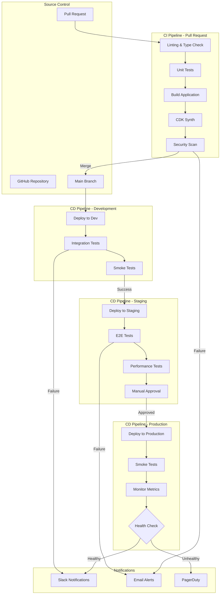

# Deployment Pipeline Architecture

## Overview

This document describes the CI/CD pipeline architecture for deploying the AWS Energy Data Insights platform. The pipeline automates testing, building, and deployment across multiple environments.

## Pipeline Architecture Diagram



## Pipeline Stages

### Stage 1: Code Quality (Pull Request)

**Triggers**: Pull request opened or updated

**Steps**:
1. **Linting**: ESLint for TypeScript/JavaScript, Flake8 for Python
2. **Type Checking**: TypeScript compiler (`tsc --noEmit`)
3. **Unit Tests**: Jest for frontend, pytest for Python
4. **Code Coverage**: Minimum 70% coverage required
5. **Security Scan**: Snyk for dependency vulnerabilities

**Success Criteria**:
- All linters pass with zero errors
- All unit tests pass
- Code coverage meets threshold
- No high/critical security vulnerabilities

**Duration**: ~5 minutes

### Stage 2: Build and Synthesize

**Triggers**: Pull request checks pass

**Steps**:
1. **Install Dependencies**: `npm install` and `pip install`
2. **Build Frontend**: `npm run build`
3. **Build Lambda Functions**: Compile TypeScript, package Python
4. **CDK Synthesize**: Generate CloudFormation templates
5. **Template Validation**: Validate CloudFormation syntax

**Artifacts**:
- Frontend build output (`dist/`)
- Lambda deployment packages (`.zip` files)
- CloudFormation templates (`cdk.out/`)

**Duration**: ~3 minutes

### Stage 3: Development Deployment

**Triggers**: Merge to `main` branch

**Steps**:
1. **Deploy Infrastructure**: `cdk deploy --all` to dev account
2. **Deploy Frontend**: Upload to S3, invalidate CloudFront
3. **Run Integration Tests**: Test API endpoints and agent flows
4. **Run Smoke Tests**: Verify critical user paths

**Environment Variables**:
```bash
AWS_ACCOUNT_ID=123456789012
AWS_REGION=us-east-1
ENVIRONMENT=development
COGNITO_USER_POOL_ID=us-east-1_devpool
API_GATEWAY_URL=https://dev-api.example.com
```

**Success Criteria**:
- All CloudFormation stacks deploy successfully
- Integration tests pass (>95% success rate)
- Smoke tests complete without errors

**Duration**: ~15 minutes

### Stage 4: Staging Deployment

**Triggers**: Successful dev deployment

**Steps**:
1. **Deploy Infrastructure**: `cdk deploy --all` to staging account
2. **Deploy Frontend**: Upload to staging S3/CloudFront
3. **Run E2E Tests**: Comprehensive end-to-end testing
4. **Performance Tests**: Load testing with 100 concurrent users
5. **Manual Approval**: Product owner reviews staging

**Test Scenarios**:
- Authentication flow (sign up, sign in, token refresh)
- Chat interactions (all agent types)
- Artifact generation (terrain, layout, simulation, reports)
- Multi-well correlation
- Data catalog search
- Error handling and recovery

**Performance Targets**:
- API p95 latency < 5s
- Agent response time < 30s
- Artifact generation < 60s
- Error rate < 1%

**Duration**: ~30 minutes (excluding manual approval)

### Stage 5: Production Deployment

**Triggers**: Manual approval in staging

**Steps**:
1. **Create Deployment Tag**: `git tag v1.2.3`
2. **Deploy Infrastructure**: Blue/green deployment with CDK
3. **Deploy Frontend**: Gradual rollout (10% → 50% → 100%)
4. **Run Smoke Tests**: Verify critical functionality
5. **Monitor Metrics**: Watch CloudWatch for 30 minutes
6. **Health Check**: Automated rollback if metrics degrade

**Deployment Strategy**: Blue/Green
- Deploy new version alongside existing (blue)
- Route 10% of traffic to new version (green)
- Monitor for 10 minutes
- If healthy, route 50% of traffic
- Monitor for 10 minutes
- If healthy, route 100% of traffic
- Decommission blue environment after 24 hours

**Rollback Criteria**:
- Error rate > 5%
- API latency p95 > 10s
- Agent success rate < 80%
- Any P0 incident reported

**Duration**: ~45 minutes

## GitHub Actions Workflow

### `.github/workflows/ci.yml`

```yaml
name: CI Pipeline

on:
  pull_request:
    branches: [main, develop]

jobs:
  lint-and-test:
    runs-on: ubuntu-latest
    steps:
      - uses: actions/checkout@v3
      
      - name: Setup Node.js
        uses: actions/setup-node@v3
        with:
          node-version: '18'
          cache: 'npm'
      
      - name: Install dependencies
        run: npm ci
      
      - name: Lint
        run: npm run lint
      
      - name: Type check
        run: npx tsc --noEmit
      
      - name: Unit tests
        run: npm test -- --coverage
      
      - name: Upload coverage
        uses: codecov/codecov-action@v3
        with:
          files: ./coverage/lcov.info

  security-scan:
    runs-on: ubuntu-latest
    steps:
      - uses: actions/checkout@v3
      
      - name: Run Snyk
        uses: snyk/actions/node@master
        env:
          SNYK_TOKEN: ${{ secrets.SNYK_TOKEN }}

  build:
    runs-on: ubuntu-latest
    needs: [lint-and-test, security-scan]
    steps:
      - uses: actions/checkout@v3
      
      - name: Setup Node.js
        uses: actions/setup-node@v3
        with:
          node-version: '18'
      
      - name: Install dependencies
        run: npm ci
      
      - name: Build frontend
        run: npm run build
      
      - name: CDK synth
        run: |
          cd cdk
          npm ci
          npx cdk synth
      
      - name: Upload artifacts
        uses: actions/upload-artifact@v3
        with:
          name: build-artifacts
          path: |
            dist/
            cdk/cdk.out/
```

### `.github/workflows/cd.yml`

```yaml
name: CD Pipeline

on:
  push:
    branches: [main]

jobs:
  deploy-dev:
    runs-on: ubuntu-latest
    environment: development
    steps:
      - uses: actions/checkout@v3
      
      - name: Configure AWS credentials
        uses: aws-actions/configure-aws-credentials@v2
        with:
          aws-access-key-id: ${{ secrets.AWS_ACCESS_KEY_ID }}
          aws-secret-access-key: ${{ secrets.AWS_SECRET_ACCESS_KEY }}
          aws-region: us-east-1
      
      - name: Deploy CDK
        run: |
          cd cdk
          npm ci
          npx cdk deploy --all --require-approval never
      
      - name: Run integration tests
        run: npm run test:integration
      
      - name: Notify Slack
        uses: slackapi/slack-github-action@v1
        with:
          payload: |
            {
              "text": "✅ Dev deployment successful"
            }
        env:
          SLACK_WEBHOOK_URL: ${{ secrets.SLACK_WEBHOOK }}

  deploy-staging:
    runs-on: ubuntu-latest
    needs: deploy-dev
    environment: staging
    steps:
      - uses: actions/checkout@v3
      
      - name: Configure AWS credentials
        uses: aws-actions/configure-aws-credentials@v2
        with:
          aws-access-key-id: ${{ secrets.AWS_ACCESS_KEY_ID_STAGING }}
          aws-secret-access-key: ${{ secrets.AWS_SECRET_ACCESS_KEY_STAGING }}
          aws-region: us-east-1
      
      - name: Deploy CDK
        run: |
          cd cdk
          npm ci
          npx cdk deploy --all --require-approval never
      
      - name: Run E2E tests
        run: npm run test:e2e
      
      - name: Performance tests
        run: npm run test:performance

  deploy-production:
    runs-on: ubuntu-latest
    needs: deploy-staging
    environment: production
    steps:
      - uses: actions/checkout@v3
      
      - name: Create release tag
        run: |
          git tag v$(date +%Y%m%d-%H%M%S)
          git push --tags
      
      - name: Configure AWS credentials
        uses: aws-actions/configure-aws-credentials@v2
        with:
          aws-access-key-id: ${{ secrets.AWS_ACCESS_KEY_ID_PROD }}
          aws-secret-access-key: ${{ secrets.AWS_SECRET_ACCESS_KEY_PROD }}
          aws-region: us-east-1
      
      - name: Deploy CDK (Blue/Green)
        run: |
          cd cdk
          npm ci
          npx cdk deploy --all --require-approval never
      
      - name: Smoke tests
        run: npm run test:smoke
      
      - name: Monitor metrics
        run: |
          sleep 1800  # Wait 30 minutes
          npm run check-health
      
      - name: Notify success
        uses: slackapi/slack-github-action@v1
        with:
          payload: |
            {
              "text": "🚀 Production deployment successful"
            }
        env:
          SLACK_WEBHOOK_URL: ${{ secrets.SLACK_WEBHOOK }}
```

## Manual Deployment Procedures

### Emergency Hotfix Deployment

When a critical bug requires immediate production fix:

```bash
# 1. Create hotfix branch
git checkout -b hotfix/critical-bug main

# 2. Make minimal fix
# Edit files...

# 3. Test locally
npm test
npm run build

# 4. Commit and push
git add .
git commit -m "hotfix: Fix critical bug"
git push origin hotfix/critical-bug

# 5. Deploy directly to production (bypass staging)
cd cdk
AWS_PROFILE=production npx cdk deploy --all

# 6. Verify fix
npm run test:smoke -- --env production

# 7. Merge back to main
git checkout main
git merge hotfix/critical-bug
git push origin main
```

### Rollback Procedure

If production deployment causes issues:

```bash
# Option 1: Rollback via CDK (if stack is healthy)
cd cdk
AWS_PROFILE=production npx cdk deploy --all --previous-parameters

# Option 2: Rollback via CloudFormation console
# 1. Go to CloudFormation console
# 2. Select stack
# 3. Click "Stack actions" → "Roll back"

# Option 3: Revert code and redeploy
git revert HEAD
git push origin main
# Wait for CI/CD pipeline to deploy

# Option 4: Emergency rollback (fastest)
# 1. Update Route53/CloudFront to point to previous version
# 2. Disable new Lambda versions
# 3. Restore previous DynamoDB tables from backup
```

## Environment Configuration

### Development Environment

```bash
# .env.development
AWS_ACCOUNT_ID=111111111111
AWS_REGION=us-east-1
ENVIRONMENT=development
COGNITO_USER_POOL_ID=us-east-1_devXXXXX
COGNITO_CLIENT_ID=1234567890abcdef
API_GATEWAY_URL=https://dev-api.example.com
S3_BUCKET=dev-storage-bucket
BEDROCK_MODEL_ID=anthropic.claude-3-5-sonnet-20241022-v2:0
LOG_LEVEL=DEBUG
```

### Staging Environment

```bash
# .env.staging
AWS_ACCOUNT_ID=222222222222
AWS_REGION=us-east-1
ENVIRONMENT=staging
COGNITO_USER_POOL_ID=us-east-1_stgXXXXX
COGNITO_CLIENT_ID=abcdef1234567890
API_GATEWAY_URL=https://staging-api.example.com
S3_BUCKET=staging-storage-bucket
BEDROCK_MODEL_ID=anthropic.claude-3-5-sonnet-20241022-v2:0
LOG_LEVEL=INFO
```

### Production Environment

```bash
# .env.production
AWS_ACCOUNT_ID=333333333333
AWS_REGION=us-east-1
ENVIRONMENT=production
COGNITO_USER_POOL_ID=us-east-1_prodXXXXX
COGNITO_CLIENT_ID=fedcba0987654321
API_GATEWAY_URL=https://api.example.com
S3_BUCKET=production-storage-bucket
BEDROCK_MODEL_ID=anthropic.claude-3-5-sonnet-20241022-v2:0
LOG_LEVEL=WARN
```

## Deployment Checklist

### Pre-Deployment

- [ ] All tests passing in CI
- [ ] Code review approved
- [ ] Security scan passed
- [ ] Performance tests passed
- [ ] Database migrations prepared (if any)
- [ ] Rollback plan documented
- [ ] Stakeholders notified
- [ ] Maintenance window scheduled (if needed)

### During Deployment

- [ ] Monitor CloudWatch logs
- [ ] Watch error rates in real-time
- [ ] Check API latency metrics
- [ ] Verify Lambda invocations
- [ ] Monitor DynamoDB throttling
- [ ] Check S3 upload success rates

### Post-Deployment

- [ ] Run smoke tests
- [ ] Verify critical user flows
- [ ] Check CloudWatch alarms
- [ ] Review error logs
- [ ] Monitor for 30 minutes
- [ ] Update deployment log
- [ ] Notify stakeholders of completion
- [ ] Document any issues encountered

## Troubleshooting Deployment Issues

### CDK Deployment Fails

**Symptom**: `cdk deploy` fails with CloudFormation error

**Common Causes**:
1. IAM permissions insufficient
2. Resource limits exceeded
3. Dependency conflicts
4. Invalid CloudFormation template

**Resolution**:
```bash
# Check CloudFormation events
aws cloudformation describe-stack-events \
  --stack-name YourStackName \
  --max-items 20

# Validate template
cd cdk
npx cdk synth
aws cloudformation validate-template \
  --template-body file://cdk.out/YourStack.template.json

# Check IAM permissions
aws sts get-caller-identity
aws iam get-user
```

### Lambda Deployment Fails

**Symptom**: Lambda function not updating or timing out

**Common Causes**:
1. Package size too large (>250MB unzipped)
2. Missing dependencies
3. Incorrect handler path
4. VPC configuration issues

**Resolution**:
```bash
# Check Lambda function
aws lambda get-function --function-name your-function

# Check function configuration
aws lambda get-function-configuration --function-name your-function

# Test function locally
sam local invoke YourFunction --event test-event.json

# Check CloudWatch logs
aws logs tail /aws/lambda/your-function --follow
```

### Frontend Deployment Fails

**Symptom**: S3 upload fails or CloudFront not updating

**Common Causes**:
1. S3 bucket permissions
2. CloudFront cache not invalidated
3. Build artifacts missing

**Resolution**:
```bash
# Check S3 bucket
aws s3 ls s3://your-frontend-bucket/

# Upload manually
aws s3 sync dist/ s3://your-frontend-bucket/ --delete

# Invalidate CloudFront
aws cloudfront create-invalidation \
  --distribution-id YOUR_DIST_ID \
  --paths "/*"

# Check CloudFront distribution
aws cloudfront get-distribution --id YOUR_DIST_ID
```

## Best Practices

1. **Always test in dev/staging first** - Never deploy directly to production
2. **Use feature flags** - Enable gradual rollout of new features
3. **Monitor during deployment** - Watch metrics in real-time
4. **Have rollback plan ready** - Know how to revert quickly
5. **Communicate with team** - Notify before/during/after deployment
6. **Document changes** - Update changelog and release notes
7. **Automate everything** - Reduce human error with automation
8. **Use infrastructure as code** - All resources defined in CDK
9. **Version everything** - Tag releases and track deployments
10. **Learn from failures** - Conduct post-mortems for issues

---

**Last Updated**: January 2025  
**Maintained By**: DevOps Team
