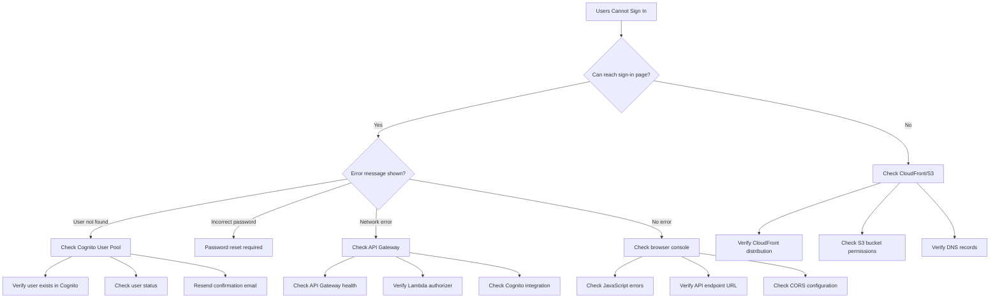
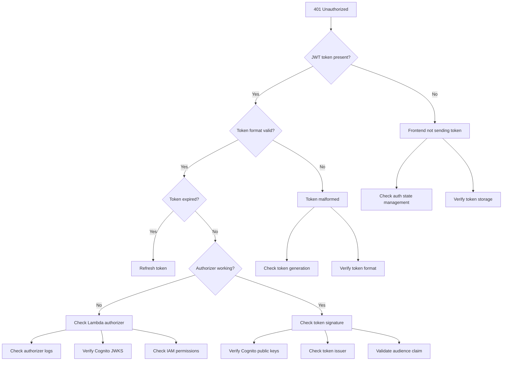
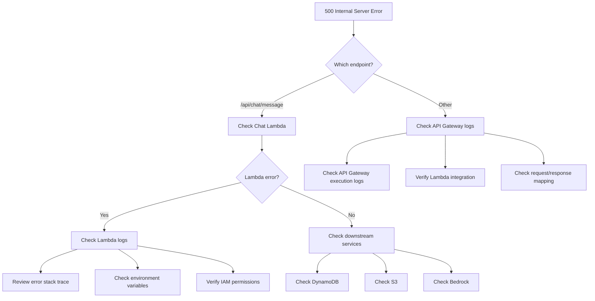
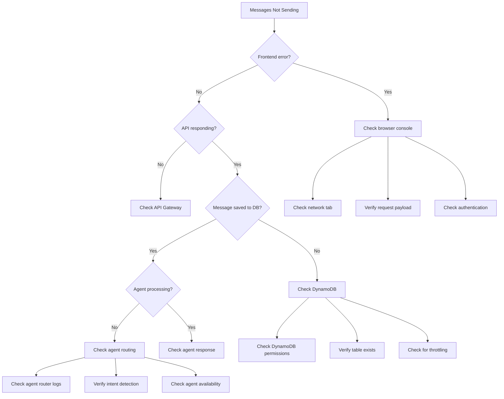
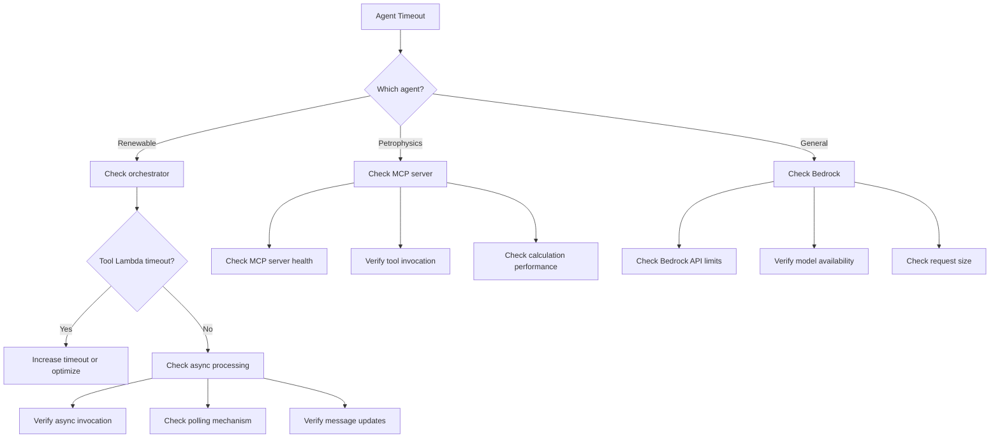
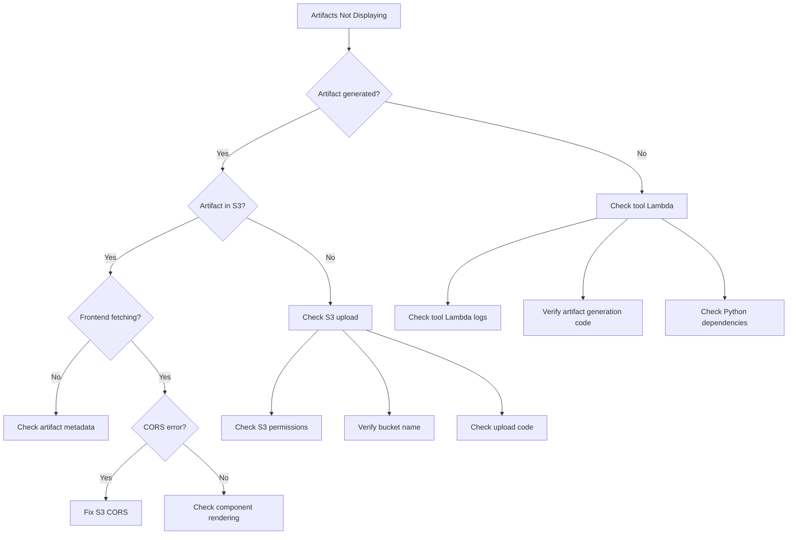
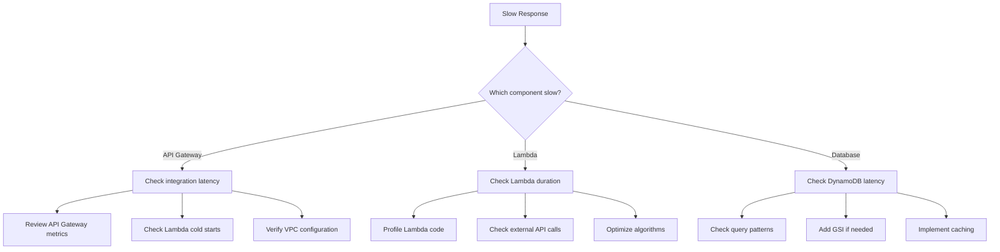
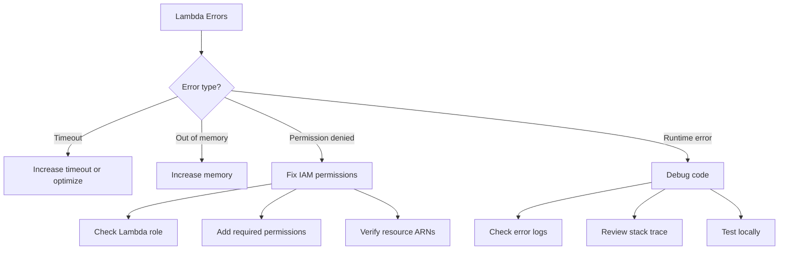
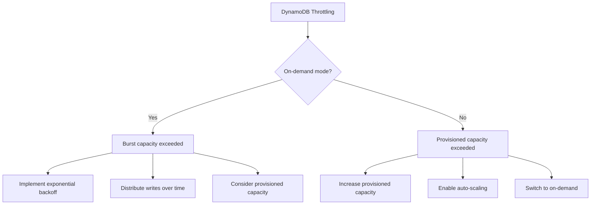
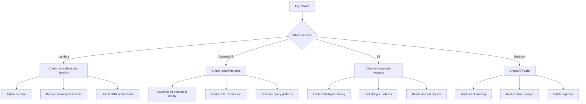

# Troubleshooting Decision Tree

## Overview

This document provides a systematic approach to diagnosing and resolving issues in the AWS Energy Data Insights platform. Follow the decision tree based on symptoms to identify root causes and implement solutions.

## Quick Symptom Index

- [Users Cannot Sign In](#symptom-users-cannot-sign-in)
- [API Returns 401 Unauthorized](#symptom-api-returns-401-unauthorized)
- [API Returns 500 Internal Server Error](#symptom-api-returns-500-internal-server-error)
- [Chat Messages Not Sending](#symptom-chat-messages-not-sending)
- [Agent Responses Timing Out](#symptom-agent-responses-timing-out)
- [Artifacts Not Displaying](#symptom-artifacts-not-displaying)
- [Slow API Response Times](#symptom-slow-api-response-times)
- [Lambda Function Errors](#symptom-lambda-function-errors)
- [DynamoDB Throttling](#symptom-dynamodb-throttling)
- [High AWS Costs](#symptom-high-aws-costs)

---

## Symptom: Users Cannot Sign In



### Diagnostic Steps

1. **Verify Frontend Accessibility**
   ```bash
   # Test CloudFront distribution
   curl -I https://your-domain.com
   
   # Check S3 bucket
   aws s3 ls s3://your-frontend-bucket/
   ```

2. **Check Cognito User Pool**
   ```bash
   # List users
   aws cognito-idp list-users \
     --user-pool-id us-east-1_XXXXXXX
   
   # Get user details
   aws cognito-idp admin-get-user \
     --user-pool-id us-east-1_XXXXXXX \
     --username user@example.com
   ```

3. **Test Authentication Flow**
   ```bash
   # Test sign-in
   aws cognito-idp admin-initiate-auth \
     --user-pool-id us-east-1_XXXXXXX \
     --client-id YOUR_CLIENT_ID \
     --auth-flow ADMIN_NO_SRP_AUTH \
     --auth-parameters USERNAME=user@example.com,PASSWORD=password
   ```

### Common Causes and Solutions

| Cause | Solution |
|-------|----------|
| User not confirmed | Resend confirmation email or manually confirm user |
| User account disabled | Enable user account in Cognito console |
| Incorrect Cognito configuration | Verify User Pool ID and Client ID in environment variables |
| CORS issues | Add frontend domain to API Gateway CORS configuration |
| Expired password | Initiate password reset flow |

---

## Symptom: API Returns 401 Unauthorized



### Diagnostic Steps

1. **Inspect JWT Token**
   ```bash
   # Decode JWT (use jwt.io or)
   echo "YOUR_JWT_TOKEN" | cut -d'.' -f2 | base64 -d | jq
   ```

2. **Check Lambda Authorizer Logs**
   ```bash
   aws logs tail /aws/lambda/custom-authorizer --follow
   ```

3. **Test Authorizer Directly**
   ```bash
   aws lambda invoke \
     --function-name custom-authorizer \
     --payload '{"authorizationToken":"Bearer YOUR_JWT","methodArn":"arn:aws:execute-api:us-east-1:ACCOUNT_ID:API_ID/*/POST/*"}' \
     response.json
   ```

### Common Causes and Solutions

| Cause | Solution |
|-------|----------|
| Token expired | Implement automatic token refresh |
| Invalid signature | Verify Cognito User Pool configuration |
| Wrong audience | Check token `aud` claim matches Client ID |
| Authorizer timeout | Increase authorizer timeout or optimize code |
| JWKS fetch failure | Check authorizer IAM permissions for Cognito |

---

## Symptom: API Returns 500 Internal Server Error



### Diagnostic Steps

1. **Check Lambda Logs**
   ```bash
   # Tail logs in real-time
   aws logs tail /aws/lambda/chat --follow
   
   # Search for errors
   aws logs filter-log-events \
     --log-group-name /aws/lambda/chat \
     --filter-pattern "ERROR" \
     --start-time $(date -u -d '1 hour ago' +%s)000
   ```

2. **Check Lambda Metrics**
   ```bash
   # Get error count
   aws cloudwatch get-metric-statistics \
     --namespace AWS/Lambda \
     --metric-name Errors \
     --dimensions Name=FunctionName,Value=chat \
     --start-time $(date -u -d '1 hour ago' +%Y-%m-%dT%H:%M:%S) \
     --end-time $(date -u +%Y-%m-%dT%H:%M:%S) \
     --period 300 \
     --statistics Sum
   ```

3. **Test Lambda Directly**
   ```bash
   aws lambda invoke \
     --function-name chat \
     --payload '{"body":"{\"chatSessionId\":\"test\",\"message\":\"hello\"}"}' \
     --log-type Tail \
     response.json
   ```

### Common Causes and Solutions

| Cause | Solution |
|-------|----------|
| Unhandled exception | Add try-catch blocks and error handling |
| Missing environment variable | Verify all required env vars are set |
| IAM permission denied | Add required permissions to Lambda role |
| Timeout | Increase Lambda timeout or optimize code |
| Memory limit exceeded | Increase Lambda memory allocation |
| DynamoDB throttling | Implement exponential backoff retry logic |

---

## Symptom: Chat Messages Not Sending



### Diagnostic Steps

1. **Check Frontend Network Requests**
   - Open browser DevTools → Network tab
   - Look for failed requests
   - Inspect request/response payloads

2. **Verify Message Persistence**
   ```bash
   # Query DynamoDB for recent messages
   aws dynamodb query \
     --table-name ChatMessage-XXXXX \
     --index-name chatSessionId-createdAt-index \
     --key-condition-expression "chatSessionId = :sid" \
     --expression-attribute-values '{":sid":{"S":"YOUR_SESSION_ID"}}' \
     --scan-index-forward false \
     --limit 10
   ```

3. **Check Agent Processing**
   ```bash
   # Check orchestrator logs
   aws logs tail /aws/lambda/renewable-orchestrator --follow
   ```

### Common Causes and Solutions

| Cause | Solution |
|-------|----------|
| Network connectivity | Check internet connection and firewall |
| Authentication expired | Refresh JWT token |
| DynamoDB write failure | Check IAM permissions and table capacity |
| Agent routing failure | Verify intent detection patterns |
| Orchestrator timeout | Implement async processing pattern |

---

## Symptom: Agent Responses Timing Out



### Diagnostic Steps

1. **Check Lambda Duration**
   ```bash
   aws cloudwatch get-metric-statistics \
     --namespace AWS/Lambda \
     --metric-name Duration \
     --dimensions Name=FunctionName,Value=renewable-orchestrator \
     --start-time $(date -u -d '1 hour ago' +%Y-%m-%dT%H:%M:%S) \
     --end-time $(date -u +%Y-%m-%dT%H:%M:%S) \
     --period 300 \
     --statistics Average,Maximum
   ```

2. **Check for Timeout Errors**
   ```bash
   aws logs filter-log-events \
     --log-group-name /aws/lambda/renewable-orchestrator \
     --filter-pattern "Task timed out"
   ```

3. **Test Tool Lambda Performance**
   ```bash
   time aws lambda invoke \
     --function-name renewable-tools-terrain \
     --payload '{"action":"analyze_terrain","latitude":35.0,"longitude":-101.0}' \
     response.json
   ```

### Common Causes and Solutions

| Cause | Solution |
|-------|----------|
| Lambda timeout (300s) | Implement async processing with polling |
| Slow external API | Add caching or increase timeout |
| Large data processing | Optimize algorithms or use Step Functions |
| Cold start delay | Increase provisioned concurrency |
| Bedrock rate limiting | Implement exponential backoff |

---

## Symptom: Artifacts Not Displaying



### Diagnostic Steps

1. **Verify Artifact in DynamoDB**
   ```bash
   aws dynamodb get-item \
     --table-name ChatMessage-XXXXX \
     --key '{"id":{"S":"MESSAGE_ID"}}'
   ```

2. **Check S3 for Artifact**
   ```bash
   aws s3 ls s3://storage-bucket/renewable-projects/ --recursive
   ```

3. **Test S3 Access**
   ```bash
   aws s3 cp s3://storage-bucket/renewable-projects/test/artifact.json -
   ```

4. **Check Browser Console**
   - Look for CORS errors
   - Check network requests for S3
   - Verify artifact URL format

### Common Causes and Solutions

| Cause | Solution |
|-------|----------|
| S3 upload failed | Check Lambda IAM permissions for S3 |
| CORS not configured | Add CORS policy to S3 bucket |
| Artifact URL incorrect | Verify S3 key format in metadata |
| Component not registered | Add artifact type to renderer |
| Large artifact size | Implement compression or chunking |

---

## Symptom: Slow API Response Times



### Diagnostic Steps

1. **Analyze API Gateway Latency**
   ```bash
   aws cloudwatch get-metric-statistics \
     --namespace AWS/ApiGateway \
     --metric-name Latency \
     --dimensions Name=ApiName,Value=energy-insights-api \
     --start-time $(date -u -d '1 hour ago' +%Y-%m-%dT%H:%M:%S) \
     --end-time $(date -u +%Y-%m-%dT%H:%M:%S) \
     --period 300 \
     --statistics Average,p95,p99
   ```

2. **Profile Lambda Performance**
   ```typescript
   // Add timing logs
   const startTime = Date.now();
   // ... operation ...
   console.log(`Operation took ${Date.now() - startTime}ms`);
   ```

3. **Check DynamoDB Performance**
   ```bash
   aws cloudwatch get-metric-statistics \
     --namespace AWS/DynamoDB \
     --metric-name SuccessfulRequestLatency \
     --dimensions Name=TableName,Value=ChatMessage-XXXXX \
     --start-time $(date -u -d '1 hour ago' +%Y-%m-%dT%H:%M:%S) \
     --end-time $(date -u +%Y-%m-%dT%H:%M:%S) \
     --period 300 \
     --statistics Average,p95
   ```

### Common Causes and Solutions

| Cause | Solution |
|-------|----------|
| Lambda cold starts | Increase provisioned concurrency |
| Inefficient queries | Optimize DynamoDB queries with GSI |
| Large response payloads | Implement pagination |
| External API latency | Add caching layer |
| VPC networking overhead | Remove VPC if not needed |

---

## Symptom: Lambda Function Errors



### Diagnostic Steps

1. **Identify Error Pattern**
   ```bash
   aws logs filter-log-events \
     --log-group-name /aws/lambda/FUNCTION_NAME \
     --filter-pattern "ERROR" \
     --start-time $(date -u -d '1 hour ago' +%s)000 \
     | jq '.events[].message'
   ```

2. **Check Lambda Configuration**
   ```bash
   aws lambda get-function-configuration \
     --function-name FUNCTION_NAME
   ```

3. **Test Locally**
   ```bash
   sam local invoke FUNCTION_NAME \
     --event test-event.json \
     --env-vars env.json
   ```

### Common Causes and Solutions

| Cause | Solution |
|-------|----------|
| Unhandled exception | Add comprehensive error handling |
| Missing dependency | Include in deployment package |
| Environment variable missing | Add to Lambda configuration |
| IAM permission denied | Update Lambda execution role |
| Timeout | Increase timeout or implement async pattern |
| Memory exceeded | Increase memory allocation |

---

## Symptom: DynamoDB Throttling



### Diagnostic Steps

1. **Check Throttling Metrics**
   ```bash
   aws cloudwatch get-metric-statistics \
     --namespace AWS/DynamoDB \
     --metric-name UserErrors \
     --dimensions Name=TableName,Value=ChatMessage-XXXXX \
     --start-time $(date -u -d '1 hour ago' +%Y-%m-%dT%H:%M:%S) \
     --end-time $(date -u +%Y-%m-%dT%H:%M:%S) \
     --period 300 \
     --statistics Sum
   ```

2. **Review Table Configuration**
   ```bash
   aws dynamodb describe-table \
     --table-name ChatMessage-XXXXX
   ```

### Common Causes and Solutions

| Cause | Solution |
|-------|----------|
| Burst traffic | Implement request queuing |
| Hot partition | Redesign partition key |
| Insufficient capacity | Increase provisioned capacity |
| No retry logic | Implement exponential backoff |

---

## Symptom: High AWS Costs



### Diagnostic Steps

1. **Analyze Cost by Service**
   ```bash
   aws ce get-cost-and-usage \
     --time-period Start=$(date -u -d '7 days ago' +%Y-%m-%d),End=$(date -u +%Y-%m-%d) \
     --granularity DAILY \
     --metrics BlendedCost \
     --group-by Type=DIMENSION,Key=SERVICE
   ```

2. **Check Lambda Costs**
   ```bash
   # Get invocation count
   aws cloudwatch get-metric-statistics \
     --namespace AWS/Lambda \
     --metric-name Invocations \
     --start-time $(date -u -d '7 days ago' +%Y-%m-%dT%H:%M:%S) \
     --end-time $(date -u +%Y-%m-%dT%H:%M:%S) \
     --period 86400 \
     --statistics Sum
   ```

### Common Causes and Solutions

| Cause | Solution |
|-------|----------|
| Excessive Lambda invocations | Implement caching, reduce polling frequency |
| High DynamoDB capacity | Switch to on-demand or reduce provisioned capacity |
| Large S3 storage | Enable lifecycle policies, delete old artifacts |
| High Bedrock usage | Implement response caching, optimize prompts |
| Unused resources | Delete unused Lambda functions, DynamoDB tables |

---

## General Troubleshooting Tips

1. **Always check CloudWatch Logs first** - Most issues leave traces in logs
2. **Use X-Ray for distributed tracing** - Understand request flow across services
3. **Test in isolation** - Isolate components to identify the failing part
4. **Check recent changes** - Issues often correlate with recent deployments
5. **Monitor metrics** - Use CloudWatch dashboards for real-time visibility
6. **Enable debug logging** - Temporarily increase log verbosity for troubleshooting
7. **Use AWS Support** - Don't hesitate to open support tickets for AWS service issues
8. **Document solutions** - Update runbooks with new troubleshooting steps
9. **Automate common fixes** - Create Lambda functions for auto-remediation
10. **Learn from incidents** - Conduct post-mortems and improve monitoring

---

**Last Updated**: January 2025  
**Maintained By**: DevOps Team
