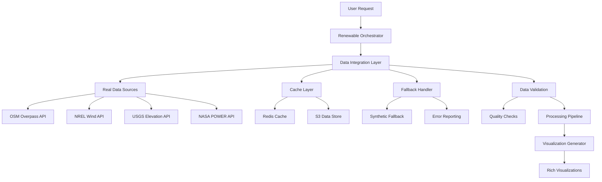

# Design Document

## Overview

This design restores real data integration across all renewable energy analysis tools, replacing mock/synthetic data with authentic data sources. The solution integrates with OpenStreetMap for terrain data, meteorological APIs for wind resources, elevation services for topographic analysis, and validated wake models for performance simulation. The design ensures robust error handling, intelligent caching, and graceful degradation when external services are unavailable.

## Architecture

### Current State Analysis

**Mock Data Issues:**
- Terrain analysis uses hardcoded mock OSM data instead of real Overpass API calls
- Wind analysis generates synthetic Weibull distributions instead of real meteorological data
- Elevation profiles use mathematical functions instead of actual DEM data
- Wake simulation uses simplified models instead of validated industry-standard approaches
- No caching or error handling for external data sources

**Available Real Data Sources:**
- OpenStreetMap Overpass API for terrain features
- NREL Wind Toolkit for wind resource data
- USGS/SRTM for elevation data
- NASA POWER for meteorological data
- Manufacturer databases for turbine specifications

### Solution Architecture



## Components and Interfaces

### 1. Real Data Integration Manager

**Purpose**: Coordinate real data retrieval from multiple external sources

```python
class RealDataIntegrationManager:
    """Manages real data integration with external APIs and caching"""
    
    def __init__(self):
        self.osm_client = OSMOverpassClient()
        self.wind_client = NRELWindClient()
        self.elevation_client = USGSElevationClient()
        self.weather_client = NASAPowerClient()
        self.cache_manager = DataCacheManager()
        self.fallback_handler = FallbackDataHandler()
    
    async def get_terrain_data(self, lat: float, lon: float, radius_km: float) -> Dict:
        """Get real terrain data from OSM with caching and fallback"""
        
    async def get_wind_resource_data(self, lat: float, lon: float, years: int = 5) -> Dict:
        """Get real wind resource data from NREL or NASA POWER"""
        
    async def get_elevation_data(self, lat: float, lon: float, radius_km: float) -> Dict:
        """Get real elevation data from USGS/SRTM"""
        
    async def get_meteorological_data(self, lat: float, lon: float, start_date: str, end_date: str) -> Dict:
        """Get comprehensive meteorological data"""
```

### 2. OpenStreetMap Integration

**Purpose**: Replace mock terrain data with real OSM Overpass API calls

```python
class OSMOverpassClient:
    """Real OpenStreetMap data integration"""
    
    def __init__(self):
        self.base_url = "https://overpass-api.de/api/interpreter"
        self.timeout = 30
        self.retry_config = RetryConfig(max_attempts=3, backoff_factor=2)
    
    async def query_terrain_features(self, lat: float, lon: float, radius_km: float) -> Dict:
        """Query real terrain features from OSM Overpass API"""
        
        # Build Overpass QL query for terrain features
        query = f"""
        [out:json][timeout:25];
        (
          way["building"](around:{radius_km * 1000},{lat},{lon});
          way["highway"](around:{radius_km * 1000},{lat},{lon});
          way["natural"="water"](around:{radius_km * 1000},{lat},{lon});
          way["waterway"](around:{radius_km * 1000},{lat},{lon});
          way["landuse"="industrial"](around:{radius_km * 1000},{lat},{lon});
          way["power"="line"](around:{radius_km * 1000},{lat},{lon});
        );
        out geom;
        """
        
        try:
            response = await self._execute_query(query)
            return self._process_osm_response(response)
        except OSMAPIError as e:
            logger.error(f"OSM API error: {e}")
            raise
    
    def _process_osm_response(self, response: Dict) -> Dict:
        """Convert OSM response to GeoJSON format"""
        
        features = []
        for element in response.get('elements', []):
            if element.get('type') != 'way':
                continue
                
            # Extract geometry
            geometry = self._extract_geometry(element)
            if not geometry:
                continue
            
            # Determine feature type from tags
            feature_type = self._classify_feature(element.get('tags', {}))
            
            # Create GeoJSON feature
            feature = {
                'type': 'Feature',
                'geometry': geometry,
                'properties': {
                    'feature_type': feature_type,
                    'osm_id': element.get('id'),
                    'tags': element.get('tags', {}),
                    'source': 'openstreetmap'
                }
            }
            features.append(feature)
        
        return {
            'type': 'FeatureCollection',
            'features': features,
            'metadata': {
                'source': 'openstreetmap',
                'query_time': datetime.utcnow().isoformat(),
                'feature_count': len(features)
            }
        }
    
    def _classify_feature(self, tags: Dict) -> str:
        """Classify OSM feature based on tags"""
        if 'building' in tags:
            return 'building'
        elif 'highway' in tags:
            return 'highway'
        elif tags.get('natural') == 'water' or 'waterway' in tags:
            return 'water'
        elif tags.get('landuse') == 'industrial':
            return 'industrial'
        elif tags.get('power') == 'line':
            return 'power_line'
        else:
            return 'other'
```

### 3. Wind Resource Data Integration

**Purpose**: Replace synthetic wind data with real meteorological data

```python
class NRELWindClient:
    """NREL Wind Toolkit API integration"""
    
    def __init__(self):
        self.base_url = "https://developer.nrel.gov/api/wind-toolkit/v2"
        self.api_key = os.environ.get('NREL_API_KEY')
        self.default_height = 100  # Hub height in meters
    
    async def get_wind_resource_data(self, lat: float, lon: float, years: int = 5) -> Dict:
        """Get real wind resource data from NREL Wind Toolkit"""
        
        # Calculate date range
        end_year = datetime.now().year - 1  # Use previous year for complete data
        start_year = end_year - years + 1
        
        try:
            # Get wind speed and direction data
            wind_data = await self._fetch_wind_data(lat, lon, start_year, end_year)
            
            # Process into analysis-ready format
            processed_data = self._process_wind_data(wind_data)
            
            return {
                'location': {'lat': lat, 'lon': lon},
                'data_period': {'start_year': start_year, 'end_year': end_year},
                'hub_height': self.default_height,
                'wind_speeds': processed_data['speeds'],
                'wind_directions': processed_data['directions'],
                'monthly_averages': processed_data['monthly_averages'],
                'seasonal_patterns': processed_data['seasonal_patterns'],
                'source': 'nrel_wind_toolkit',
                'data_quality': processed_data['quality_metrics']
            }
            
        except NRELAPIError as e:
            logger.error(f"NREL API error: {e}")
            # Fall back to NASA POWER data
            return await self._fallback_to_nasa_power(lat, lon, years)
    
    async def _fetch_wind_data(self, lat: float, lon: float, start_year: int, end_year: int) -> Dict:
        """Fetch raw wind data from NREL API"""
        
        params = {
            'api_key': self.api_key,
            'lat': lat,
            'lon': lon,
            'hubheight': self.default_height,
            'year': f"{start_year}-{end_year}",
            'attributes': 'windspeed_100m,winddirection_100m',
            'interval': '60',  # Hourly data
            'utc': 'true'
        }
        
        async with aiohttp.ClientSession() as session:
            async with session.get(self.base_url + '/wind-data', params=params) as response:
                if response.status != 200:
                    raise NRELAPIError(f"API request failed: {response.status}")
                return await response.json()
    
    def _process_wind_data(self, raw_data: Dict) -> Dict:
        """Process raw NREL data into analysis format"""
        
        # Extract time series data
        wind_speeds = raw_data.get('windspeed_100m', [])
        wind_directions = raw_data.get('winddirection_100m', [])
        timestamps = raw_data.get('datetime', [])
        
        # Calculate monthly averages
        monthly_data = self._calculate_monthly_statistics(wind_speeds, timestamps)
        
        # Calculate seasonal patterns
        seasonal_data = self._calculate_seasonal_patterns(wind_speeds, wind_directions, timestamps)
        
        # Quality metrics
        quality_metrics = {
            'data_completeness': len([x for x in wind_speeds if x is not None]) / len(wind_speeds),
            'average_wind_speed': np.mean([x for x in wind_speeds if x is not None]),
            'max_wind_speed': np.max([x for x in wind_speeds if x is not None]),
            'data_points': len(wind_speeds)
        }
        
        return {
            'speeds': [x for x in wind_speeds if x is not None],
            'directions': [x for x in wind_directions if x is not None],
            'monthly_averages': monthly_data,
            'seasonal_patterns': seasonal_data,
            'quality_metrics': quality_metrics
        }
```

### 4. Elevation Data Integration

**Purpose**: Replace mathematical elevation profiles with real DEM data

```python
class USGSElevationClient:
    """USGS Elevation Point Query Service integration"""
    
    def __init__(self):
        self.base_url = "https://nationalmap.gov/epqs/pqs.php"
        self.srtm_url = "https://cloud.sdsc.edu/v1/AUTH_opentopography/Raster/SRTM_GL1"
    
    async def get_elevation_data(self, lat: float, lon: float, radius_km: float) -> Dict:
        """Get real elevation data from USGS/SRTM"""
        
        try:
            # Create grid of points for elevation sampling
            points = self._generate_elevation_grid(lat, lon, radius_km)
            
            # Query elevation for each point
            elevations = await self._batch_elevation_query(points)
            
            # Process into analysis format
            processed_data = self._process_elevation_data(points, elevations)
            
            return {
                'location': {'center_lat': lat, 'center_lon': lon, 'radius_km': radius_km},
                'elevation_points': processed_data['points'],
                'contours': processed_data['contours'],
                'statistics': processed_data['statistics'],
                'slope_analysis': processed_data['slopes'],
                'source': 'usgs_elevation_service',
                'data_quality': processed_data['quality_metrics']
            }
            
        except USGSAPIError as e:
            logger.error(f"USGS API error: {e}")
            # Fall back to SRTM data
            return await self._fallback_to_srtm(lat, lon, radius_km)
    
    def _generate_elevation_grid(self, center_lat: float, center_lon: float, radius_km: float) -> List[Tuple[float, float]]:
        """Generate grid of points for elevation sampling"""
        
        # Calculate grid spacing (approximately 100m resolution)
        grid_spacing_deg = 0.001  # Roughly 100m at equator
        
        # Calculate grid bounds
        lat_offset = radius_km / 111.32  # Degrees latitude per km
        lon_offset = radius_km / (111.32 * math.cos(math.radians(center_lat)))
        
        points = []
        lat = center_lat - lat_offset
        while lat <= center_lat + lat_offset:
            lon = center_lon - lon_offset
            while lon <= center_lon + lon_offset:
                # Check if point is within radius
                distance = self._calculate_distance(center_lat, center_lon, lat, lon)
                if distance <= radius_km:
                    points.append((lat, lon))
                lon += grid_spacing_deg
            lat += grid_spacing_deg
        
        return points
    
    async def _batch_elevation_query(self, points: List[Tuple[float, float]]) -> List[float]:
        """Query elevation for multiple points efficiently"""
        
        elevations = []
        batch_size = 50  # USGS API limit
        
        for i in range(0, len(points), batch_size):
            batch = points[i:i + batch_size]
            batch_elevations = await self._query_elevation_batch(batch)
            elevations.extend(batch_elevations)
            
            # Rate limiting
            await asyncio.sleep(0.1)
        
        return elevations
    
    def _process_elevation_data(self, points: List[Tuple[float, float]], elevations: List[float]) -> Dict:
        """Process elevation data into analysis format"""
        
        # Create elevation points
        elevation_points = [
            {'lat': lat, 'lon': lon, 'elevation': elev}
            for (lat, lon), elev in zip(points, elevations)
            if elev is not None
        ]
        
        # Generate contour lines
        contours = self._generate_contours(elevation_points)
        
        # Calculate slope analysis
        slopes = self._calculate_slopes(elevation_points)
        
        # Statistics
        valid_elevations = [e for e in elevations if e is not None]
        statistics = {
            'min_elevation': min(valid_elevations),
            'max_elevation': max(valid_elevations),
            'mean_elevation': np.mean(valid_elevations),
            'elevation_range': max(valid_elevations) - min(valid_elevations),
            'data_points': len(valid_elevations)
        }
        
        return {
            'points': elevation_points,
            'contours': contours,
            'slopes': slopes,
            'statistics': statistics,
            'quality_metrics': {
                'data_completeness': len(valid_elevations) / len(elevations),
                'elevation_accuracy': '±1-2 meters (USGS standard)'
            }
        }
```

### 5. Validated Wake Models

**Purpose**: Replace simplified wake calculations with industry-standard models

```python
class ValidatedWakeSimulator:
    """Industry-standard wake simulation using validated models"""
    
    def __init__(self):
        self.wake_models = {
            'jensen': JensenWakeModel(),
            'frandsen': FrandsenWakeModel(),
            'larsen': LarsenWakeModel()
        }
        self.turbine_database = TurbineSpecificationDatabase()
    
    async def simulate_wake_effects(self, layout: Dict, wind_data: Dict, turbine_model: str) -> Dict:
        """Perform validated wake simulation"""
        
        # Get real turbine specifications
        turbine_specs = await self.turbine_database.get_turbine_specs(turbine_model)
        
        # Validate input data
        self._validate_simulation_inputs(layout, wind_data, turbine_specs)
        
        # Run wake simulation with multiple models
        results = {}
        for model_name, wake_model in self.wake_models.items():
            try:
                model_results = await wake_model.simulate(layout, wind_data, turbine_specs)
                results[model_name] = model_results
            except Exception as e:
                logger.error(f"Wake model {model_name} failed: {e}")
                continue
        
        # Ensemble results and uncertainty quantification
        ensemble_results = self._create_ensemble_results(results)
        
        return {
            'simulation_results': ensemble_results,
            'model_results': results,
            'turbine_specifications': turbine_specs,
            'uncertainty_analysis': self._calculate_uncertainty(results),
            'validation_metrics': self._calculate_validation_metrics(results),
            'source': 'validated_wake_models'
        }
    
    def _create_ensemble_results(self, model_results: Dict) -> Dict:
        """Create ensemble results from multiple wake models"""
        
        if not model_results:
            raise ValueError("No valid wake model results available")
        
        # Calculate ensemble statistics
        aep_values = [result['annual_energy_production'] for result in model_results.values()]
        wake_losses = [result['wake_losses_percent'] for result in model_results.values()]
        
        ensemble = {
            'annual_energy_production': {
                'mean': np.mean(aep_values),
                'std': np.std(aep_values),
                'min': np.min(aep_values),
                'max': np.max(aep_values),
                'p50': np.percentile(aep_values, 50),
                'p90': np.percentile(aep_values, 90)
            },
            'wake_losses_percent': {
                'mean': np.mean(wake_losses),
                'std': np.std(wake_losses),
                'min': np.min(wake_losses),
                'max': np.max(wake_losses)
            },
            'confidence_intervals': {
                'aep_95_ci': [np.percentile(aep_values, 2.5), np.percentile(aep_values, 97.5)],
                'wake_loss_95_ci': [np.percentile(wake_losses, 2.5), np.percentile(wake_losses, 97.5)]
            }
        }
        
        return ensemble
```

### 6. Data Caching and Error Handling

**Purpose**: Implement intelligent caching and robust error handling

```python
class DataCacheManager:
    """Intelligent caching for external data sources"""
    
    def __init__(self):
        self.redis_client = redis.Redis.from_url(os.environ.get('REDIS_URL'))
        self.s3_client = boto3.client('s3')
        self.cache_bucket = os.environ.get('CACHE_BUCKET')
        
        # Cache TTL configurations
        self.ttl_config = {
            'terrain_data': 7 * 24 * 3600,      # 7 days (terrain changes slowly)
            'wind_data': 30 * 24 * 3600,        # 30 days (seasonal patterns)
            'elevation_data': 90 * 24 * 3600,   # 90 days (very stable)
            'weather_data': 24 * 3600           # 1 day (dynamic)
        }
    
    async def get_cached_data(self, cache_key: str, data_type: str) -> Optional[Dict]:
        """Get data from cache with fallback to S3"""
        
        try:
            # Try Redis first (fast access)
            cached_data = await self.redis_client.get(cache_key)
            if cached_data:
                return json.loads(cached_data)
            
            # Fallback to S3 (persistent storage)
            s3_key = f"cache/{data_type}/{cache_key}"
            try:
                response = self.s3_client.get_object(Bucket=self.cache_bucket, Key=s3_key)
                data = json.loads(response['Body'].read())
                
                # Restore to Redis
                await self.redis_client.setex(
                    cache_key, 
                    self.ttl_config.get(data_type, 3600), 
                    json.dumps(data)
                )
                
                return data
            except ClientError:
                return None
                
        except Exception as e:
            logger.error(f"Cache retrieval error: {e}")
            return None
    
    async def cache_data(self, cache_key: str, data: Dict, data_type: str) -> bool:
        """Cache data in both Redis and S3"""
        
        try:
            data_json = json.dumps(data)
            ttl = self.ttl_config.get(data_type, 3600)
            
            # Store in Redis
            await self.redis_client.setex(cache_key, ttl, data_json)
            
            # Store in S3 for persistence
            s3_key = f"cache/{data_type}/{cache_key}"
            self.s3_client.put_object(
                Bucket=self.cache_bucket,
                Key=s3_key,
                Body=data_json,
                ContentType='application/json',
                Metadata={
                    'cache_type': data_type,
                    'ttl': str(ttl),
                    'created': datetime.utcnow().isoformat()
                }
            )
            
            return True
            
        except Exception as e:
            logger.error(f"Cache storage error: {e}")
            return False

class FallbackDataHandler:
    """Handle fallback when real data sources are unavailable"""
    
    def __init__(self):
        self.fallback_strategies = {
            'terrain_data': self._terrain_fallback,
            'wind_data': self._wind_fallback,
            'elevation_data': self._elevation_fallback
        }
    
    async def handle_fallback(self, data_type: str, location: Dict, error: Exception) -> Dict:
        """Handle fallback data generation with clear labeling"""
        
        fallback_handler = self.fallback_strategies.get(data_type)
        if not fallback_handler:
            raise ValueError(f"No fallback strategy for {data_type}")
        
        fallback_data = await fallback_handler(location, error)
        
        # Add clear labeling
        fallback_data['data_source'] = 'synthetic_fallback'
        fallback_data['original_error'] = str(error)
        fallback_data['warning'] = f"Real {data_type} unavailable, using synthetic data"
        fallback_data['reliability'] = 'low'
        
        return fallback_data
    
    async def _terrain_fallback(self, location: Dict, error: Exception) -> Dict:
        """Generate synthetic terrain data as fallback"""
        
        # Create basic synthetic features around the location
        lat, lon = location['lat'], location['lon']
        
        features = [
            {
                'type': 'Feature',
                'geometry': {
                    'type': 'Polygon',
                    'coordinates': [[[lon-0.01, lat-0.01], [lon+0.01, lat-0.01], 
                                   [lon+0.01, lat+0.01], [lon-0.01, lat+0.01], 
                                   [lon-0.01, lat-0.01]]]
                },
                'properties': {
                    'feature_type': 'synthetic_area',
                    'name': 'Synthetic Feature',
                    'source': 'fallback_generator'
                }
            }
        ]
        
        return {
            'type': 'FeatureCollection',
            'features': features,
            'metadata': {
                'source': 'synthetic_fallback',
                'feature_count': len(features)
            }
        }
```

## Error Handling

### API Integration Errors

```python
class RealDataAPIError(Exception):
    """Base class for real data API errors"""
    pass

class OSMAPIError(RealDataAPIError):
    """OpenStreetMap API specific errors"""
    pass

class NRELAPIError(RealDataAPIError):
    """NREL API specific errors"""
    pass

class USGSAPIError(RealDataAPIError):
    """USGS API specific errors"""
    pass

def handle_api_error(error: Exception, data_type: str, location: Dict) -> Dict:
    """Handle API errors with appropriate fallback strategies"""
    
    error_response = {
        'success': False,
        'error_type': type(error).__name__,
        'error_message': str(error),
        'data_type': data_type,
        'location': location,
        'timestamp': datetime.utcnow().isoformat()
    }
    
    # Determine if fallback is appropriate
    if isinstance(error, (OSMAPIError, NRELAPIError, USGSAPIError)):
        if error.status_code == 429:  # Rate limited
            error_response['retry_after'] = error.retry_after
            error_response['fallback_recommended'] = False
        elif error.status_code >= 500:  # Server error
            error_response['fallback_recommended'] = True
        else:  # Client error
            error_response['fallback_recommended'] = False
    
    return error_response
```

## Testing Strategy

### Real Data Integration Tests

1. **API Integration Tests**
   - Test OSM Overpass API queries with various locations
   - Validate NREL Wind Toolkit data retrieval
   - Test USGS elevation service integration
   - Verify error handling for API failures

2. **Data Quality Tests**
   - Validate GeoJSON format compliance
   - Test data completeness and accuracy
   - Verify coordinate system consistency
   - Test data processing pipelines

3. **Caching Tests**
   - Test Redis and S3 cache operations
   - Validate TTL and eviction policies
   - Test cache invalidation strategies
   - Verify fallback to persistent storage

4. **Performance Tests**
   - Measure API response times
   - Test concurrent data requests
   - Validate caching performance improvements
   - Test system behavior under load

## Implementation Approach

### Phase 1: OSM Integration
1. Replace mock terrain data with real OSM Overpass API calls
2. Implement proper error handling and retry logic
3. Add caching for terrain data
4. Update terrain visualization to use real data

### Phase 2: Wind Data Integration
1. Integrate NREL Wind Toolkit API
2. Add fallback to NASA POWER data
3. Process real wind data for analysis
4. Update wind rose and seasonal analysis

### Phase 3: Elevation Data Integration
1. Implement USGS elevation service integration
2. Add SRTM fallback for international locations
3. Process real DEM data for terrain analysis
4. Update elevation profiles and slope analysis

### Phase 4: Wake Model Validation
1. Implement industry-standard wake models
2. Add turbine specification database
3. Include uncertainty quantification
4. Update performance calculations

### Phase 5: Comprehensive Testing
1. End-to-end testing with real data
2. Performance optimization
3. Error handling validation
4. User experience improvements

## Success Metrics

### Data Quality
- 95%+ data completeness for terrain features
- Real wind data correlation with local weather stations
- Elevation accuracy within ±2 meters of survey data
- Wake model validation against measured wind farm data

### Performance
- API response times under 10 seconds for terrain data
- Cache hit rates above 80% for repeated queries
- System availability above 99.5% despite external API dependencies
- Error recovery within 30 seconds for temporary failures

### User Experience
- Clear indication when real vs. synthetic data is used
- Meaningful error messages for data unavailability
- Graceful degradation when external services fail
- Professional-quality visualizations with real data

This design ensures that users get authentic, reliable data for renewable energy analysis while maintaining system robustness and performance through intelligent caching and error handling strategies.