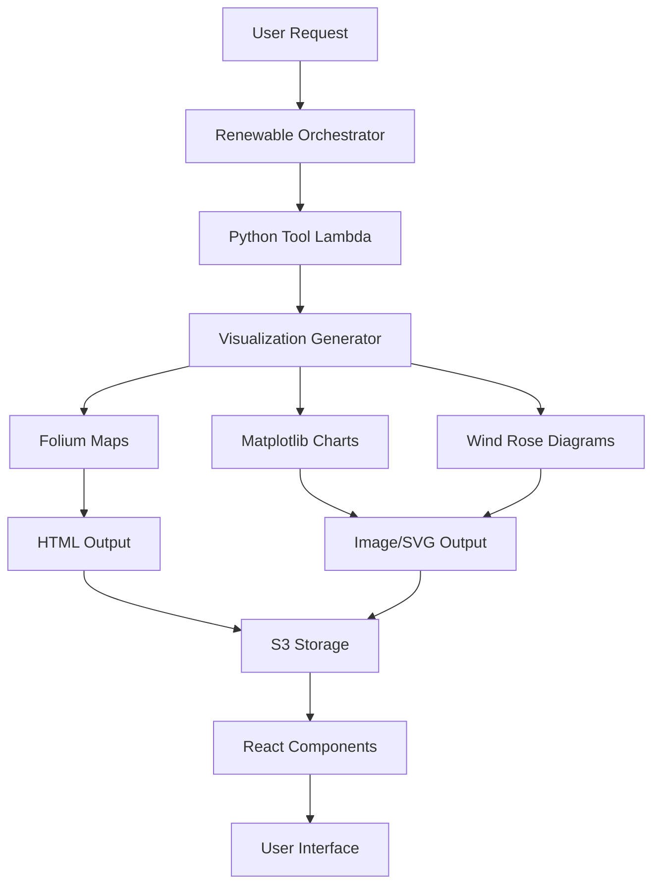

# Design Document

## Overview

This design restores the comprehensive scientific visualizations that were available in the original renewable energy demo. The solution integrates folium maps, matplotlib charts, wind rose diagrams, and other professional-grade visualizations into the EDI Platform, using the same proven libraries and approaches from the original workshop materials while ensuring seamless integration with the existing React-based UI.

## Architecture

### Current State Analysis

**Missing Visualizations:**
- Interactive folium maps with multiple tile layers
- Wind rose diagrams showing directional patterns
- Wake analysis heat maps and deficit visualizations
- Matplotlib-based scientific charts and plots
- Terrain elevation profiles and topographic analysis
- Professional styling and interactive controls

**Available Resources:**
- Original `visualization_utils.py` with proven folium map generation
- Workshop notebooks with matplotlib chart examples
- Existing React components that can embed HTML/images
- Python Lambda functions that can generate visualizations

### Solution Architecture



## Components and Interfaces

### 1. Enhanced Visualization Generator

**Purpose**: Generate professional-grade visualizations using original demo libraries

```python
class RenewableVisualizationGenerator:
    """Enhanced visualization generator using original demo libraries"""
    
    def __init__(self):
        self.folium_generator = FoliumMapGenerator()
        self.matplotlib_generator = MatplotlibChartGenerator()
        self.wind_rose_generator = WindRoseGenerator()
    
    # Folium map generation
    def create_terrain_map(self, boundaries_data, center_lat, center_lon) -> str:
        """Generate interactive folium terrain map with multiple tile layers"""
        
    def create_wind_farm_map(self, boundaries_data, turbines_data, center_lat, center_lon) -> str:
        """Generate complete wind farm visualization with boundaries and turbines"""
    
    def create_wake_analysis_map(self, wake_data, turbines_data) -> str:
        """Generate wake deficit visualization overlay"""
    
    # Matplotlib chart generation
    def create_wind_rose(self, wind_data, title="Wind Rose") -> bytes:
        """Generate wind rose diagram showing directional patterns"""
    
    def create_performance_charts(self, performance_data) -> List[bytes]:
        """Generate turbine performance and energy production charts"""
    
    def create_elevation_profile(self, terrain_data) -> bytes:
        """Generate terrain elevation profile charts"""
    
    # Utility methods
    def save_to_s3(self, content, key, content_type) -> str:
        """Save visualization content to S3 and return URL"""
```

### 2. Folium Map Generator

**Purpose**: Create interactive maps using the original folium utilities

```python
class FoliumMapGenerator:
    """Generate folium maps using original demo styling and functionality"""
    
    def create_base_map(self, center_lat: float, center_lon: float, zoom: int = 12):
        """Create base map with multiple tile layers"""
        
    def add_terrain_features(self, map_obj, boundaries_data):
        """Add terrain boundaries with consistent color scheme"""
        
    def add_turbine_markers(self, map_obj, turbines_data):
        """Add turbine markers with popups and tooltips"""
        
    def add_wake_overlay(self, map_obj, wake_data):
        """Add wake analysis visualization overlay"""
        
    def style_feature(self, feature_type: str) -> dict:
        """Return consistent styling for different feature types"""
```

### 3. Matplotlib Chart Generator

**Purpose**: Create publication-quality scientific charts

```python
class MatplotlibChartGenerator:
    """Generate matplotlib charts with professional styling"""
    
    def __init__(self):
        self.setup_style()
    
    def setup_style(self):
        """Configure matplotlib for professional appearance"""
        
    def create_wind_rose(self, wind_data, bins=16) -> bytes:
        """Generate wind rose diagram"""
        
    def create_performance_chart(self, turbine_data) -> bytes:
        """Generate turbine performance visualization"""
        
    def create_wake_deficit_chart(self, wake_data) -> bytes:
        """Generate wake deficit analysis chart"""
        
    def create_elevation_profile(self, elevation_data, distance_data) -> bytes:
        """Generate terrain elevation profile"""
        
    def save_chart_to_bytes(self, fig) -> bytes:
        """Convert matplotlib figure to bytes for web display"""
```

### 4. Enhanced Lambda Tool Functions

**Purpose**: Update existing Lambda functions to generate rich visualizations

```python
# Enhanced terrain analysis tool
def enhanced_terrain_analysis(project_id, lat, lon, radius_km=5):
    """Generate terrain analysis with rich folium visualization"""
    
    # Existing terrain analysis logic...
    boundaries_data = analyze_terrain_boundaries(lat, lon, radius_km)
    
    # NEW: Generate rich folium map
    viz_generator = RenewableVisualizationGenerator()
    terrain_map_html = viz_generator.create_terrain_map(
        boundaries_data, lat, lon
    )
    
    # Save to S3
    map_url = viz_generator.save_to_s3(
        terrain_map_html, 
        f"{project_id}/terrain_map.html", 
        "text/html"
    )
    
    return {
        'boundaries': boundaries_data,
        'mapHtml': terrain_map_html,
        'mapUrl': map_url,
        'visualizations': {
            'interactive_map': map_url
        }
    }

# Enhanced layout optimization tool  
def enhanced_layout_optimization(project_id, turbine_count, center_lat, center_lon):
    """Generate layout optimization with folium visualization"""
    
    # Existing layout logic...
    layout_data = optimize_turbine_layout(turbine_count, center_lat, center_lon)
    
    # NEW: Generate rich visualizations
    viz_generator = RenewableVisualizationGenerator()
    
    # Folium map with turbines
    layout_map_html = viz_generator.create_wind_farm_map(
        boundaries_data, layout_data['turbines'], center_lat, center_lon
    )
    
    # Layout validation chart
    validation_chart = viz_generator.create_layout_validation_chart(layout_data)
    
    # Save visualizations
    map_url = viz_generator.save_to_s3(layout_map_html, f"{project_id}/layout_map.html", "text/html")
    chart_url = viz_generator.save_to_s3(validation_chart, f"{project_id}/layout_chart.png", "image/png")
    
    return {
        'layout': layout_data,
        'mapHtml': layout_map_html,
        'mapUrl': map_url,
        'visualizations': {
            'interactive_map': map_url,
            'validation_chart': chart_url
        }
    }

# Enhanced wake simulation tool
def enhanced_wake_simulation(project_id, turbines_data, wind_data):
    """Generate wake simulation with comprehensive visualizations"""
    
    # Existing simulation logic...
    wake_results = simulate_wake_effects(turbines_data, wind_data)
    
    # NEW: Generate rich visualizations
    viz_generator = RenewableVisualizationGenerator()
    
    # Wake analysis map
    wake_map_html = viz_generator.create_wake_analysis_map(wake_results, turbines_data)
    
    # Wind rose diagram
    wind_rose_chart = viz_generator.create_wind_rose(wind_data)
    
    # Performance charts
    performance_charts = viz_generator.create_performance_charts(wake_results)
    
    # Save all visualizations
    visualizations = {
        'wake_map': viz_generator.save_to_s3(wake_map_html, f"{project_id}/wake_map.html", "text/html"),
        'wind_rose': viz_generator.save_to_s3(wind_rose_chart, f"{project_id}/wind_rose.png", "image/png"),
        'performance_charts': [
            viz_generator.save_to_s3(chart, f"{project_id}/performance_{i}.png", "image/png")
            for i, chart in enumerate(performance_charts)
        ]
    }
    
    return {
        'simulation_results': wake_results,
        'mapHtml': wake_map_html,
        'visualizations': visualizations
    }
```

## Data Models

### Enhanced Artifact Responses

```typescript
interface EnhancedTerrainArtifact {
  messageContentType: 'wind_farm_terrain_analysis';
  title: string;
  subtitle?: string;
  projectId: string;
  coordinates: { lat: number; lng: number };
  exclusionZones: GeoJSONFeature[];
  metrics: TerrainMetrics;
  
  // Enhanced visualization data
  mapHtml: string;           // Folium HTML for iframe embedding
  mapUrl: string;            // S3 URL for the interactive map
  visualizations: {
    interactive_map: string;
    elevation_profile?: string;
    slope_analysis?: string;
  };
}

interface EnhancedLayoutArtifact {
  messageContentType: 'wind_farm_layout';
  title: string;
  projectId: string;
  turbineCount: number;
  totalCapacity: number;
  turbinePositions: TurbinePosition[];
  
  // Enhanced visualization data
  mapHtml: string;           // Folium HTML with turbine markers
  mapUrl: string;            // S3 URL for the interactive map
  visualizations: {
    interactive_map: string;
    layout_validation: string;
    spacing_analysis?: string;
  };
}

interface EnhancedSimulationArtifact {
  messageContentType: 'wind_farm_simulation';
  title: string;
  projectId: string;
  performanceMetrics: PerformanceMetrics;
  
  // Enhanced visualization data
  mapHtml: string;           // Wake analysis map
  visualizations: {
    wake_map: string;
    wind_rose: string;
    performance_charts: string[];
    monthly_production?: string;
    wake_deficit_heatmap?: string;
  };
}
```

### Visualization Configuration

```typescript
interface VisualizationConfig {
  // Folium map settings
  folium: {
    default_zoom: number;
    tile_layers: TileLayerConfig[];
    marker_styles: MarkerStyleConfig;
    popup_styles: PopupStyleConfig;
  };
  
  // Matplotlib settings
  matplotlib: {
    style: string;
    figure_size: [number, number];
    dpi: number;
    color_palette: string[];
  };
  
  // Wind rose settings
  wind_rose: {
    bins: number;
    colors: string[];
    calm_limit: number;
  };
  
  // S3 storage settings
  storage: {
    bucket: string;
    prefix: string;
    expiration_days: number;
  };
}
```

## Error Handling

### Visualization Generation Errors

```python
class VisualizationError(Exception):
    """Base class for visualization errors"""
    pass

class FoliumGenerationError(VisualizationError):
    """Error generating folium maps"""
    pass

class MatplotlibGenerationError(VisualizationError):
    """Error generating matplotlib charts"""
    pass

class S3StorageError(VisualizationError):
    """Error storing visualizations in S3"""
    pass

def handle_visualization_error(error: Exception, fallback_data: dict) -> dict:
    """Handle visualization errors with graceful fallbacks"""
    
    if isinstance(error, FoliumGenerationError):
        # Return basic map placeholder
        return generate_basic_map_placeholder(fallback_data)
    
    elif isinstance(error, MatplotlibGenerationError):
        # Return basic chart placeholder
        return generate_basic_chart_placeholder(fallback_data)
    
    elif isinstance(error, S3StorageError):
        # Return inline data without S3 URLs
        return generate_inline_visualization(fallback_data)
    
    else:
        # Generic fallback
        return generate_minimal_visualization(fallback_data)
```

## Testing Strategy

### Visualization Quality Tests

1. **Folium Map Tests**
   - Test map generation with various data inputs
   - Validate HTML output structure and JavaScript functionality
   - Test multiple tile layers and interactive controls
   - Verify marker placement and popup content

2. **Matplotlib Chart Tests**
   - Test chart generation with different data sets
   - Validate image output quality and formatting
   - Test various chart types (wind roses, line plots, heat maps)
   - Verify professional styling and legends

3. **Integration Tests**
   - Test end-to-end visualization pipeline
   - Validate S3 storage and URL generation
   - Test React component embedding of visualizations
   - Verify responsive behavior and loading states

### Performance Tests

1. **Generation Speed**
   - Measure visualization generation times
   - Test with large datasets
   - Optimize for acceptable response times

2. **Memory Usage**
   - Monitor memory consumption during generation
   - Test garbage collection and cleanup
   - Optimize for Lambda memory limits

## Implementation Approach

### Phase 1: Core Visualization Infrastructure
1. Set up enhanced visualization generator classes
2. Integrate original `visualization_utils.py` functions
3. Implement S3 storage for visualization assets
4. Create basic folium map generation

### Phase 2: Folium Map Enhancement
1. Implement multi-layer interactive maps
2. Add professional styling and controls
3. Create terrain analysis visualizations
4. Add turbine layout mapping

### Phase 3: Matplotlib Chart Integration
1. Set up matplotlib chart generation
2. Implement wind rose diagrams
3. Create performance analysis charts
4. Add elevation profile visualizations

### Phase 4: React Component Updates
1. Update artifact components to display rich visualizations
2. Implement iframe embedding for folium maps
3. Add image display for matplotlib charts
4. Create tabbed interfaces for multiple visualizations

### Phase 5: Advanced Features
1. Add wake analysis heat maps
2. Implement seasonal wind pattern analysis
3. Create comparative visualization tools
4. Add export functionality for visualizations

## Deployment Strategy

### Python Dependencies

```python
# requirements.txt additions
folium>=0.14.0
matplotlib>=3.7.0
seaborn>=0.12.0
pandas>=2.0.0
numpy>=1.24.0
scipy>=1.10.0
geopandas>=0.13.0
windrose>=1.8.0
```

### Lambda Layer Updates

```bash
# Create enhanced visualization layer
pip install -r requirements.txt -t python/
zip -r renewable-visualization-layer.zip python/
aws lambda publish-layer-version \
  --layer-name renewable-visualization-layer \
  --zip-file fileb://renewable-visualization-layer.zip \
  --compatible-runtimes python3.12
```

### S3 Configuration

```typescript
// Enhanced S3 bucket configuration
const visualizationBucket = {
  name: 'renewable-visualizations',
  cors: {
    allowedOrigins: ['*'],
    allowedMethods: ['GET'],
    allowedHeaders: ['*']
  },
  lifecycle: {
    rules: [{
      id: 'cleanup-old-visualizations',
      expiration: { days: 30 }
    }]
  }
};
```

## Success Metrics

### Visualization Quality
- All terrain analysis includes interactive folium maps
- Wind analysis includes professional wind rose diagrams
- Wake simulation includes heat map visualizations
- Charts maintain publication-quality formatting

### User Experience
- Visualizations load within 5 seconds
- Maps are fully interactive with zoom/pan
- Charts are properly sized and responsive
- Professional appearance matches original demo

### Technical Performance
- Visualization generation completes within 30 seconds
- S3 storage costs remain under $10/month for development
- Lambda memory usage stays within 1GB limits
- Error rate for visualization generation < 5%

## Migration from Current State

### Current Component Updates

1. **TerrainMapArtifact.tsx**
   - Replace Leaflet implementation with folium HTML embedding
   - Add support for multiple visualization types
   - Maintain existing interactive features

2. **LayoutMapArtifact.tsx**
   - Add folium map HTML rendering
   - Include layout validation charts
   - Add turbine spacing visualizations

3. **SimulationChartArtifact.tsx**
   - Add wind rose diagram display
   - Include wake analysis heat maps
   - Add performance chart galleries

### Backward Compatibility
- Maintain existing artifact interfaces
- Provide fallbacks for missing visualization data
- Ensure graceful degradation when visualizations fail

This design ensures that users get the rich, professional-grade visualizations they expect from a renewable energy analysis tool, while maintaining seamless integration with the existing EDI Platform architecture.