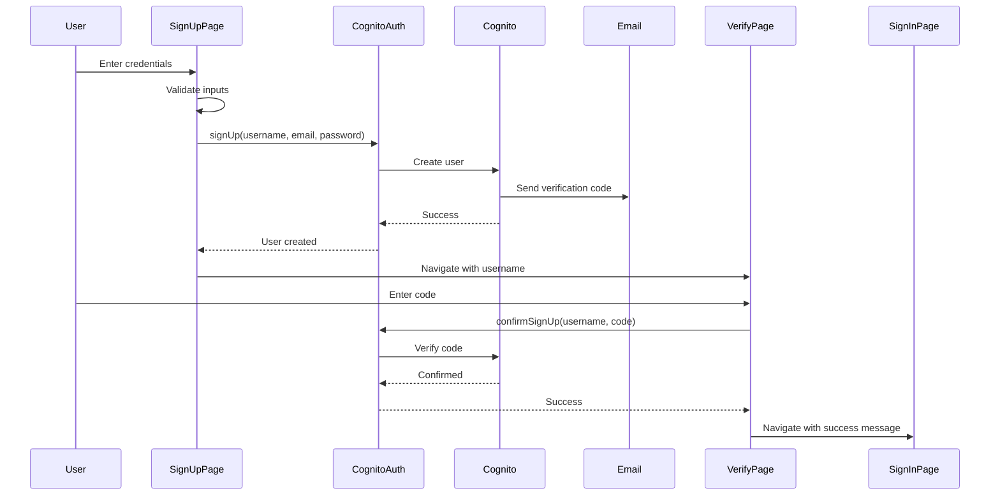

# Design Document

## Overview

This feature adds user registration (sign-up) functionality to the application, allowing new users to create accounts through a dedicated sign-up page. The implementation follows the existing authentication architecture using AWS Cognito User Pool and extends the current `cognitoAuth` provider with sign-up methods.

The design prioritizes user experience with clear validation, helpful error messages, and a smooth email verification flow. The frontend-first approach ensures users have an intuitive registration experience before implementing backend integration.

## Architecture

### High-Level Flow

```
User → Sign-Up Page → Cognito User Pool → Email Verification → Sign-In Page
```

### Component Interaction



## Components and Interfaces

### 1. SignUpPage Component

**Location**: `src/pages/SignUpPage.tsx`

**Purpose**: Provides user interface for account creation

**State Management**:
```typescript
interface SignUpState {
  username: string;
  email: string;
  password: string;
  confirmPassword: string;
  loading: boolean;
  error: string | null;
  validationErrors: {
    username?: string;
    email?: string;
    password?: string;
    confirmPassword?: string;
  };
}
```

**Key Methods**:
- `validateUsername()`: Checks username format and length
- `validateEmail()`: Validates email format
- `validatePassword()`: Checks password strength requirements
- `validateConfirmPassword()`: Ensures passwords match
- `handleSignUp()`: Submits registration to Cognito

### 2. VerifyEmailPage Component

**Location**: `src/pages/VerifyEmailPage.tsx`

**Purpose**: Handles email verification with code confirmation

**State Management**:
```typescript
interface VerifyState {
  username: string;
  verificationCode: string;
  loading: boolean;
  error: string | null;
  resendLoading: boolean;
  resendSuccess: boolean;
}
```

**Key Methods**:
- `handleVerify()`: Confirms user with verification code
- `handleResendCode()`: Requests new verification code
- `validateCode()`: Checks code format (6 digits)

### 3. CognitoAuthProvider Extension

**Location**: `src/lib/auth/cognitoAuth.ts`

**New Methods**:

```typescript
class CognitoAuthProvider {
  // Existing methods...
  
  /**
   * Register new user
   */
  async signUp(
    username: string,
    email: string,
    password: string
  ): Promise<void>;
  
  /**
   * Confirm user email with verification code
   */
  async confirmSignUp(
    username: string,
    code: string
  ): Promise<void>;
  
  /**
   * Resend verification code
   */
  async resendConfirmationCode(
    username: string
  ): Promise<void>;
}
```

### 4. Routing Updates

**Location**: `src/App.tsx` or routing configuration

**New Routes**:
- `/sign-up` → SignUpPage
- `/verify-email` → VerifyEmailPage

**Updated Routes**:
- `/sign-in` → Add link to sign-up page

## Data Models

### User Registration Data

```typescript
interface SignUpData {
  username: string;      // 3-50 characters, alphanumeric + underscore
  email: string;         // Valid email format
  password: string;      // Min 8 chars, uppercase, lowercase, number, special char
}
```

### Verification Data

```typescript
interface VerificationData {
  username: string;      // Username from sign-up
  code: string;          // 6-digit verification code
}
```

### Validation Rules

```typescript
const VALIDATION_RULES = {
  username: {
    minLength: 3,
    maxLength: 50,
    pattern: /^[a-zA-Z0-9_]+$/,
    errorMessage: 'Username can only contain letters, numbers, and underscores'
  },
  email: {
    pattern: /^[^\s@]+@[^\s@]+\.[^\s@]+$/,
    errorMessage: 'Please enter a valid email address'
  },
  password: {
    minLength: 8,
    requireUppercase: true,
    requireLowercase: true,
    requireNumber: true,
    requireSpecial: true,
    errorMessage: 'Password must be at least 8 characters with uppercase, lowercase, number, and special character'
  }
};
```

## Correctness Properties

*A property is a characteristic or behavior that should hold true across all valid executions of a system-essentially, a formal statement about what the system should do. Properties serve as the bridge between human-readable specifications and machine-verifiable correctness guarantees.*

### Property 1: Valid input acceptance
*For any* sign-up form submission with valid username, email, and password, the system should successfully create a user in Cognito and navigate to the verification page
**Validates: Requirements 1.1, 1.3**

### Property 2: Invalid input rejection
*For any* sign-up form submission with invalid inputs (malformed email, weak password, short username), the system should prevent submission and display specific validation errors
**Validates: Requirements 2.2, 9.2, 10.2**

### Property 3: Password matching requirement
*For any* sign-up attempt where password and confirmPassword fields differ, the system should prevent submission and display "Passwords do not match" error
**Validates: Requirements 2.3, 2.4**

### Property 4: Verification code validation
*For any* verification code submission, if the code is valid and matches the user, the system should confirm the account and redirect to sign-in; if invalid, should display error and allow retry
**Validates: Requirements 3.3, 3.5, 7.4**

### Property 5: Duplicate account prevention
*For any* sign-up attempt with an already-registered username or email, the system should reject the registration and display appropriate error message
**Validates: Requirements 7.1, 7.2**

### Property 6: Navigation consistency
*For any* navigation between sign-in and sign-up pages, the system should clear previous error messages and reset form state
**Validates: Requirements 6.5**

### Property 7: Loading state management
*For any* async operation (sign-up, verify, resend), the system should display loading indicators, disable inputs during processing, and remove indicators upon completion
**Validates: Requirements 8.1, 8.2, 8.3, 8.4, 8.5**

### Property 8: Resend code functionality
*For any* resend code request, the system should send a new verification code to the user's email and display success confirmation
**Validates: Requirements 4.2, 4.3**

## Error Handling

### Frontend Validation Errors

Display inline validation errors for:
- Username too short or invalid characters
- Invalid email format
- Weak password (missing requirements)
- Password mismatch
- Empty required fields

### Cognito API Errors

Map Cognito error codes to user-friendly messages:

```typescript
const ERROR_MESSAGES = {
  'UsernameExistsException': 'Username already taken. Please choose another.',
  'InvalidParameterException': 'Invalid input. Please check your information.',
  'InvalidPasswordException': 'Password does not meet requirements.',
  'CodeMismatchException': 'Invalid verification code. Please try again.',
  'ExpiredCodeException': 'Verification code expired. Please request a new one.',
  'LimitExceededException': 'Too many attempts. Please try again later.',
  'UserNotFoundException': 'User not found. Please sign up first.',
  'NotAuthorizedException': 'Invalid verification code.',
};
```

### Network Errors

Handle network failures gracefully:
- Display "Network error. Please check your connection."
- Allow retry without losing form data
- Log errors to console for debugging

### Rate Limiting

Cognito enforces rate limits on:
- Sign-up attempts
- Verification code resends
- Confirmation attempts

Display clear messages when limits are hit and suggest waiting period.

## Testing Strategy

### Unit Tests

Test individual validation functions:
- `validateUsername()` with valid/invalid inputs
- `validateEmail()` with various email formats
- `validatePassword()` with weak/strong passwords
- `validateConfirmPassword()` with matching/non-matching passwords

Test error message mapping:
- Cognito error codes map to correct user messages
- Unknown errors fall back to generic message

### Property-Based Tests

Property tests will use a property-based testing library (fast-check for TypeScript) to verify correctness properties across many randomly generated inputs.

**Property 1: Valid input acceptance**
- Generate random valid usernames, emails, and passwords
- Verify sign-up succeeds and navigates to verification page
- **Validates: Requirements 1.1, 1.3**

**Property 2: Invalid input rejection**
- Generate random invalid inputs (bad emails, weak passwords, short usernames)
- Verify submission is prevented and errors are displayed
- **Validates: Requirements 2.2, 9.2, 10.2**

**Property 3: Password matching requirement**
- Generate random password pairs where passwords differ
- Verify submission is prevented with "Passwords do not match" error
- **Validates: Requirements 2.3, 2.4**

**Property 4: Verification code validation**
- Generate random valid and invalid verification codes
- Verify valid codes confirm account, invalid codes show error
- **Validates: Requirements 3.3, 3.5, 7.4**

**Property 5: Duplicate account prevention**
- Generate random usernames/emails, some duplicates
- Verify duplicates are rejected with appropriate errors
- **Validates: Requirements 7.1, 7.2**

**Property 6: Navigation consistency**
- Generate random navigation sequences between pages
- Verify errors are cleared and forms are reset
- **Validates: Requirements 6.5**

**Property 7: Loading state management**
- Generate random async operations
- Verify loading indicators appear, inputs disable, indicators remove
- **Validates: Requirements 8.1, 8.2, 8.3, 8.4, 8.5**

**Property 8: Resend code functionality**
- Generate random resend requests
- Verify new codes are sent and success is displayed
- **Validates: Requirements 4.2, 4.3**

### Integration Tests

Test complete user flows:
- Full sign-up → verification → sign-in flow
- Sign-up with existing username/email
- Verification with invalid code
- Resend verification code
- Navigation between sign-in and sign-up

### Manual Testing Checklist

- [ ] Sign up with valid credentials
- [ ] Verify email with correct code
- [ ] Sign in with new account
- [ ] Try signing up with existing username
- [ ] Try signing up with existing email
- [ ] Enter invalid email format
- [ ] Enter weak password
- [ ] Enter mismatched passwords
- [ ] Enter invalid verification code
- [ ] Resend verification code
- [ ] Navigate between sign-in and sign-up
- [ ] Test on mobile viewport
- [ ] Test with slow network
- [ ] Test with network failure

## Implementation Notes

### Password Requirements

Cognito default password policy:
- Minimum length: 8 characters
- Require uppercase letter
- Require lowercase letter
- Require number
- Require special character

Frontend validation should match these requirements exactly.

### Email Verification

Cognito sends verification emails automatically. The email contains:
- 6-digit verification code
- Link to verify (optional, not used in this design)
- Expiration time (typically 24 hours)

### Session Management

After successful verification:
- User is NOT automatically signed in
- User must sign in with credentials on sign-in page
- This is standard Cognito behavior

### Styling

Use existing Cloudscape Design System components:
- Container for page layout
- FormField for input labels
- Input for text fields
- Button for actions
- Alert for error messages
- SpaceBetween for spacing

Match styling of existing SignInPage for consistency.

### Accessibility

Ensure WCAG 2.1 AA compliance:
- Proper label associations
- Keyboard navigation support
- Screen reader announcements for errors
- Focus management on page transitions
- Sufficient color contrast

### Mobile Responsiveness

Design works on all screen sizes:
- Form width: max 400px, centered
- Touch-friendly input sizes
- Readable font sizes
- Proper viewport meta tag

## Security Considerations

### Password Handling

- Never log passwords
- Clear password fields on error
- Use type="password" for password inputs
- Don't send passwords in URL parameters

### HTTPS Only

- All authentication must use HTTPS
- Cognito enforces HTTPS for API calls
- Frontend should enforce HTTPS in production

### Rate Limiting

- Cognito handles rate limiting server-side
- Frontend should display clear messages when limits hit
- Don't implement client-side rate limiting (can be bypassed)

### Input Sanitization

- Validate all inputs before sending to Cognito
- Prevent XSS with proper React escaping
- Don't trust client-side validation alone (Cognito validates server-side)

## Future Enhancements

Potential improvements for future iterations:
- Social sign-in (Google, Facebook)
- Password strength meter
- Username availability check before submission
- Email verification via link (in addition to code)
- Remember me functionality
- Multi-factor authentication (MFA)
- Password reset flow
- Profile completion after sign-up
